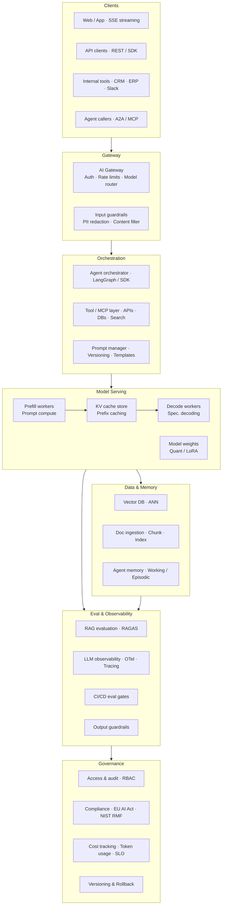

# AI Systems Engineering

> A personal knowledge base for understanding modern AI systems engineering — from inference infrastructure to agents, evaluation, and production operations.
>
> Each topic follows the same structure: **what it is → how it works → why it matters → code demo → notes**.

---

## Progress

**2 / 136 topics complete** — see the learning map below for what's done and what's next.

| Section | Done | Total |
|---------|------|-------|
| 01 · Model inference core | 2 | 17 |
| 02 · Model optimization | 0 | 11 |
| 03 · Serving infrastructure | 0 | 15 |
| 04 · Retrieval & memory | 0 | 12 |
| 05 · Agents & orchestration | 0 | 15 |
| 06 · Prompting & control | 0 | 9 |
| 07 · Evaluation & quality | 0 | 13 |
| 08 · Observability & ops | 0 | 14 |
| 09 · Integration & cloud | 0 | 15 |
| 10 · Safety & governance | 0 | 15 |

---

## Architecture overview

The diagram below shows how all layers connect in a production AI system.

> Reference image: [`assets/images/architecture.png`](assets/images/architecture.png)



---

## Recommended learning path

Topics within each section are ordered from foundational → advanced. Follow sections in this order for the best build-up:

1. **Model inference core** — understand what LLMs are before anything else
2. **Prompting & control** — learn to talk to models (fast practical wins)
3. **Serving infrastructure** — learn how to deploy what you understand
4. **Model optimization** — make models smaller and faster
5. **Retrieval & memory** — ground models in real data
6. **Agents & orchestration** — build systems that act autonomously
7. **Safety & governance** — make it safe and compliant
8. **Evaluation & quality** — measure whether it actually works
9. **Observability & ops** — run it in production reliably
10. **Integration & cloud** — connect to the broader stack

---

## Status legend

| Icon | Meaning |
|------|---------|
| 🔴 | Not started |
| 🟡 | In progress |
| 🟢 | Done — notes written |
| 🔨 | Demo built |

---

## Learning map

Topics within each section are listed in recommended study order (top = start here).

---

### 01 · Model inference core
*What runs the model — start here before anything else.*

| # | Topic | Status | Notes |
|---|-------|--------|-------|
| 1 | [LLM, SLM & Foundation Models](topics/01-model-inference-core/llm-slm-overview.md) | 🟢 | |
| 2 | [Tokenization](topics/01-model-inference-core/tokenization.md) | 🔴 | |
| 3 | [Embeddings](topics/01-model-inference-core/embeddings.md) | 🔴 | |
| 4 | [Transformer architecture](topics/01-model-inference-core/transformer.md) | 🔴 | |
| 5 | [Attention mechanism](topics/01-model-inference-core/attention-mechanism.md) | 🔴 | |
| 6 | [Context window](topics/01-model-inference-core/context-window.md) | 🔴 | |
| 7 | [Autoregressive decoding](topics/01-model-inference-core/autoregressive-decoding.md) | 🔴 | |
| 8 | [KV cache](topics/01-model-inference-core/kv-cache.md) | 🔴 | |
| 9 | [TTFT & TBT — inference latency metrics](topics/01-model-inference-core/ttft-tbt-metrics.md) | 🔴 | |
| 10 | [Continuous batching](topics/01-model-inference-core/continuous-batching.md) | 🔴 | |
| 11 | [Paged attention](topics/01-model-inference-core/paged-attention.md) | 🔴 | |
| 12 | [FlashAttention](topics/01-model-inference-core/flash-attention.md) | 🔴 | |
| 13 | [Chunked prefill](topics/01-model-inference-core/chunked-prefill.md) | 🔴 | |
| 14 | [Speculative decoding](topics/01-model-inference-core/speculative-decoding.md) | 🔴 | |
| 15 | [Mixture of Experts (MoE)](topics/01-model-inference-core/mixture-of-experts.md) | 🔴 | |
| 16 | [Multimodal LLMs & VLMs](topics/01-model-inference-core/multimodal-llm.md) | 🔴 | |
| 17 | [Reasoning models](topics/01-model-inference-core/reasoning-models.md) | 🔴 | |

---

### 02 · Model optimization & formats
*Making models smaller and faster — after you understand what they are.*

| # | Topic | Status | Notes |
|---|-------|--------|-------|
| 1 | [Quantization](topics/02-model-optimization/quantization.md) | 🔴 | |
| 2 | [FP8 / INT8 / INT4 — numeric formats](topics/02-model-optimization/fp8-int8-int4.md) | 🔴 | |
| 3 | [GPTQ, AWQ & GGUF](topics/02-model-optimization/gptq-awq-gguf.md) | 🔴 | |
| 4 | [Pruning & Sparsity](topics/02-model-optimization/pruning-sparsity.md) | 🔴 | |
| 5 | [Knowledge Distillation](topics/02-model-optimization/distillation.md) | 🔴 | |
| 6 | [LoRA & QLoRA](topics/02-model-optimization/lora-qlora.md) | 🔴 | |
| 7 | [Adapter layers](topics/02-model-optimization/adapter-layers.md) | 🔴 | |
| 8 | [Fine-tuning & SFT](topics/02-model-optimization/fine-tuning-sft.md) | 🔴 | |
| 9 | [RLHF](topics/02-model-optimization/rlhf.md) | 🔴 | |
| 10 | [DPO & GRPO](topics/02-model-optimization/dpo-grpo.md) | 🔴 | |
| 11 | [Model merging](topics/02-model-optimization/model-merging.md) | 🔴 | |

---

### 03 · Serving infrastructure
*How to deploy and scale — the engines that run inference.*

| # | Topic | Status | Notes |
|---|-------|--------|-------|
| 1 | [vLLM](topics/03-serving-infrastructure/vllm.md) | 🔴 | |
| 2 | [OpenAI-compatible API](topics/03-serving-infrastructure/openai-compatible-api.md) | 🔴 | |
| 3 | [TGI — Text Generation Inference](topics/03-serving-infrastructure/tgi.md) | 🔴 | |
| 4 | [TensorRT-LLM](topics/03-serving-infrastructure/tensorrt-llm.md) | 🔴 | |
| 5 | [SGLang](topics/03-serving-infrastructure/sglang.md) | 🔴 | |
| 6 | [llama.cpp & Ollama](topics/03-serving-infrastructure/llama-cpp-ollama.md) | 🔴 | |
| 7 | [Triton Inference Server](topics/03-serving-infrastructure/triton-inference-server.md) | 🔴 | |
| 8 | [P/D disaggregation](topics/03-serving-infrastructure/prefill-decode-disaggregation.md) | 🔴 | |
| 9 | [Tensor parallelism](topics/03-serving-infrastructure/tensor-parallelism.md) | 🔴 | |
| 10 | [Pipeline parallelism](topics/03-serving-infrastructure/pipeline-parallelism.md) | 🔴 | |
| 11 | [Expert parallelism (MoE)](topics/03-serving-infrastructure/expert-parallelism.md) | 🔴 | |
| 12 | [Serving metrics — Throughput, Latency SLO, Goodput](topics/03-serving-infrastructure/serving-metrics.md) | 🔴 | |
| 13 | [Batch inference](topics/03-serving-infrastructure/batch-inference.md) | 🔴 | |
| 14 | [Edge inference](topics/03-serving-infrastructure/edge-inference.md) | 🔴 | |
| 15 | [NVIDIA Dynamo](topics/03-serving-infrastructure/nvidia-dynamo.md) | 🔴 | |

---

### 04 · Retrieval & memory
*Grounding models in your data — RAG and beyond.*

| # | Topic | Status | Notes |
|---|-------|--------|-------|
| 1 | [RAG](topics/04-retrieval-memory/rag.md) | 🔴 | |
| 2 | [Embedding models](topics/04-retrieval-memory/embedding-models.md) | 🔴 | |
| 3 | [Vector databases](topics/04-retrieval-memory/vector-databases.md) | 🔴 | |
| 4 | [Chunking strategies](topics/04-retrieval-memory/chunking-strategies.md) | 🔴 | |
| 5 | [Semantic search](topics/04-retrieval-memory/semantic-search.md) | 🔴 | |
| 6 | [Hybrid search (BM25 + dense)](topics/04-retrieval-memory/hybrid-search.md) | 🔴 | |
| 7 | [Re-ranking](topics/04-retrieval-memory/reranking.md) | 🔴 | |
| 8 | [Knowledge graph](topics/04-retrieval-memory/knowledge-graph.md) | 🔴 | |
| 9 | [GraphRAG](topics/04-retrieval-memory/graphrag.md) | 🔴 | |
| 10 | [Agentic RAG](topics/04-retrieval-memory/agentic-rag.md) | 🔴 | |
| 11 | [Long-context retrieval](topics/04-retrieval-memory/long-context-retrieval.md) | 🔴 | |
| 12 | [Working & episodic memory](topics/04-retrieval-memory/working-episodic-memory.md) | 🔴 | |

---

### 05 · Agents & orchestration
*Multi-step autonomous systems — concepts first, frameworks second.*

| # | Topic | Status | Notes |
|---|-------|--------|-------|
| 1 | [AI agent fundamentals](topics/05-agents-orchestration/ai-agent-fundamentals.md) | 🔴 | |
| 2 | [Tool / function calling](topics/05-agents-orchestration/tool-calling.md) | 🔴 | |
| 3 | [ReAct pattern](topics/05-agents-orchestration/react-pattern.md) | 🔴 | |
| 4 | [Chain of Thought (CoT)](topics/05-agents-orchestration/chain-of-thought.md) | 🔴 | |
| 5 | [Plan & execute](topics/05-agents-orchestration/plan-and-execute.md) | 🔴 | |
| 6 | [Human-in-the-loop](topics/05-agents-orchestration/human-in-the-loop.md) | 🔴 | |
| 7 | [MCP — Model Context Protocol](topics/05-agents-orchestration/mcp.md) | 🔴 | |
| 8 | [Agent SDK](topics/05-agents-orchestration/agent-sdk.md) | 🔴 | |
| 9 | [LangGraph](topics/05-agents-orchestration/langgraph.md) | 🔴 | |
| 10 | [LangChain & LlamaIndex](topics/05-agents-orchestration/langchain-llamaindex.md) | 🔴 | |
| 11 | [Multi-agent systems](topics/05-agents-orchestration/multi-agent-systems.md) | 🔴 | |
| 12 | [Handoff — agent to agent](topics/05-agents-orchestration/handoff-agent-to-agent.md) | 🔴 | |
| 13 | [Tool registry](topics/05-agents-orchestration/tool-registry.md) | 🔴 | |
| 14 | [Idempotent tool calls](topics/05-agents-orchestration/idempotent-tool-calls.md) | 🔴 | |
| 15 | [A2A protocol](topics/05-agents-orchestration/a2a-protocol.md) | 🔴 | |

---

### 06 · Prompting & control
*How you talk to the model — high ROI, tackle this early.*

| # | Topic | Status | Notes |
|---|-------|--------|-------|
| 1 | [System prompt](topics/06-prompting-control/system-prompt.md) | 🔴 | |
| 2 | [Prompt engineering](topics/06-prompting-control/prompt-engineering.md) | 🔴 | |
| 3 | [Few-shot & zero-shot](topics/06-prompting-control/few-shot-zero-shot.md) | 🔴 | |
| 4 | [In-context learning (ICL)](topics/06-prompting-control/in-context-learning.md) | 🔴 | |
| 5 | [Temperature, Top-p & sampling](topics/06-prompting-control/temperature-sampling.md) | 🔴 | |
| 6 | [Structured output & JSON mode](topics/06-prompting-control/structured-output.md) | 🔴 | |
| 7 | [Prompt versioning](topics/06-prompting-control/prompt-versioning.md) | 🔴 | |
| 8 | [Constitutional AI](topics/06-prompting-control/constitutional-ai.md) | 🔴 | |
| 9 | [System card](topics/06-prompting-control/system-card.md) | 🔴 | |

---

### 07 · Evaluation & quality
*Measuring what the model actually does.*

| # | Topic | Status | Notes |
|---|-------|--------|-------|
| 1 | [RAGAS](topics/07-evaluation-quality/ragas.md) | 🔴 | |
| 2 | [Faithfulness metrics](topics/07-evaluation-quality/faithfulness-metrics.md) | 🔴 | |
| 3 | [Hallucination rate](topics/07-evaluation-quality/hallucination-rate.md) | 🔴 | |
| 4 | [LLM-as-judge](topics/07-evaluation-quality/llm-as-judge.md) | 🔴 | |
| 5 | [Golden dataset](topics/07-evaluation-quality/golden-dataset.md) | 🔴 | |
| 6 | [Offline vs online eval](topics/07-evaluation-quality/offline-vs-online-eval.md) | 🔴 | |
| 7 | [DeepEval](topics/07-evaluation-quality/deepeval.md) | 🔴 | |
| 8 | [Benchmark evals — MMLU, HellaSwag, BEIR](topics/07-evaluation-quality/benchmark-evals.md) | 🔴 | |
| 9 | [Regression testing](topics/07-evaluation-quality/regression-testing.md) | 🔴 | |
| 10 | [A/B prompt testing](topics/07-evaluation-quality/ab-prompt-testing.md) | 🔴 | |
| 11 | [Trajectory evaluation (agents)](topics/07-evaluation-quality/trajectory-evaluation.md) | 🔴 | |
| 12 | [CI/CD eval gates](topics/07-evaluation-quality/cicd-eval-gates.md) | 🔴 | |
| 13 | [PROMOTE / HOLD / ROLLBACK](topics/07-evaluation-quality/promote-hold-rollback.md) | 🔴 | |

---

### 08 · Observability & ops (LLMOps)
*Running it in production reliably.*

| # | Topic | Status | Notes |
|---|-------|--------|-------|
| 1 | [LLMOps overview](topics/08-observability-ops/llmops-overview.md) | 🔴 | |
| 2 | [OpenTelemetry for LLMs](topics/08-observability-ops/opentelemetry.md) | 🔴 | |
| 3 | [Tracing & spans](topics/08-observability-ops/tracing.md) | 🔴 | |
| 4 | [Latency percentiles — p95/p99](topics/08-observability-ops/latency-percentiles.md) | 🔴 | |
| 5 | [Cost per token](topics/08-observability-ops/cost-per-token.md) | 🔴 | |
| 6 | [Prompt & semantic drift](topics/08-observability-ops/drift-detection.md) | 🔴 | |
| 7 | [Toxicity scoring](topics/08-observability-ops/toxicity-scoring.md) | 🔴 | |
| 8 | [RBAC & IAM](topics/08-observability-ops/rbac-iam.md) | 🔴 | |
| 9 | [Audit logs](topics/08-observability-ops/audit-logs.md) | 🔴 | |
| 10 | [Langfuse & LangSmith](topics/08-observability-ops/langfuse-langsmith.md) | 🔴 | |
| 11 | [Arize & Datadog LLM](topics/08-observability-ops/arize-datadog.md) | 🔴 | |
| 12 | [Data residency](topics/08-observability-ops/data-residency.md) | 🔴 | |
| 13 | [Model versioning](topics/08-observability-ops/model-versioning.md) | 🔴 | |
| 14 | [Spans & traces — primitives](topics/08-observability-ops/spans-traces.md) | 🔴 | |

---

### 09 · Integration & cloud
*Connecting to your existing stack.*

| # | Topic | Status | Notes |
|---|-------|--------|-------|
| 1 | [Streaming (SSE)](topics/09-integration-cloud/streaming-sse.md) | 🔴 | |
| 2 | [AI gateway](topics/09-integration-cloud/ai-gateway.md) | 🔴 | |
| 3 | [Auth & rate limiting](topics/09-integration-cloud/auth-rate-limiting.md) | 🔴 | |
| 4 | [Load balancing](topics/09-integration-cloud/load-balancing.md) | 🔴 | |
| 5 | [Model router](topics/09-integration-cloud/model-router.md) | 🔴 | |
| 6 | [KV cache-aware routing](topics/09-integration-cloud/kv-cache-aware-routing.md) | 🔴 | |
| 7 | [Prefix-aware routing](topics/09-integration-cloud/prefix-aware-routing.md) | 🔴 | |
| 8 | [Fallback chain](topics/09-integration-cloud/fallback-chain.md) | 🔴 | |
| 9 | [Open-weight vs managed endpoints](topics/09-integration-cloud/open-weight-vs-managed.md) | 🔴 | |
| 10 | [Cloud platforms — Vertex AI, Azure ML, SageMaker](topics/09-integration-cloud/cloud-platforms.md) | 🔴 | |
| 11 | [Managed inference — Groq, Baseten, Modal](topics/09-integration-cloud/managed-inference.md) | 🔴 | |
| 12 | [Hugging Face Inference Endpoints](topics/09-integration-cloud/huggingface-endpoints.md) | 🔴 | |
| 13 | [Data sovereignty](topics/09-integration-cloud/data-sovereignty.md) | 🔴 | |
| 14 | [VPC & private endpoint](topics/09-integration-cloud/vpc-private-endpoint.md) | 🔴 | |
| 15 | [On-prem & hybrid deployment](topics/09-integration-cloud/on-prem-hybrid.md) | 🔴 | |

---

### 10 · Safety, alignment & governance
*Keeping it trustworthy at scale — technical safety first, then regulation.*

| # | Topic | Status | Notes |
|---|-------|--------|-------|
| 1 | [Input guardrails](topics/10-safety-governance/input-guardrails.md) | 🔴 | |
| 2 | [PII redaction](topics/10-safety-governance/pii-redaction.md) | 🔴 | |
| 3 | [Prompt injection](topics/10-safety-governance/prompt-injection.md) | 🔴 | |
| 4 | [Output guardrails](topics/10-safety-governance/output-guardrails.md) | 🔴 | |
| 5 | [Content filtering](topics/10-safety-governance/content-filtering.md) | 🔴 | |
| 6 | [Red-teaming](topics/10-safety-governance/red-teaming.md) | 🔴 | |
| 7 | [Adversarial inputs](topics/10-safety-governance/adversarial-inputs.md) | 🔴 | |
| 8 | [Safety alignment](topics/10-safety-governance/safety-alignment.md) | 🔴 | |
| 9 | [Bias detection](topics/10-safety-governance/bias-detection.md) | 🔴 | |
| 10 | [Fairness metrics](topics/10-safety-governance/fairness-metrics.md) | 🔴 | |
| 11 | [Human approval gate](topics/10-safety-governance/human-approval-gate.md) | 🔴 | |
| 12 | [Policy-as-code](topics/10-safety-governance/policy-as-code.md) | 🔴 | |
| 13 | [AI RMF (NIST)](topics/10-safety-governance/ai-rmf-nist.md) | 🔴 | |
| 14 | [EU AI Act](topics/10-safety-governance/eu-ai-act.md) | 🔴 | |
| 15 | [Responsible AI](topics/10-safety-governance/responsible-ai.md) | 🔴 | |

---

## Demos

| Demo | What it covers | Status |
|------|----------------|--------|
| [vllm-minimal](demos/vllm-minimal/) | Spin up vLLM, serve a model, hit the OpenAI-compatible API | 🔴 |
| [rag-with-eval](demos/rag-with-eval/) | RAG pipeline end-to-end with RAGAS eval baked in | 🔴 |
| [guardrail-pipeline](demos/guardrail-pipeline/) | PII redaction + injection detection before LLM call | 🔴 |

---

## How I use this repo

```
## What it is        ← plain English, one paragraph
## How it works      ← the actual mechanism
## Why it matters    ← where it sits in the architecture
## Key terms         ← sub-concepts within this topic
## Code / demo       ← link to /demos/ or inline snippet
## My notes          ← what the docs don't tell you
## Resources         ← 2–3 links max
```

**Workflow per topic:**
1. Run `/research-topic <name>` in Claude Code — it researches, writes, and commits
2. Review and add personal observations to `## My notes`
3. Build the demo if one is planned
4. Update the progress counter at the top of this file

## Goal

Genuine understanding of how production AI systems are built and operated — not certification coverage.
