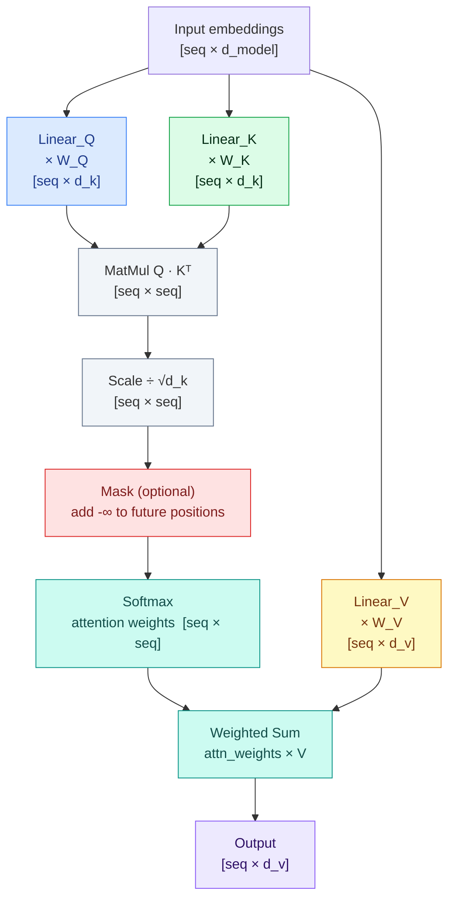
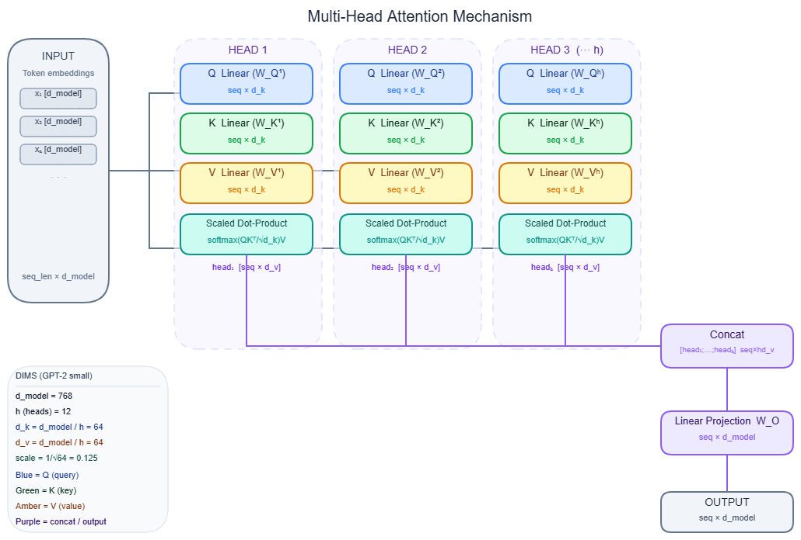

# Attention mechanism

---

## What it is

Think of attention like a database lookup where the query is fuzzy, the keys are soft labels, and you retrieve a weighted blend of all values rather than a single exact match.

Attention is a learned mechanism that computes, for each position in a sequence, a weighted sum of every other position's value — where the weights are determined by the similarity between that position's query vector and every position's key vector.

It is not a model of human visual attention or selective focus. High attention weight on a token does not mean the model considers that token "important" — a token can receive near-zero attention in one pathway and still dominate the output through the residual stream.

---

## How it works

### Scaled dot-product attention

The 10-second version: every token asks a question (query), every token broadcasts a label (key), and the similarity between each question and each label determines how much of each token's content (value) flows forward.

The full formula from Vaswani et al. (2017):

```
Attention(Q, K, V) = softmax(QKᵀ / √d_k) · V
```

- **Q** (queries): what is this token looking for?
- **K** (keys): what does this token contain?
- **V** (values): what does this token return when matched?

The dot product `QKᵀ` scores every query against every key simultaneously. Softmax converts those raw scores into a probability distribution summing to 1.0. That distribution is then used to compute a weighted sum of all value vectors, producing the output for each position.

**Why divide by √d_k:** Each element in Q and K is drawn from a distribution with variance ~1. The dot product of two d_k-dimensional vectors has variance d_k — so for d_k = 512, the pre-softmax logits have standard deviation ~22.6. Softmax saturates at those magnitudes, producing near-zero gradients everywhere. Dividing by √d_k keeps variance at 1 regardless of head size.

**Causal masking:** Decoder-only models (GPT, Llama, Mistral) must not let token i see tokens i+1..n during training or inference. A lower-triangular mask sets future positions to -∞ before the softmax, which maps those positions to 0 probability. Token i attends to positions 0..i only.

The Mermaid diagram below shows the full data flow through one attention head:



Time complexity is O(n² · d) and space complexity is O(n²) for the attention matrix. Doubling the sequence length quadruples both compute and memory for the attention step. → see [Context window](context-window.md) for how this shapes practical limits.

### Multi-head attention

Rather than running a single attention function over the full d_model-dimensional space, multi-head attention (MHA) runs h independent attention functions in parallel, each operating on a d_k = d_model/h subspace, then concatenates and projects back:

```
MultiHead(Q, K, V) = Concat(head₁, ..., headₕ) · W^O
where head_i = Attention(Q · W^Q_i, K · W^K_i, V · W^V_i)
```

Each head learns to specialize. Research by Voita et al. identified three functional head types: positional heads (attend to neighboring tokens), syntactic heads (grammatical relations), and rare-word heads (low-frequency vocabulary). Crucially, those researchers pruned 66% of encoder heads with near-zero performance loss — most heads are redundant at inference time.

Concrete model dimensions:

| Model | d_model | Heads (h) | d_k per head | Layers |
|---|---|---|---|---|
| Transformer base (2017) | 512 | 8 | 64 | 6 |
| GPT-2 small | 768 | 12 | 64 | 12 |
| GPT-2 XL | 1,600 | 25 | 64 | 48 |
| GPT-3 175B | 12,288 | 96 | 128 | 96 |

Note that d_k = 64 stays constant across early models — scale came from adding more heads and layers, not enlarging each head's subspace.

The full MHA landscape showing how Q, K, V projections split across heads and recombine:



Every attention operation feeds its output into the residual stream, which accumulates across all layers. → see [Transformer architecture](transformer.md) for how attention layers compose inside the full stack.

### Self-attention vs cross-attention

**Self-attention:** Q, K, and V all come from the same sequence. Used in both bidirectional encoder stacks (BERT) and causal decoder stacks (GPT, Llama). The model attends to itself.

**Cross-attention:** Q comes from the decoder's current state; K and V come from a separately encoded sequence. Used only in encoder-decoder architectures like T5 and BART for tasks like translation and summarization.

**Decoder-only models** (GPT, Llama, Mistral, Falcon, Gemma) use only causal self-attention — cross-attention does not exist in these architectures.

### GQA and MQA — the production evolution

Full MHA is memory-bandwidth-bound at inference. Every head has its own K and V matrices, and every token generation step must load all of them from HBM (high-bandwidth memory). The KV cache for Llama 2 70B at 32K context with full MHA reaches ~80 GB.

Two variants address this:

**Multi-Query Attention (MQA):** All query heads share a single K and V pair. Extreme cache reduction, modest quality drop on some tasks.

**Grouped-Query Attention (GQA):** Query heads are partitioned into G groups; each group shares one K and V. MQA is GQA with G=1; full MHA is GQA with G=h.

GQA numbers from the paper (T5 XXL):

| Variant | Avg score | Per-sample latency |
|---|---|---|
| MHA-XXL | 47.2 | 1.51s |
| GQA-8-XXL | 47.1 | 0.28s |
| MQA-XXL | 46.6 | 0.24s |

GQA-8 matches MHA quality while cutting latency by 5.4x. GQA is now the production default: Llama 2 70B uses 64 query heads with 8 KV heads, cutting the KV cache from ~80 GB to ~10 GB at 32K context. Mistral 7B uses 32 query heads with 8 KV heads. Falcon 40B uses full MQA (1 KV head).

The reason this works at all ties back to head redundancy: if 60-90% of K/V head variations were redundant anyway, sharing them across groups loses little real information.

**MLA (Multi-Head Latent Attention):** DeepSeek-V2/V3 (2024) introduced a different approach — instead of head-sharing, K/V projections are compressed into a small latent vector using low-rank decomposition, then decompressed at inference. This achieves better quality than GQA at comparable memory efficiency.

The KV cache that these variants feed is a central inference resource. → see [KV cache](kv-cache.md) for how those matrices are sized, stored, and managed at runtime.

Hardware-efficient attention computation that avoids materializing the O(n²) attention matrix is a separate concern. → see [FlashAttention](flash-attention.md) for the tiling algorithm that makes long-context attention practical.

### Gotchas & production behavior

**Mental model pitfalls**

- **Attention weights are not importance scores.** Jain and Wallace (2019) demonstrated that adversarial attention distributions can produce identical model outputs despite completely different attention patterns. Gradient-based methods (integrated gradients, SHAP) or perturbation tests are the correct tool for interpretability — not raw attention heatmaps.
- **"More heads = more capacity in use" is wrong at inference.** Up to 90% of attention heads can be removed at runtime with no measurable quality loss (Michel et al., 2019). This is precisely why GQA works: K/V head reduction doesn't hurt much because most head variations were redundant. Benchmarking a model's head count tells you little about its effective representational use.
- **A large context window is not a flat, uniform one.** Models trained with RoPE (Rotary Position Embedding) exhibit a U-shaped positional bias: tokens at the beginning and end of the context receive systematically higher attention, while mid-context tokens are underweighted regardless of their relevance. Performance drops 30%+ when the answer is buried mid-context. Place critical documents first or last in RAG contexts — never in the middle.

**Attention sinks**

- The `<BOS>` (beginning-of-sequence) token absorbs 30-50%+ of total attention weight across many heads in virtually all autoregressive transformers (LLaMA, Falcon, MPT, Pythia). This is a learned routing artifact driven by softmax's requirement that weights sum to 1.0 — the model routes "excess" attention mass to a stable positional anchor.
- Because sink positions absorb excess attention mass regardless of content, any eviction strategy that removes them from the context degrades generation quality — the failure looks like incoherent output, not a recoverable error. → see [KV cache](kv-cache.md) for eviction strategies that account for this.

**Benchmark interpretation**

- Perplexity is a misleading benchmark for long-context capability. A model can achieve low perplexity on long-context test sets via local pattern matching without integrating long-range information at all. Perplexity measures next-token prediction uniformly and is insensitive to positional bias. Evaluate long-context claims with position-aware tasks: needle-in-haystack, multi-document QA with known answer positions, and accuracy tracked by answer position.
- RoPE does not extrapolate cleanly beyond its training context length. Attention scores blow up in magnitude past the training boundary, causing perplexity to spike and generation to degrade. The failure looks like incoherent output, not a clean error. Use YaRN or NTK-aware scaling for context extension.

**GQA quality is task-specific**

- Official "GQA matches MHA" benchmark claims are aggregate scores. Tasks requiring simultaneous tracking of multiple evidence chains — complex code generation, multi-hop reasoning — degrade more than aggregate numbers show. Post-hoc conversion from MHA to GQA degrades quality more than training with GQA from scratch. Run a task-specific ablation before assuming the aggregate benchmark transfers to your use case.

---

## Why it matters

This topic sits at the **Model serving** layer — every downstream decision in this section depends on understanding what the attention mechanism actually computes. Without this foundation, KV cache sizing, batch scheduling, and quantization tradeoffs are opaque. → see [KV cache](kv-cache.md) for the direct memory consequence, and [FlashAttention](flash-attention.md) for the compute consequence.

Without knowing that attention is O(n²) in both time and memory, you cannot reason about why context windows are expensive or why GQA was necessary. Without knowing that attention weights are not importance scores, interpretability work produces misleading conclusions that drive bad model selection and debugging decisions.

The concrete stakes: Llama 2 70B's KV cache at 32K context drops from ~80 GB (full MHA) to ~10 GB (GQA-8) — an 8x reduction that determines whether the model fits on a single node at all.

---

## Key terms

| Term | Meaning |
|------|---------|
| Query (Q) | A learned projection of the current token asking "what am I looking for?" |
| Key (K) | A learned projection of each token broadcasting "what do I contain?" |
| Value (V) | A learned projection of each token representing "what do I return when matched?" |
| d_k | The dimension of each attention head's Q and K vectors; equals d_model / h |
| Causal mask | A lower-triangular mask applied before softmax that prevents token i from attending to future positions |
| Multi-head attention (MHA) | Running h attention functions in parallel across d_k-dimensional subspaces, then concatenating |
| Grouped-Query Attention (GQA) | Query heads partitioned into groups that share K and V matrices; the production default for large models |
| Multi-Query Attention (MQA) | Extreme GQA variant where all query heads share a single K/V pair |
| Attention sink | The learned behavior where the `<BOS>` token accumulates disproportionate attention mass as a softmax normalization artifact |
| MLA (Multi-Head Latent Attention) | DeepSeek's alternative to GQA: low-rank compression of K/V projections rather than head-sharing |

---

## Code / demo

```python
# pip install numpy
import numpy as np

def scaled_dot_product_attention(Q, K, V, mask=None):
    d_k = Q.shape[-1]
    scores = Q @ K.T / np.sqrt(d_k)           # [seq, seq]
    if mask is not None:
        scores = np.where(mask, scores, -1e9)  # -1e9 → ~0 after softmax
    # numerically stable softmax
    scores -= scores.max(axis=-1, keepdims=True)
    weights = np.exp(scores)
    weights /= weights.sum(axis=-1, keepdims=True)
    return weights @ V, weights                # [seq, d_v], [seq, seq]

seq_len, d_k = 4, 8
rng = np.random.default_rng(42)
Q = rng.standard_normal((seq_len, d_k))
K = rng.standard_normal((seq_len, d_k))
V = rng.standard_normal((seq_len, d_k))

# causal mask: token i attends only to positions 0..i
causal_mask = np.tril(np.ones((seq_len, seq_len), dtype=bool))

output, attn_weights = scaled_dot_product_attention(Q, K, V, mask=causal_mask)
print("Output shape:", output.shape)
print("Row sums (should all be 1.0):", attn_weights.sum(axis=-1).round(4))
print("Future positions masked (top-right should be 0):")
print(attn_weights.round(3))
```

---

## My notes

- The attention-weights-as-importance-scores mistake keeps surfacing in production interpretability work. Teams spend days building attention visualization dashboards and then tune prompts based on heatmaps that have no reliable causal relationship to the model's actual decisions. Gradient attribution is the correct primitive.
- The U-shaped positional bias from "Lost in the Middle" has direct RAG design consequences: retrieval ranking alone is not enough. Reranking and then placing the top result at the beginning of the context (not just first in the retrieved list) is a concrete mitigation many teams skip.
- GQA's quality-vs-task specificity matters more than the official papers suggest. The aggregate benchmark gap between GQA-8 and MHA is small, but on tasks with multiple interleaved evidence threads I've seen meaningful degradation. Always run your specific eval, not just MMLU.
- The attention sink finding (Finding 2) interacts directly with KV eviction strategies in long-context serving. Any system that uses recency-based eviction without special-casing the first few tokens will silently degrade — the failure mode is generation becoming incoherent, not a recoverable error. → see [KV cache](kv-cache.md) for eviction strategies.
- MLA from DeepSeek is worth watching. It is not just an incremental GQA variant — the low-rank compression approach decouples quality from cache size in a different way, and if it generalizes across training scales it may become the next production default the way GQA displaced full MHA.

*Last researched: 2026-05-19*

---

## Resources

1. Vaswani et al. (2017) — "Attention Is All You Need": https://arxiv.org/abs/1706.03762
2. Ainslie et al. (2023) — "GQA: Training Generalized Multi-Query Transformer Models": https://arxiv.org/abs/2305.13245
3. Liu et al. (2023) — "Lost in the Middle: How Language Models Use Long Contexts" (TACL): https://direct.mit.edu/tacl/article/doi/10.1162/tacl_a_00638/119630/Lost-in-the-Middle-How-Language-Models-Use-Long
