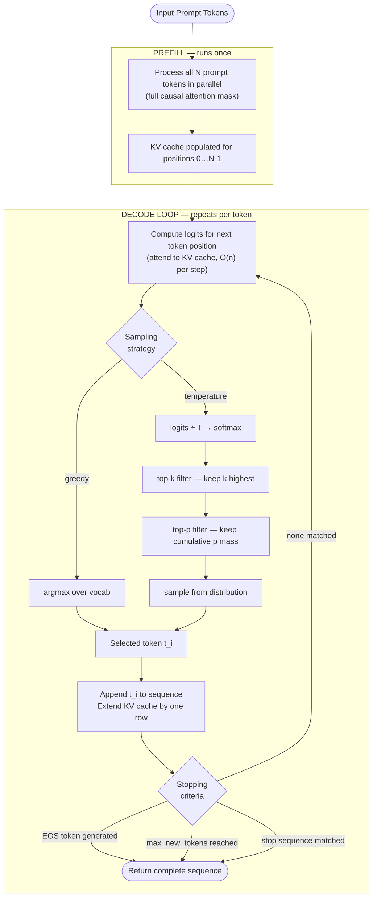
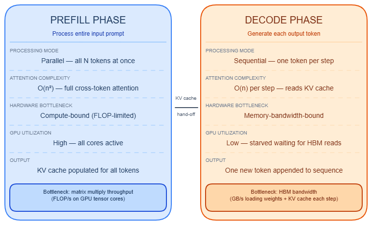

# Autoregressive Decoding

---

## What it is

Think of autoregressive decoding like a typewriter that can only print one character at a time, where each keystroke is informed by every character already on the page — the machine re-reads the full page before deciding the next letter, then repeats.

Autoregressive decoding is the generation algorithm used by transformer language models: given an input and all previously generated tokens, the model runs a full forward pass to produce a probability distribution over its vocabulary, samples one token from that distribution, appends it to the sequence, and repeats until a stopping condition is met.

It is not a training algorithm — it is a purely inference-time procedure, and the model's weights are frozen throughout.

---

## How it works

### Two-phase execution: prefill and decode

The autoregressive loop splits into two distinct phases with radically different computational profiles.

**Prefill** processes the entire input prompt in a single forward pass. All N prompt tokens are fed simultaneously, the [N × N] attention matrix is computed with a causal mask, and key/value tensors for every position are written to the KV cache. → see [KV cache](kv-cache.md) for how this cache is structured and sized. Only the final position's logits are used to sample the first output token. Prefill is **compute-bound**: projection layers operate at roughly 1,024 FLOPs/byte on LLaMA-2-7B on an A6000.

**Decode** runs one token per forward pass, sequentially. Each step attends to the full KV cache — one new row appended per step — so the attention operation shrinks from [N × N] to [1 × seq_len]. Decode is **memory-bandwidth-bound**: it executes at 1–2 FLOPs/byte, 200–600× below the hardware's compute roofline. The bottleneck is reading all model weights from HBM on every step, not arithmetic throughput.

Concrete timing (500-token prompt, 200 output tokens, mid-range GPU):
- Prefill: ~50 ms (one pass)
- Decode: ~2,000 ms (200 sequential ~10 ms passes)
- Decode accounts for roughly 97% of wall-clock time

| Phase | Compute profile | Attention shape | Scales with |
|-------|----------------|-----------------|-------------|
| Prefill | Compute-bound (~1,024 FLOPs/byte) | [N × N] | Prompt length² |
| Decode | Memory-bandwidth-bound (1–2 FLOPs/byte) | [1 × seq_len] | Model weight size |

Key throughput numbers: a 7B FP16 model (14 GB weights) on an H100 SXM5 (2,039 GB/s) has a theoretical minimum per-token latency of ~6 ms; the same model on an A10 (600 GB/s) is ~23 ms. A 70B FP16 model requires reading ~140 GB of weights per decode step, giving ~42 ms minimum latency on an H100. Model bandwidth utilization (MBU) at batch size 1 is typically 55–65% of peak. Reaching a compute-bound regime requires batch sizes of 512+ on an H100 with a 70B model.

→ see [TTFT & TBT metrics](ttft-tbt-metrics.md) for how prefill latency maps to time-to-first-token and decode latency maps to time-between-tokens.

### The decode loop



### Prefill vs. decode phase comparison



### Sampling strategies

After each forward pass the model outputs a logits vector of shape [vocab_size] — typically 32K–256K entries. The sampling strategy converts this to a single token ID. Sampling strategies compose in a fixed pipeline order: temperature → top-k → top-p → min-p → final sample.

**Temperature** divides all logits by T before softmax. T < 1.0 sharpens the distribution; T > 1.0 flattens it; T → 0 approaches greedy. Temperature is not a sampling strategy itself — it reshapes the distribution that other strategies then filter.

**Greedy** selects argmax. Deterministic (in theory), fast, and prone to repetition loops in open-ended generation. Appropriate for classification and structured extraction where there is a single correct answer.

**Top-k** keeps only the k highest-probability tokens, re-normalizes, and samples. The boundary is hard regardless of how confident or uncertain the model is. k = 50 is common. Problem: when the model is very confident, k = 50 still admits many garbage tokens.

**Top-p (nucleus sampling)** keeps the smallest set of tokens whose cumulative probability ≥ p, re-normalizes, and samples. Adaptive: when the model is confident only 2–3 tokens pass; when uncertain 50+ may pass. Standard range is p = 0.90–0.95. Problem: at high temperatures, low-probability tokens flood into the nucleus.

**Min-p** (Mabaker et al., oral ICLR 2025) sets a dynamic threshold based on the top token's probability:

```
threshold = p_base × max(probability)
```

When the model is confident (top token p = 0.95), the threshold is high (0.095 for p_base = 0.1). When uncertain (top token p = 0.2), the threshold is low (0.02). This adaptive behavior fixes the top-p degradation at high temperatures. Available in HuggingFace, vLLM, SGLang, llama.cpp, and Ollama. Not exposed by OpenAI, Anthropic, or Google commercial APIs as of May 2026. A June 2025 paper (arXiv:2506.13681) disputes whether the quality gains are real — this remains an open debate.

**Beam search** maintains `num_beams` candidate sequences, running that many forward passes per step. Not stochastic. Produces measurably better output for constrained tasks (translation, summarization) but generates repetitive output in open-ended tasks. Rarely used with aligned chat models.

**Repetition penalties** adjust logits before sampling:
- `repetition_penalty` (HuggingFace): multiplier ≥ 1.0 on all previously seen tokens. 1.3 is a common conservative value.
- `frequency_penalty` (OpenAI): penalty proportional to occurrence count.
- `presence_penalty` (OpenAI): flat penalty on any token that appeared at all.

### Stopping criteria

The decode loop ends when one of three conditions fires:

1. **EOS token**: the model predicts the end-of-sequence token. Requires the model to have been trained to emit it reliably.
2. **`max_new_tokens`**: a hard ceiling on output length. Most runtimes also have a silent global cap (often 10K–16K) that overrides user-supplied values.
3. **Stop sequences**: user-supplied strings. Multi-token stop sequences require all tokens to be generated in order before the match fires — the partial sequence is emitted and then stripped, which can produce unexpected behavior in streaming clients.

→ see [Context window](context-window.md) for how `max_new_tokens` interacts with the total context budget.

### Fundamental limitation: no lookahead

Autoregressive generation commits to each token before seeing what comes next — there is no planning, backtracking, or lookahead. This produces a structural failure mode: tasks where the correct early token depends on information that only becomes clear later (a function signature that must match a return type emerging 50 tokens later; a JSON field value that constrains later fields) are inherently difficult. The training procedure (teacher forcing, where ground-truth tokens are fed at each step) compounds this — the model was never trained on the distribution of errors it produces at inference time, so early mistakes compound faster than training exposure would predict.

→ see [Speculative decoding](speculative-decoding.md) for the dominant technique that accelerates decode without changing the autoregressive output distribution.

### Gotchas & production behavior

**Determinism and temperature**

- **Temperature = 0 is not deterministic.** Thinking Machines found 80 unique completions across 1,000 identical runs at temperature = 0, with the most common output appearing only 78 times. Anthropic's documentation acknowledges this. Root causes: (1) GPU reduction operations in matrix multiplications are not order-invariant — floating-point addition is not associative; (2) batch-size-dependent reduction orders mean a solo request is numerically different from the same request in a batch of 16; (3) in MoE models, routing contention from concurrent requests can push tokens to different experts.
- **Greedy decoding produces 48x more repetition loops than T = 1.0 sampling** (from an analysis of 172B tokens). Holtzman et al. showed GPT-2 Large under greedy has measurably worse repetition than human text (0.28% repetition rate). The mechanism: once a high-probability n-gram appears, conditioning on it makes it more probable next step; without stochastic escape the model locks in. This risk is concentrated in long open-ended prose — code generation is less affected because syntax introduces structural variety. Temperature = 0 still delivers the best accuracy in roughly 60% of configurations for factual and reasoning tasks, so the choice is workload-dependent.

**Sampling parameter pitfalls**

- **Standard repetition penalties are largely ineffective, and cranking them causes new failures.** Production teams have documented degenerate repetition rates of up to 4% even with penalties applied. One team reduced repetition from 15% to 0% not by tuning parameters but by simplifying prompt structure. Setting `presence_penalty = 1.5` was observed to regress degeneration rate back from 10% to 15%. Root cause: numbered lists, tables, and parallel bullets in the system prompt teach the model to repeat patterns through in-context learning — penalties operate on logits *after* the self-reinforcement loop has already formed. Secondary damage: `repetition_penalty` above ~1.3 penalizes necessary repetition (code syntax keywords, technical terms), producing incoherent synonym-hopping.
- **Running temperature and top-p simultaneously creates non-linear interactions.** Temperature reshapes the distribution first; top-p then filters from the reshaped result. High temperature + low top-p is contradictory: the top-p constraint wins but the outputs are less predictable than either parameter alone. OpenAI, Anthropic, and Google all recommend tuning temperature *or* top-p, not both simultaneously.
- **Top-p degrades silently at high temperatures.** As temperature increases, token probabilities become more uniform, so top-p admits increasingly many low-quality tokens. Min-p adapts its threshold to the top token's probability, fixing this — but min-p is unavailable on commercial APIs (OpenAI, Anthropic, Google) as of May 2026.

**Benchmark interpretation**

- **Benchmark scores under greedy vs. sampling differ by 10–18 points on the same model.** Qwen2-7B scores 83.5% on GSM8K under greedy but only 72% under sampling. Llama-2-7B achieves 97.7% on GSM8K with best-of-256 samples, surpassing GPT-4's single-sample score. An 18.3-point gap was observed on HumanEval for Llama-3-8B-Instruct between greedy and sampling. Teams that benchmark on greedy and deploy with sampling observe systematic production quality regressions with no obvious cause.

**EOS and stopping failures**

- **Fine-tuned models often stop generating at `max_new_tokens` instead of EOS.** Root cause 1: setting `pad_token = eos_token` causes `DataCollatorForLanguageModeling` to mask PAD out of the loss computation — because PAD and EOS share the same ID, the model never learns EOS as a stopping signal. Root cause 2: chat template mismatch between training and inference causes the model's trained stopping cue to never be generated. This has been observed across Llama 2, Llama 3 (EOS bug in pre-May 13, 2024 checkpoints, later fixed by Meta), Qwen2, and StarChat.
- **Multi-token stop sequences emit a partial sequence before matching.** Streaming clients may receive partial tokens from a stop sequence before the match fires and the server truncates. This behavior is implementation-specific and inconsistent across providers.

---

## Why it matters

This topic sits at the **Model serving** layer — every latency, throughput, and cost decision downstream depends on understanding the prefill/decode split. Without this mental model, a team tuning a 70B model to improve throughput cannot distinguish between optimizing the prefill phase (compute-bound, parallelizable) and the decode phase (memory-bandwidth-bound, sequential) — strategies that require entirely different approaches.

The 97% decode share of request latency means that improving time-to-first-token and improving throughput are structurally different engineering problems: one requires batching and chunked prefill; the other requires hardware with higher HBM bandwidth or batching to amortize weight reads. Confusing them produces interventions that move the wrong metric.

The anchor number: a 70B FP16 model requires reading ~140 GB of weights per decode token. On an H100 at 3.35 TB/s bandwidth, the theoretical minimum per-token latency is ~42 ms. No software optimization can beat that floor without changing the hardware or reducing the model size.

---

## Key terms

| Term | Meaning |
|------|---------|
| Autoregressive | Generating each token conditioned on all previously generated tokens — the output feeds back as input |
| Prefill phase | The single forward pass that processes all prompt tokens in parallel, populating the KV cache |
| Decode phase | The sequential loop that generates one output token per forward pass |
| Arithmetic intensity | FLOPs divided by bytes moved from memory; low intensity (1–2) means memory-bandwidth-bound; high intensity (~1,024) means compute-bound |
| Roofline | The theoretical performance ceiling set by either compute (FLOPs/s) or memory bandwidth (GB/s), whichever is saturated first |
| Teacher forcing | The training-time practice of feeding ground-truth tokens at each step, creating a gap between training and inference distributions |
| Nucleus sampling (top-p) | Sampling from the smallest set of tokens whose cumulative probability mass meets a threshold p |
| Min-p | A sampling threshold dynamic relative to the top token's probability — adapts to model confidence without a hard cutoff |
| EOS token | The end-of-sequence token whose prediction terminates the decode loop; training failures can prevent the model from learning to emit it |
| Model bandwidth utilization (MBU) | Ratio of observed memory bandwidth used to theoretical peak; 55–65% is typical for batch-size-1 decode |

---

## Code / demo

```python
# pip install torch transformers
# Note: requires a GPU or will be slow on CPU; downloads ~500 MB on first run

from transformers import AutoTokenizer, AutoModelForCausalLM
import torch

model_id = "gpt2"  # small model, no auth required
tokenizer = AutoTokenizer.from_pretrained(model_id)
model = AutoModelForCausalLM.from_pretrained(model_id, torch_dtype=torch.float32)
model.eval()

prompt = "The autoregressive decoding loop works by"
inputs = tokenizer(prompt, return_tensors="pt")
input_ids = inputs["input_ids"]

print(f"Prompt tokens: {input_ids.shape[1]}")

# Manual decode loop — shows the per-step structure explicitly
generated = input_ids.clone()
with torch.no_grad():
    for step in range(10):
        outputs = model(generated)
        logits = outputs.logits[:, -1, :]        # shape: [1, vocab_size]
        next_token = torch.argmax(logits, dim=-1) # greedy
        generated = torch.cat([generated, next_token.unsqueeze(0)], dim=1)
        token_str = tokenizer.decode(next_token)
        print(f"Step {step+1}: '{token_str}' (id={next_token.item()})")

print("\nFull output:", tokenizer.decode(generated[0], skip_special_tokens=True))
```

---

## My notes

- The prefill/decode split is the single most important mental model in inference optimization, yet it is absent from almost every introductory treatment of transformers. Engineers routinely conflate "make inference faster" with buying more FLOPs, when decode is starved for HBM bandwidth, not compute.
- Temperature = 0 non-determinism is one of the most reliable sources of prod/dev divergence — tests pass locally with a deterministic result, then production behaves differently at scale with real batch traffic. The fix (true greedy via `do_sample=False` + fixed seed) does not fully eliminate it when requests are batched.
- The benchmark interpretation gap (Finding 5) is a systematic problem: published leaderboard scores almost always use greedy, while deployed systems almost always use sampling. An 18-point HumanEval gap on Llama-3-8B-Instruct means leaderboard rankings can be genuinely misleading for production use cases.
- The teacher forcing / exposure bias problem (Finding 8) interacts with → [Context window](context-window.md) length: longer outputs accumulate more self-generated tokens, widening the distribution gap from training conditions and making errors compound faster near the end of long generations.
- Min-p vs. top-p is an unresolved community debate (arXiv:2506.13681, June 2025 rebuttal to ICLR 2025 acceptance). The practical implication is that users on commercial APIs cannot access min-p regardless of the outcome — if it is genuinely better, that gap will persist until API providers expose it.

*Last researched: 2026-05-20*

---

## Resources

1. **LLM Inference Unveiled: Survey and Roofline Model Analysis** — arXiv:2402.16363. Primary quantitative source for arithmetic intensity, MBU measurements, and prefill/decode roofline analysis.
2. **Databricks LLM Inference Performance Engineering Best Practices** — [https://www.databricks.com/blog/llm-inference-performance-engineering-best-practices](https://www.databricks.com/blog/llm-inference-performance-engineering-best-practices). Concrete throughput numbers for MPT-7B and Llama-2, with MBU benchmarks across batch sizes.
3. **A Contrastive Framework for Neural Text Generation (Holtzman et al.)** — arXiv:1904.09751. The foundational analysis of why greedy and beam search produce degenerate text, and the case for nucleus sampling.
