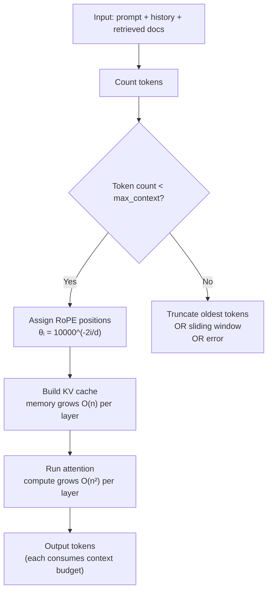
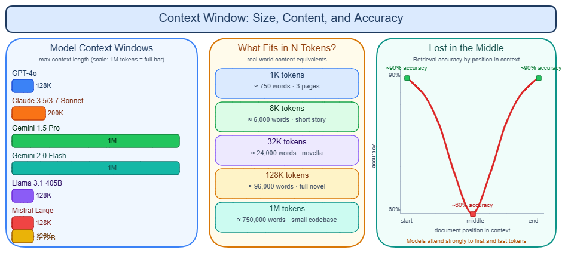

# Context Window

---

## What it is

Think of the context window like a whiteboard a model can see when generating its next word — everything on the board shapes the answer, but the board has a fixed size, and once it is full, adding new content means erasing something old.

The context window is the total number of tokens a model can process in a single forward pass, covering the system prompt, conversation history, retrieved documents, and generated output combined.

It is not a measure of memory or storage — the model retains no state between requests. Every API call is stateless; the entire context must be resent each time.

---

## How it works

### Why the limit exists

The root constraint is quadratic scaling in self-attention. Every token must compute a similarity score against every other token. For n tokens, that is n² operations per layer per attention head — both in time and in memory. Doubling the context quadruples the attention computation. A 100K-token context requires roughly 10,000× more compute than a 1K context under dense attention.

FlashAttention reduces the high-bandwidth memory (HBM) pressure of storing the full attention matrix, but it does not remove the quadratic FLOPs. → see [FlashAttention](flash-attention.md) for the full mechanics.

The KV cache adds a second constraint: it grows O(n) per layer with context length. A 70B model at 128K context needs roughly 40 GB of KV cache per user — exceeding single-GPU capacity. → see [KV cache](kv-cache.md) for the full treatment.

### How position is encoded within the window

A transformer has no built-in sense of order. Positional embeddings inject that information. The dominant approach today is RoPE.

**Absolute learned positions (BERT, GPT-2):** A lookup table indexed by position ID. Position IDs beyond the table have no representation — BERT was hard-capped at 512 tokens, GPT-2 at 1,024.

**RoPE — Rotary Position Embeddings (LLaMA, Mistral, Qwen, Gemini):** Rather than adding a position vector, RoPE rotates each query and key vector by an angle proportional to its position. The base frequency for dimension i is θᵢ = 10000^(−2i/d). Because the dot product between two rotated vectors depends only on their relative distance (m − n), the model learns position as *relative*, not absolute. This enables some generalization beyond training length — but only some.

The default RoPE base of 10,000 is tuned for ~4K tokens. At longer ranges, high-frequency dimensions complete more rotation cycles than seen during training, attention scores explode (reported above 8,000 in some analyses), and softmax normalization breaks entirely. This is not graceful degradation — it is catastrophic failure.

**NTK-aware scaling:** Modifies the RoPE base to `base_new = base × α^(d/(d−2))`, slowing all rotation frequencies proportionally. Works without fine-tuning for roughly 2–4× context extensions.

**YaRN (Peng et al., ICLR 2024):** Piecewise scaling per dimension — low-frequency dimensions get full linear interpolation, high-frequency dimensions stay unscaled, and middle dimensions get a ramp. Adds an attention temperature correction term. Achieves 128K context from LLaMA 2 with roughly 400–600 fine-tuning steps and under 2% degradation on MMLU, ARC, and HellaSwag.

**LongRoPE2 (Microsoft, February 2025):** Uses evolutionary search to find per-dimension rescaling factors, guided by needle-driven perplexity. Adds *mixed context window training* — rescaled RoPE for long sequences, original RoPE for short. Achieves LLaMA3-8B at 128K context with >98.5% short-context benchmark retention, using ~80× fewer training tokens than Meta's own 128K extension run.

### The token budget

Every part of the conversation competes for the same budget. The total must stay below the model's limit:

```
system prompt + history + retrieved docs + output tokens = context budget
```

Output tokens consume the same budget as input tokens. A model with a 128K window generating a 4K response has 124K available for input.

### Context flow



→ see [Autoregressive decoding](autoregressive-decoding.md) for how tokens are generated one at a time inside this budget.



### Advertised vs. effective context length

Context window sizes have grown dramatically: 4K (GPT-3.5, 2022) → 128K (GPT-4 Turbo, late 2023) → 1M (Gemini 1.5 Pro, 2024; GPT-4.1, 2025) → 10M (Llama 4 Scout, 2025). However, advertised size and usable size are not the same number.

**RULER (Hsieh et al., 2024)** replaced needle-in-a-haystack (NIAH) as the primary long-context benchmark. NIAH only tests simple single-fact retrieval. RULER adds multi-hop tracing, multi-needle aggregation, and variable-length distractors. Key findings:

- Only ~50% of models claiming ≥32K context reliably handle 32K on RULER tasks
- Yi-34B: 200K advertised → effective ~32K on complex tasks
- GPT-4: ~64K effective out of 128K advertised
- Llama 3.1-70B: 96.5% accuracy at 4K → 66.6% at 128K on independent benchmarks

**HELMET (Yen et al., 2025)** evaluated 59 models across 7 task categories and found that NIAH and RULER synthetic scores are weakly predictive of downstream performance. A model that scores well on RAG at 64K does not necessarily score well on multi-hop reasoning at 64K. There is no single "effective context length" number — it is task-dependent.

### The lost-in-the-middle problem

Liu et al. (2023) found that performance on multi-document QA follows a U-shape: highest when the relevant document is at the start or end, substantially lower when it is buried in the middle. In a 20-document setting:

- GPT-3.5-Turbo: 75.8% accuracy (beginning) → 53.8% (middle) — a 22-percentage-point drop
- Worst case: performance fell below the closed-book baseline of 56.1%, meaning the model performed worse *with* the document than without it

The cause is a combination of primacy bias (softmax over-routes attention to early tokens), recency bias from causal attention, and RoPE's natural decay of attention scores across long distances.

→ see [Attention mechanism](attention-mechanism.md) for how the softmax weighting that drives primacy bias works.

### Gotchas & production behavior

**Mental model pitfalls**

- **RoPE failure is a hard wall, not a slope.** A common assumption is that going slightly beyond a model's context limit produces slightly worse output. On base or instruct models without long-context fine-tuning, crossing the trained position limit by even one token produces incoherent output. The softmax normalization breaks from exploding attention scores. Users who extend context on unmodified base models hit this immediately.
- **Passing NIAH does not mean long context works.** HELMET (2025) confirmed formally what practitioners had observed: models that ace NIAH often fail at real long-context reasoning. RULER is the minimum bar; multi-hop benchmarks are the real test. Do not select a long-context model based on NIAH alone.
- **Effective context is task-dependent, not a single number.** A model may handle 64K tokens reliably for RAG-style lookup but collapse at 32K for multi-hop reasoning. There is no "safe" length that transfers across task types. Benchmark your specific task at your specific length before committing.

**Content placement and ordering**

- **Lost in the middle is a production reality.** Teams using long context for document QA, agent memory, or code review consistently report that content buried in the middle is missed. The mitigation is deliberate ordering: put the most important content at the beginning or end. Some teams reorder retrieved chunks by relevance score, placing highest-scoring chunks first and last.
- **Context stuffing is an anti-pattern.** Filling the window to maximum capacity often hurts quality and always increases cost and latency. The community term for treating context as a resource to optimize (not a bin to fill) is *context engineering*: use RAG for only relevant chunks, summarize long histories, cache static system prompts, and measure tokens-per-task.

**Extension and benchmark gaps**

- **Context extension fine-tunes often regress short-context performance.** LongRoPE2's mixed context window training was developed specifically to fix this regression — it fine-tunes on a mix of short and long sequences. If you extend a model's context yourself, measure short-context benchmarks (MMLU, ARC) before and after.
- **Advertised context numbers require verification for your task.** RULER data is widely cited: Yi-34B's 200K context reliably handles only ~32K on complex tasks. Community consensus is to benchmark specific models on specific tasks before trusting advertised lengths.

---

## Why it matters

This topic sits at the **Model serving** layer — the context window is the primary resource constraint that all downstream decisions in section 01 are organized around. Without understanding it, KV cache sizing, chunked prefill scheduling, and decoding strategies have no grounding.

Concretely: without this concept, you cannot reason about why a 128K context API call costs 50× more than a 1K call, why a multi-hop reasoning task fails at 32K on a model rated for 200K, or why retrieved documents placed in the middle of a prompt produce worse answers than the same documents placed at the top.

The anchor number: GPT-3.5-Turbo accuracy on multi-document QA drops 22 percentage points (75.8% → 53.8%) solely from moving the relevant document from the first position to the middle of a 20-document context.

---

## Key terms

| Term | Meaning |
|------|---------|
| Context window | Total token budget for one forward pass: system prompt + history + docs + output combined |
| RoPE | Rotary Position Embeddings — encodes position by rotating Q and K vectors; the dominant method in current LLMs |
| OOD positions | Out-of-distribution positions — token positions beyond the range seen during training; causes catastrophic RoPE failure |
| NTK-aware scaling | A training-free RoPE extension technique that slows all rotation frequencies proportionally; works for ~2–4× extension |
| YaRN | A fine-tuning-based RoPE extension that scales dimensions piecewise with an attention temperature correction |
| LongRoPE2 | Microsoft's 2025 technique using evolutionary search for per-dimension RoPE rescaling with mixed-length training |
| Lost in the middle | U-shaped accuracy pattern where content at the middle of a long context is attended to less than content at the edges |
| RULER | A long-context benchmark (2024) that replaced NIAH; tests multi-hop retrieval and aggregation, not just single-fact lookup |
| HELMET | A 2025 benchmark covering 59 models across 7 task types; showed NIAH/RULER scores weakly predict downstream task performance |
| Context engineering | The practice of treating context as a resource to optimize — using RAG, summarization, and prompt caching instead of stuffing |

---

## Code / demo

```python
# pip install tiktoken
import tiktoken

def context_budget(system: str, history: list[str], docs: list[str],
                   max_tokens: int = 128_000, reserved_output: int = 4_096) -> dict:
    """
    Measure how much context budget each part of a request consumes.
    Returns a breakdown and whether the request fits within the window.
    """
    enc = tiktoken.get_encoding("cl100k_base")  # GPT-4 / GPT-4o tokenizer

    counts = {
        "system":  len(enc.encode(system)),
        "history": sum(len(enc.encode(m)) for m in history),
        "docs":    sum(len(enc.encode(d)) for d in docs),
        "reserved_output": reserved_output,
    }
    counts["total"] = sum(counts.values())
    counts["available_for_input"] = max_tokens - reserved_output
    counts["fits"] = counts["total"] <= max_tokens

    for k, v in counts.items():
        if k not in ("fits",):
            print(f"  {k:22s}: {v:>7,} tokens")
    print(f"  {'fits in window':22s}: {counts['fits']}")
    return counts

context_budget(
    system="You are a helpful assistant.",
    history=["User: What is RoPE?", "Assistant: RoPE is Rotary Position Embedding..."],
    docs=["<long retrieved document text here>" * 50],
)
```

---

## My notes

- The lost-in-the-middle effect has a practical consequence that is easy to miss: with default chunk ordering from a vector DB (sorted by recency or insertion order), the highest-relevance chunks often land in the middle of the context. Reordering by relevance score and placing top chunks first and last is a low-cost mitigation.
- LongRoPE2's mixed context window training (short + long sequences in the same fine-tuning run) is now the approach to watch for context extension. The ~80× reduction in required training tokens over Meta's own 128K extension run is a significant practical threshold.
- The HELMET finding — that NIAH, RULER, and downstream task scores are weakly correlated — has not fully propagated into model selection practices. Teams still cite NIAH pass/fail as a proxy for long-context capability. → [Attention mechanism](attention-mechanism.md) explains why softmax weighting produces the primacy and recency biases that drive this.
- Chunked prefill is the serving-side response to large context inputs — splitting long prefill phases to avoid GPU memory spikes. → see [Chunked prefill](chunked-prefill.md) for how this interacts with the KV cache budget.
- "Context engineering" as a named discipline is a 2024–2025 emergence. The core insight — that every token in the window has a cost and an attention budget — is what ties token counting, RAG chunk sizing, prompt caching, and conversation summarization into a single design concern.

*Last researched: 2026-05-20*

---

## Resources

- Liu et al. (2023), "Lost in the Middle: How Language Models Use Long Contexts" — arXiv 2307.03172 (TACL 2023)
- Hsieh et al. (2024), "RULER: What's the Real Context Window Size of Your LLM?" — arXiv 2404.06654
- Peng et al. (2024), "YaRN: Efficient Context Window Extension of Large Language Models" — arXiv 2309.00071 (ICLR 2024)
