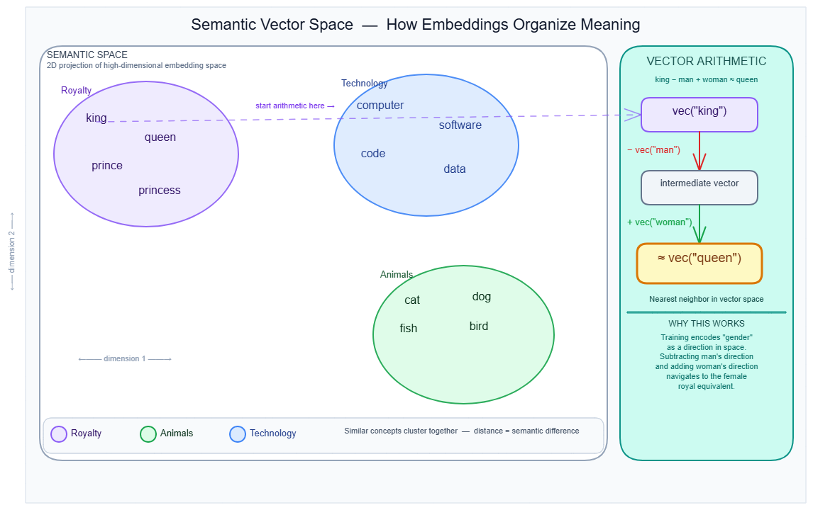
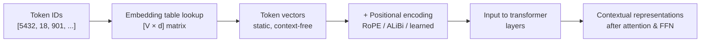

# Embeddings

---

## What it is

Think of an embedding like a seating chart in a theater, where every token gets assigned a specific seat — but instead of a single seat number, each token gets a coordinate in hundreds or thousands of dimensions, and tokens that "belong together" end up seated near each other.

An embedding is a dense, fixed-length float vector assigned to each token by a lookup table (a matrix of shape `[vocabulary_size × embedding_dimension]`) that is learned during training and encodes semantic and syntactic relationships as geometric position.

It is not a hand-coded dictionary or a symbolic feature vector — the semantic content of the vectors is never explicitly programmed. It emerges entirely from which tokens co-occur during training.

---

## How it works

### The embedding table: a lookup, not a transformation

The simple mental model: every token ID is an integer. The embedding layer is a giant matrix. Looking up a token's embedding is a single indexed row-read — no multiplication, no activation function.

At inference time the process is:

1. Tokenizer converts raw text to a sequence of integer token IDs. → see [Tokenization](tokenization.md)
2. Each integer indexes into the embedding matrix, retrieving that row as a float vector.
3. That vector becomes the model's working representation of the token — the input to every downstream layer.

```
Embedding matrix shape:  [V × d]
  V = vocabulary size    (e.g., 128,000 for LLaMA 3)
  d = embedding dimension (e.g., 4,096 for LLaMA 3 8B)

token_id = 5432  →  embedding = matrix[5432, :]  →  shape: [4096]
```

The learning happens only during training. Backpropagation computes gradients for the rows corresponding to tokens that appear in the current batch and updates only those rows. Tokens that appear rarely in the training corpus receive far fewer gradient steps — their rows remain noisy.

**Dimension divisibility constraint:** production embedding dimensions are always divisible by the number of attention heads. BERT's 768 dimensions = 12 heads × 64 dimensions per head. This is an architectural requirement because attention splits the embedding vector into per-head slices. → see [Attention mechanism](attention-mechanism.md)

**Memory cost at scale:** LLaMA 3's embedding table — 128,000 tokens × 4,096 dimensions × 2 bytes (bfloat16) — consumes approximately 1 GB just for the lookup table, before any transformer layers.

**Weight tying:** most LLMs share the embedding matrix between the input lookup and the output projection (the matrix that maps the final hidden state back to vocabulary logits). GPT-2 used this approach. It reduces total parameter count and improves sample efficiency for smaller models. At large scale, weight tying can hurt because the shared matrix is shaped by two competing objectives: representing input tokens well and scoring output logits well.

### From a table to meaning: why geometry encodes semantics

The vectors are not pre-defined. They emerge from training pressure: tokens that appear in similar contexts are pushed toward similar geometric positions. The classic demonstration is vector arithmetic — `king − man + woman ≈ queen`. The training process discovers that a gender direction and a royalty direction exist implicitly as axes in the space.



The diagram above shows a 2D projection of semantic space: royalty concepts cluster together (purple), animals (green), technology terms (blue). The right panel shows the step-by-step vector arithmetic that makes this possible.

### Static vs. contextual: what the embedding layer actually produces

A static embedding assigns one fixed vector per token regardless of surrounding context. Word2Vec and GloVe work this way — "bank" gets the same vector whether it means riverbank or financial institution.

Modern transformer models produce contextual representations, but this is widely misunderstood. The embedding table itself is still static — it always outputs the same vector for token ID 5432, regardless of what surrounds it. Contextual sensitivity is produced by the transformer layers downstream, through self-attention across the full token sequence.

This matters for code: calling `model.embeddings(token_ids)` in HuggingFace returns only the static lookup output, not a contextual representation. You need the full forward pass through all transformer layers to get contextually-refined vectors. → see [Transformer architecture](transformer.md)

### Positional embeddings: three generations

The transformer's self-attention is permutation-invariant. Given the same set of tokens in any order, it produces identical output unless position information is injected separately. Three generations of approach:

**1. Sinusoidal (original Transformer, 2017)**
Fixed vectors using alternating sine and cosine at varying frequencies. Not learned — no extra parameters. Can extrapolate beyond training length mathematically, but cannot learn position-specific patterns.

**2. Learned absolute positions (BERT, GPT-2)**
A second lookup table indexed by position ID (0, 1, 2, …). Learns position-specific patterns. Hard failure beyond max training length: position IDs outside the table have no representation. BERT's limit: 512 tokens. GPT-2's limit: 1,024 tokens. Any sequence beyond that is undefined behavior.

**3. RoPE — Rotary Position Embedding (LLaMA, GPT-NeoX, PaLM, most 2023+ models)**
Rather than adding a position vector to the token embedding, RoPE rotates the query and key vectors inside the attention computation using block-diagonal rotation matrices. The rotation angle for position `m` in dimension pair `i` is `m × θᵢ` where `θᵢ = 10000^(−2(i−1)/d)`. Because the attention dot product then depends on `(n − m)` — relative position — rather than absolute position, RoPE generalizes better to unseen sequence lengths.

The default RoPE base of 10,000 degrades above approximately 4,000 tokens. LLaMA 3 scales the base to 500,000, enabling stable context windows of 128k+ tokens. YaRN and other scaling methods extend this further.

**4. ALiBi — Attention with Linear Biases (Falcon, MPT)**
Does not modify embeddings at all. Adds a linear distance penalty directly to attention scores: nearby tokens are penalized less, distant tokens more. Strong extrapolation to sequences far longer than training length, at zero cost to embedding dimensionality.



### Matryoshka Representation Learning (MRL)

MRL trains a single embedding model to produce valid representations at multiple nested dimensionalities simultaneously. The first 8 values of a 2,048-dimensional vector form a valid 8-dimensional embedding; the first 128 values form a valid 128-dimensional embedding. Users can truncate to 256 or 512 dimensions and still outperform older full-dimension models.

OpenAI's `text-embedding-3` series exposes this directly — you can request dimension 256 via API parameter and receive a truncated but fully functional vector. Adaptive retrieval using this property — shortlisting with `d=32`, reranking with `d=512` — yields approximately 14× wall-clock speedup at equivalent accuracy.

MRL is primarily relevant when using embeddings for retrieval. → see [Embedding models](../04-retrieval-memory/embedding-models.md) for full coverage.

### Reference: embedding dimensions by model

| Model | Embedding dimension | Vocabulary size |
|---|---|---|
| GPT-2 small | 768 | 50,257 |
| BERT-base | 768 (12 heads × 64) | 30,522 |
| GPT-3 | 12,288 | 50,257 |
| LLaMA 3 (8B) | 4,096 | 128,000 |

### Gotchas & production behavior

**Cosine similarity pitfalls**

- Cosine similarity scores are not semantic guarantees. They depend on how the model was trained and what regularization was applied. A model fine-tuned on classification or NLI objectives with a dot-product loss may produce embeddings where cosine similarity is mathematically arbitrary — applying a diagonal rescaling matrix changes all pairwise cosine similarities while leaving the underlying predictions unchanged. (arxiv:2403.05440) Validate distance metrics against your actual task before hardcoding any threshold.

- Thresholds calibrated on one model do not transfer to another. A threshold from a tutorial — often `0.8` for "similar enough" — carries no consistent semantic meaning across models or domains. All thresholds must be empirically derived on a held-out sample from the target domain.

**Anisotropy: the narrow cone problem**

- Transformer embedding spaces are anisotropic — vectors cluster in a narrow cone of the high-dimensional space rather than distributing uniformly. This is not a training data artifact; a 2024 paper (arxiv:2401.12143) confirmed it is intrinsic to the self-attention mechanism, present across modalities and training objectives. Average inter-token cosine similarity of 0.5–0.7 is common even for semantically unrelated tokens. In an anisotropic space, a threshold of `0.8` may pass 95% of all pairs. Clustering algorithms can merge semantically distinct groups because all pairs appear highly similar.

- Workaround: apply whitening or mean-centering as a post-processing step before using cosine similarity. Models trained with contrastive objectives (SimCSE, MNRL) are substantially less affected because contrastive training explicitly pushes unrelated vectors apart.

**The "contextual" label misleads**

- Engineers assume that calling the embedding layer in a BERT-family model returns a contextual representation. It does not. The embedding layer is a static lookup table. Calling `model.embeddings(token_ids)` in HuggingFace returns the same vector for each token ID regardless of context. You must run the full forward pass through all transformer layers to get contextually-refined vectors.

**Rare token degradation**

- Subword tokenization (BPE, WordPiece) eliminates hard OOV (out-of-vocabulary) failures, but it does not fix gradient sparsity. Tokens appearing fewer than approximately 100 times in the training corpus receive too few gradient updates to develop reliable geometric positions. Domain-specific terms, neologisms, and low-resource language tokens are disproportionately affected. Audit token frequency distributions before assuming uniform embedding quality across your vocabulary — especially for medical, legal, and code-heavy applications.

**Hubness in high dimensions**

- Above approximately 1,024 dimensions for large corpora, a small fraction of embedding vectors become nearest neighbors to a disproportionate number of queries. These "hub" vectors corrupt nearest-neighbor search — queries that should return diverse results all return the same few hub vectors. This is a known mathematical property of high-dimensional spaces, not a model defect. Dimensionality reduction or hubness-corrected similarity metrics (e.g., CSLS) are the practical mitigation.

---

## Why it matters

This topic sits at the **Model serving** layer — the embedding layer is the first computation in every transformer forward pass and the mechanism by which all downstream processing acquires input signal. Without understanding embeddings, you cannot reason about context window limits (why a BERT model crashes at token 513), why positional encoding choice controls the maximum useful context length, or why fine-tuning on narrow domains can silently degrade representation quality for tokens that rarely appear in fine-tuning data.

For every downstream topic in this section — attention, KV cache, batching strategy — the embedding dimension `d` is the fundamental unit: it determines memory per token, compute per attention head, and cache size. LLaMA 3 8B's 4,096-dimensional embeddings at 128k context produce a KV cache of approximately 32 GB in fp16, entirely determined by `d`.

---

## Key terms

| Term | Meaning |
|------|---------|
| Embedding dimension (`d`) | The number of float values in each token's vector; determines memory per token and compute per attention head |
| Weight tying | Sharing the embedding matrix between input lookup and output (unembedding) projection to reduce parameter count |
| Anisotropy | The geometric property of transformer embeddings clustering in a narrow cone rather than distributing uniformly; causes cosine similarity scores to concentrate near high values for all pairs |
| RoPE | Rotary Position Embedding — encodes position by rotating Q/K vectors in attention, enabling relative position sensitivity and better length generalization than learned absolute positions |
| ALiBi | Attention with Linear Biases — injects positional information as a distance penalty on attention scores, not in the embedding space |
| MRL | Matryoshka Representation Learning — trains a single model to produce valid embeddings at multiple nested dimensionalities; enables dimension truncation without retraining |
| Hubness | A high-dimensional geometry problem where a small set of vectors become nearest neighbors to an outsized fraction of queries, corrupting retrieval results |
| Static embedding | One fixed vector per token regardless of surrounding context; the output of the embedding table before any transformer layers |
| Contextual embedding | A token representation refined by transformer layers using self-attention over the full sequence; not produced by the embedding table alone |

---

## Code / demo

```python
# pip install torch

import torch
import torch.nn as nn

# A minimal embedding layer: vocabulary of 1000 tokens, dimension 64
embedding = nn.Embedding(num_embeddings=1000, embedding_dim=64)

# Simulate a tokenized sequence: 5 token IDs
token_ids = torch.tensor([42, 7, 318, 5, 99])

# Lookup: this is a table read, not a computation
vectors = embedding(token_ids)
print(f"Input token IDs shape:  {token_ids.shape}")   # [5]
print(f"Output vectors shape:   {vectors.shape}")      # [5, 64]

# Demonstrate that the same token ID always produces the same vector (static)
same_token = torch.tensor([42, 42])
out = embedding(same_token)
print(f"Same token, same vector: {torch.allclose(out[0], out[1])}")  # True

# Cosine similarity between two token vectors
a, b = vectors[0], vectors[1]
cos_sim = torch.nn.functional.cosine_similarity(a.unsqueeze(0), b.unsqueeze(0))
print(f"Cosine similarity (random init, meaningless): {cos_sim.item():.4f}")

# Memory estimate for a production embedding table
V, d, bytes_per_value = 128_000, 4_096, 2  # LLaMA 3, bfloat16
size_gb = (V * d * bytes_per_value) / 1e9
print(f"LLaMA 3 embedding table: {size_gb:.2f} GB")  # ~1.05 GB
```

> Note: random initialization means cosine similarities here are meaningless. Semantic geometry only emerges after training on large corpora.

---

## My notes

- The anisotropy finding (arxiv:2401.12143) changed how I think about cosine similarity thresholds. The problem is not fixable by choosing a better model — it is structural to self-attention. Any pipeline relying on hard cosine thresholds needs empirical calibration, not theoretical reasoning.

- The static-vs-contextual confusion is the single most common mental model error I observe. It is not a beginner mistake — engineers with years of PyTorch experience still call `model.embeddings()` expecting contextual output. The HuggingFace API naming reinforces the confusion.

- Weight tying is still the default in many open-source LLMs for parameter efficiency. At 8B+ scale it is worth checking whether untied embeddings improve quality on your target distribution — the tradeoff between parameter count and representation fidelity is not settled in the literature.

- RoPE base scaling (10,000 → 500,000) is essentially a hyperparameter that controls the context window, yet it is rarely exposed or documented in deployment tooling. A model with RoPE base 10,000 used at 32k context will silently degrade without any error or warning.

- Rare token quality is the silent risk in domain adaptation. Fine-tuning frequency distributions rarely match pretraining distributions, so domain-specific terms that were rare in pretraining remain geometrically unreliable even after fine-tuning on domain data. Embedding audits (checking token frequency in pretraining against target vocabulary) are underused.

*Last researched: 2026-05-19*

---

## Resources

1. Mikolov et al., "Efficient Estimation of Word Representations in Vector Space" (Word2Vec, 2013) — https://arxiv.org/abs/1301.3781
2. Kusupati et al., "Matryoshka Representation Learning" (2022) — https://arxiv.org/abs/2205.13147
3. Steck et al., "Is Cosine-Similarity of Embeddings Really About Similarity?" (WWW 2024) — https://arxiv.org/abs/2403.05440
