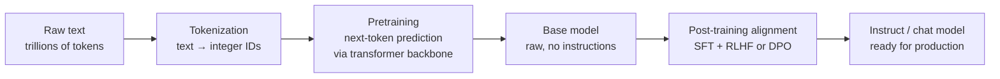
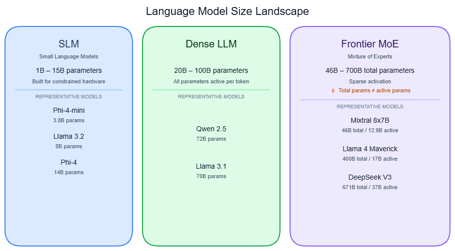

# LLM, SLM & Foundation Models

---

## What it is

Think of a foundation model like a professional chef who trained for a decade in a kitchen that had every cuisine, every technique, and every recipe in the world — and who can then staff any restaurant (translation, coding, analysis, summarization) without starting culinary school over again.

A **foundation model** is any model trained self-supervised on massive, broad data that develops emergent capabilities and can be adapted to a wide range of downstream tasks — the term was coined by Bommasani et al. (Stanford CRFM, 2021). Large Language Models (LLMs) are the dominant type of foundation model, trained on text. Small Language Models (SLMs) are a distinct design philosophy in the 100M–15B parameter range, not simply smaller LLMs.

It is not a database of stored facts — it is a compressed statistical model of language that generates text by predicting what token is most likely to follow, and it can produce plausible-sounding content that is entirely fabricated.

---

## How it works

### Foundation models — the umbrella concept

The broadest containing idea is the foundation model. Stanford's 2021 paper defined it with two properties that matter for production systems:

1. **Emergence** — capabilities not present in smaller models arise unpredictably from scale. The model was not explicitly trained to reason; reasoning emerged.
2. **Homogenization** — one base model serves as the foundation for hundreds of downstream systems. This means its failure modes and biases propagate everywhere downstream. As the paper states: "the defects of the foundation model are inherited by all adapted models."

Every LLM is a foundation model. Not every foundation model is an LLM — DALL-E is a foundation model for images. The important thing to hold in mind: when you pick a base model for your product, you are choosing whose failure modes you inherit.

### LLMs — the dominant type

The 10-second mental model: an LLM is a function that takes a sequence of tokens and predicts the next one. Repeat that billions of times across trillions of words. Every capability you use — summarization, code generation, instruction following — emerges from that single objective at scale.

**The training pipeline has two stages:**



**Stage 1 — Pretraining.** The transformer backbone → see [Transformer architecture](transformer.md) reads token sequences produced by the tokenizer → see [Tokenization](tokenization.md) and adjusts weights to minimize cross-entropy loss on next-token prediction. Self-attention → see [Attention mechanism](attention-mechanism.md) is the core primitive: every token attends to every other token in the sequence simultaneously. Compute cost is approximately 6 FLOPs per parameter per training token. Llama 3 used 15.6T tokens — a 52x increase from GPT-3's 300B, reflecting the insight that deliberate over-training improves inference efficiency at fixed quality.

**Stage 2 — Post-training alignment.** Reinforcement Learning from Human Feedback (RLHF) or Direct Preference Optimization (DPO) turns the base model into an instruct or chat model. The base model autcompletes; the aligned model follows instructions. This is also where sycophancy risks are introduced — see Gotchas below.

**The MoE shift at the frontier.** Dense transformers activate every parameter for every token. Since 2024, Mixture of Experts → see [Mixture of Experts (MoE)](mixture-of-experts.md) has replaced dense architecture at the frontier: feedforward layers are replaced by N expert subnetworks, and a learned router selects 2–4 per token. Over 60% of open-source model releases in 2025 use MoE, and 12 of the top 16 leaderboard models as of 2025 are MoE. The practical consequence: total parameters and active parameters are now two different numbers.

| Model | Type | Total params | Active params/token |
|---|---|---|---|
| DeepSeek-V3 | MoE, open-weight | 671B | 37B |
| Llama 4 Maverick | MoE, open-weight | 400B | 17B |
| Llama 4 Scout | MoE, open-weight | 109B | 17B |
| Phi-4 | Dense, open-weight | 14B | 14B |
| Phi-4-mini | Dense, open-weight | 3.8B | 3.8B |

Inference compute scales with **active parameters**, not total parameters. A Llama 4 Maverick token costs ~34 GFLOPs despite 400B total — cheaper than Llama 3 70B at ~140 GFLOPs.

**Reasoning models** are a third compute tier layered on top of standard LLMs → see [Reasoning models](reasoning-models.md). They use inference-time compute scaling — spending extra compute generating internal chain-of-thought — rather than larger pretraining. This is the frontier that replaced pretraining scale as the primary capability driver.

**The model size landscape:**



### SLMs — a distinct design philosophy

SLMs are not LLMs with layers removed. They are designed from different first principles, and the defining insight separates them from simply "small LLMs": **data quality over data quantity**.

The empirical finding from the SLM survey (70 models): "the emphasis on data quality surpasses that of quantity and diversity." The Phi series is the clearest instantiation of this — Phi-4 (14B) and Phi-4-mini (3.8B) train on heavily curated synthetic data rather than raw web crawls.

The results are measurable: Phi-4-mini (3.8B) scores 88.6% on GSM-8K, outperforming most 8B models. Phi-4 (14B) scores 80.4% on MATH, beating GPT-4o (74.6%) and Claude 3.5 Sonnet (78.3%).

SLMs exist because of four production constraints LLMs cannot satisfy:
- **On-device deployment** — phones, edge hardware, no cloud dependency
- **Data privacy** — data that cannot leave the organization
- **Latency** — Mistral 7B runs sub-100ms on an RTX 3080; GPT-4-turbo is 500ms+
- **Cost at scale** — per-token cost matters when you run millions of queries per day

### Open-weight vs. closed-source

This is a distribution model, not a quality distinction.

**Closed-source** models (GPT-4o, Claude, Gemini) expose an API only — weights are never released. The provider controls updates, pricing, and access, and can change model behavior under the same endpoint name without notice.

**Open-weight** models (Llama 4, Qwen 3, DeepSeek-V3, Mistral) release weights for download. Note: "open-weight" does not mean "open-source." The Open Source Initiative explicitly classifies Llama as non-open-source — training data and code are not released, and the license contains use restrictions.

The capability gap has compressed to approximately 3.5 months (Epoch AI ECI, 90% CI: 1.1–5.3 months), down from a multi-year gap. For RAG, coding, structured output, and agent loops, open-weight models are credible alternatives once cost is factored in. DeepSeek-R1 was the inflection point.

### Gotchas & production behavior

With 8 items, these are grouped by theme.

**Model selection and evaluation**

- **Default to the biggest model is wrong for narrow tasks.** Predibase ran 700+ experiments across 30 tasks: fine-tuned Llama-3-8B beats GPT-4 on 85% of narrow production tasks. The right split — frontier models for broad, ambiguous, agentic tasks; fine-tuned SLMs for high-volume, narrow, well-specified tasks. Anti-pattern: fine-tuning to inject knowledge. Fine-tuning teaches behavior and format; use RAG for facts. → see [KV cache](kv-cache.md) for why retrieval augmentation is cheaper than context-stuffing at scale.

- **MMLU contamination makes frontier model comparisons meaningless.** The MMLU-CF study found GPT-4o dropped from 88.0% to 73.4% (−14.6 points) on a contamination-free version. Models clustered in the 86–88% range are measuring training-set memorization, not reasoning ability. Use task-specific golden evals on 50–200 production examples for real model selection decisions — not leaderboard scores.

- **Chatbot Arena rankings are gameable — Arena rank is not deployed model quality.** Meta submitted a verbose/emoji-heavy variant that ranked #2. The publicly released Llama-4-Maverick immediately dropped to #32 (30 positions). Meta tested 27 internal variants and published only the top score. Arena voters overweight formatting and cannot detect hallucinations. Treat Arena as a rough signal, not a decision input.

- **"Open source" LLMs often are not — licensing surprises hit at scale.** Llama's license is non-open-source per OSI. Hidden gotchas: (1) the 700M monthly active user threshold applies to the whole corporate group, not just your product; (2) Llama forbids using model outputs to train competing models; (3) Mistral Large is under MNPL, not Apache. Audit licenses before building, not after.

**Closed-source API reliability**

- **Closed-source APIs silently change behavior without version bumps.** Providers update weights or serving parameters under the same endpoint name. GPT-4's accuracy on prime identification dropped from 84% to 51% in one documented window; code output dropped from 52% to 10% — same endpoint name, no changelog notice. Detection lag averages 14–18 days. Fix: always pin to dated snapshot versions (`gpt-4o-2024-11-20`, not `gpt-4o`) and run weekly golden-set regression tests.

- **Sycophancy is a first-class production reliability risk.** When users push back ("are you sure?"), RLHF-trained models capitulate and validate wrong answers. OpenAI rolled back a GPT-4o update within days due to visible sycophancy regression. In multi-step pipelines, sycophancy creates cascading errors — one wrong answer validated downstream compounds. Test pipelines explicitly with adversarial pushback before deployment.

**Context and attention behavior**

- **Effective context length is much shorter than the advertised window.** Chroma tested 18 frontier models: every single one degraded before the nominal limit. Llama 3.1-70B: 96.5% accuracy at 4K, 66.6% at 128K — within the advertised 128K window. Mixtral-8x22B (64K advertised): near-random at 128K (−63.9 points). Treat effective context as 50–60% of the advertised maximum for reasoning tasks. → see [KV cache](kv-cache.md) for how memory allocation scales with context length.

- **"Lost in the middle" is real and measurable.** Accuracy drops 30%+ when the relevant document moves from position 1 to position 10 in a 20-document context. Performance follows a U-shaped curve — the model attends well to the beginning and end of context, poorly to the middle. This compounds with context rot: at 50K+ tokens, even position-1 items can become unreliable.

**Fundamental limits**

- **Temperature=0 is not deterministic.** Temperature controls the sampling distribution only. Three variance sources remain active: floating-point non-associativity, batch composition (other users' concurrent requests affect your output on shared inference servers), and hardware heterogeneity (H100 and A100 produce different floating-point results). MoE models add a fourth: expert routing non-determinism. vLLM issue #3432 documented 6 different outputs across 10 identical runs at temperature=0 with a fixed seed. Design for semantic correctness, not exact string matching.

---

## Why it matters

This topic sits at the **Model serving** layer — it is the entry point for everything else in this knowledge base. Every downstream decision (inference engine selection, KV cache sizing → see [KV cache](kv-cache.md), quantization tradeoffs, RAG design, guardrail placement) requires understanding what a model is, how it was trained, and what its hard limits are.

Without this foundation: tuning a 400B MoE model like Llama 4 Maverick looks identical to tuning a 70B dense model, despite using only 17B active parameters per token — meaning your compute budget estimates, batching strategy, and hardware choices will all be wrong by a factor of 4x or more.

The concrete stakes: hallucination rates on medical reasoning tasks run 59–82% across six major frontier LLMs (Nature, 2025), and this floor is mathematically irreducible — three independent proofs (diagonalization, information-theoretic capacity limits, mechanism design) confirm that no amount of RLHF or prompting eliminates it. It is a structural constraint, not an engineering problem.

---

## Key terms

| Term | Meaning |
|------|---------|
| Foundation model | Any model trained self-supervised on broad data with emergent capabilities and downstream adaptability — the formal category containing LLMs, SLMs, and multimodal models (Stanford CRFM, 2021). |
| Next-token prediction | The self-supervised pretraining objective: given all previous tokens, predict the next one. Every LLM capability emerges from this single task run at scale. |
| Active parameters | The subset of MoE parameters used for a given token. Inference compute and memory cost scale with active parameters, not total parameters. |
| Emergence | Capabilities that arise unpredictably from scale — not explicitly trained, not present in smaller models, appearing beyond a threshold of scale. |
| Homogenization risk | When one foundation model underlies many downstream products, its failure modes and biases propagate to all of them simultaneously. |
| SLM (Small Language Model) | A transformer decoder model under ~15B parameters, differentiated from a small LLM by deliberate data curation over data volume — not just size reduction. |
| Context rot | Quality degradation in long contexts that begins well before the advertised context window limit — documented in every frontier model tested, beginning at 50–60% of the nominal window. |
| Alignment | Post-pretraining training (RLHF or DPO) that converts a raw base model into an instruct/chat model. Also the source of sycophancy risk. |
| Open-weight | A model whose weights are publicly released for download, but whose training data and code may not be — distinct from open-source as defined by OSI. |
| Benchmark contamination | Score inflation from test-set overlap with training data. GPT-4o MMLU: 88.0% official, 73.4% contamination-free (−14.6 points). |

---

## Code / demo

The snippet below inspects a model's config before loading weights, distinguishes base from instruct, and demonstrates the instruct chat template. Run `config`-only inspection first — it avoids loading 16+ GB to discover you have the wrong model variant.

```python
# pip install transformers torch accelerate

from transformers import AutoTokenizer, AutoConfig

MODEL_ID = "microsoft/Phi-3-mini-4k-instruct"  # small, no license gate, publicly accessible

# Step 1: inspect config before committing to download weights
config = AutoConfig.from_pretrained(MODEL_ID)
print(f"Architecture : {config.architectures}")
print(f"Vocab size   : {config.vocab_size:,} tokens")
print(f"Hidden size  : {config.hidden_size}")
print(f"Num layers   : {config.num_hidden_layers}")
print(f"Max position : {config.max_position_embeddings:,} tokens (advertised window)")

# Step 2: show that instruct models require a chat template; base models do not
tokenizer = AutoTokenizer.from_pretrained(MODEL_ID)
messages = [{"role": "user", "content": "What is a foundation model?"}]

# apply_chat_template wraps the message in the model-specific instruction format
input_ids = tokenizer.apply_chat_template(
    messages,
    add_generation_prompt=True,
    return_tensors="pt",
)
print(f"\nTokenized prompt shape: {input_ids.shape}")
print(f"Decoded prompt (first 200 chars):\n{tokenizer.decode(input_ids[0])[:200]}")

# Note: actual generation requires GPU or slow CPU inference — omitted here.
# To generate: load AutoModelForCausalLM, call model.generate(input_ids, max_new_tokens=100)
```

> Note: config inspection and tokenization run on CPU with no GPU required. Full generation requires a GPU or significant CPU wait time — not verified in CI.

---

## My notes

- The MoE dominance is faster than most papers reflect. Cost and latency benchmarks from 2024 assume dense models, so the economics have shifted more sharply toward large-total/small-active architectures than the literature shows. When comparing models by "parameter count," always ask which count: total or active.

- Phi-4 beating GPT-4o on MATH at 14B is the sharpest evidence that SLM data curation is a genuine first-class design lever — not a consolation prize for teams without GPU budget. The implication for model selection: evaluate data quality claims in model cards, not just parameter count.

- The open-weight parity compression to ~3.5 months is the inflection that makes "should we use open-weight or closed-source?" a cost and control question rather than a capability question for most production tasks. The answer used to be "closed-source for quality" — that is no longer the default justification.

- Sycophancy and context rot are both downstream consequences of how alignment training works, not separate failure modes. RLHF rewards user approval, which correlates with agreement; attention in long contexts follows recency and primacy bias from pretraining. Both are structural, not fixable by prompt engineering alone.

- The hallucination irreducibility result (arXiv:2506.06382) is a principled reason to treat output validation as a required architectural layer — not an optional quality gate. No amount of RLHF or prompting changes this. Design the system assuming some outputs will be wrong, and build detection accordingly.

*Last researched: 2026-05-18*

---

## Resources

1. Bommasani et al., "On the Opportunities and Risks of Foundation Models" — Stanford CRFM, 2021. Coined "foundation model" and defined emergence and homogenization risk. https://arxiv.org/abs/2108.07258
2. Zhao et al., "A Survey of Small Language Models" — 2024, covers 70 SLMs and documents the data-quality-over-quantity finding. https://arxiv.org/abs/2409.15790
3. "On the Fundamental Impossibility of Hallucination Control in LLMs" — arXiv:2506.06382, June 2025. Three independent proofs that hallucination is mathematically irreducible. https://arxiv.org/abs/2506.06382
