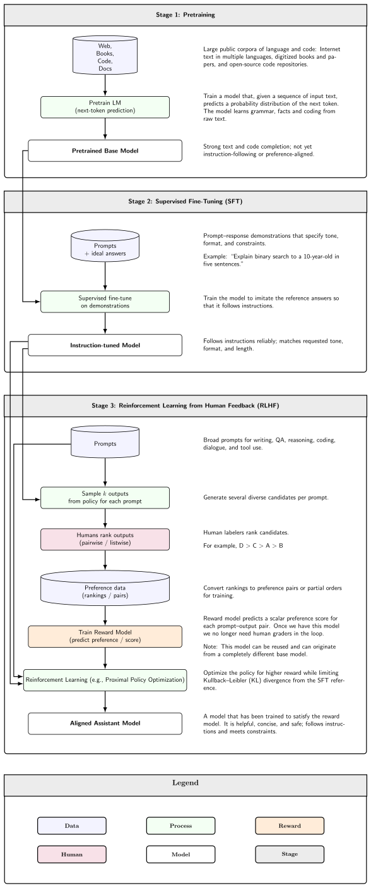

# LLM, SLM & Foundation Models

---

## What it is

Think of a foundation model like a master apprentice who reads every book ever written and then can be handed any job in the building — translation, summarization, coding, analysis — without retraining from scratch. A **large language model (LLM)** is a neural network, almost always transformer-based, trained via self-supervised next-token prediction on massive text corpora until it develops emergent capabilities far beyond explicit pattern matching. It is not a database of stored facts — it is a compressed statistical model of language that sometimes confabulates plausible-sounding content that never existed.

---

## How it works

### Pretraining, alignment, and the MoE shift

The 10-second mental model: an LLM is a giant function that takes a sequence of tokens and predicts the next one, repeated billions of times across trillions of words until the weights encode language, reasoning, and world knowledge. Every capability you use at inference time — summarization, code generation, instruction following — emerges from that one objective.

**The two-stage training pipeline** is shown below:



**Stage 1 — Pretraining.** The model reads tokens and predicts what comes next, adjusting weights via backpropagation. The compute cost is approximately 6 FLOPs per parameter per training token. GPT-3 consumed 300B tokens; Llama 3 consumed 15.6T — a 52x increase in four years, driven by the insight that more data beats Chinchilla-optimal training when you want inference efficiency (Llama 3 8B trains at 1,875 tokens per parameter vs. the Chinchilla-optimal ~20).

**Stage 2 — Alignment.** Reinforcement Learning from Human Feedback (RLHF) or Direct Preference Optimization (DPO) teaches the pretrained model to be helpful, harmless, and honest. This is where the base model becomes the instruct or chat model you interact with.

**Self-attention** is the core computational primitive. For every token in the input sequence, the model computes a weighted sum over all other tokens simultaneously — regardless of distance. Multiple attention heads run in parallel, each learning different relationship types (syntactic agreement, coreference, semantic similarity). GPT-2 small uses 12 heads; Llama 3 70B uses 64 heads grouped under Grouped Query Attention (GQA) to reduce memory.

**The MoE shift.** Dense transformers activate every parameter for every token. Mixture-of-Experts (MoE) replaces the feedforward sublayers with N expert subnetworks and a router that selects 2–4 experts per token. Over 60% of open-source model releases in 2025 use MoE. Mixtral 8x7B has 46B total parameters but only 12.9B active per token (28% activation ratio). Llama 4 Maverick has 400B total with 17B active. The practical gain is 3–5x lower inference compute per token at equivalent quality versus a dense model of the same capability.

**Reasoning models** are a third training stage layered on top. Models like DeepSeek-R1 and OpenAI o3 use reinforcement learning on reasoning quality — not just human preference — causing the model to spend extra inference compute generating an internal chain-of-thought before answering. o3 in high-compute mode uses 172x more compute than low mode. This is inference-time compute scaling, the frontier that replaced pretraining scaling as the primary driver of capability gains.

**Foundation model vs. LLM.** The term "foundation model" was coined by Bommasani et al. (Stanford, 2021) to describe any model with three properties: trained self-supervised on massive data, capable of emergent behaviors beyond explicit training, and adaptable via prompting or fine-tuning. Every LLM is a foundation model. Not every foundation model is an LLM — DALL-E is a foundation model for images, not language.

**SLMs** (Small Language Models) have no universally agreed size boundary; the working definition is under ~10–15B parameters, designed to run on constrained hardware. The key insight from the Phi series is that data quality matters more than raw size: Phi-4-mini (3.8B) matches models 10–25x larger on reasoning benchmarks because it trained on carefully curated synthetic data rather than raw web text.

**Key size anchors:**

| Model class | Total params | Active params per token |
|---|---|---|
| Frontier dense (Llama 3 70B) | 70B | 70B |
| Frontier MoE (Llama 4 Maverick) | 400B | 17B |
| Frontier MoE (GPT-4, reported) | ~1.8T | ~50B est. |
| SLM (Phi-4) | 14B | 14B |
| SLM (Phi-4-mini) | 3.8B | 3.8B |

**Inference compute** is approximately 2 FLOPs per parameter per token for the active parameters. A Llama 3 8B model generating one token costs ~16 GFLOPs. A Llama 4 Maverick token costs ~34 GFLOPs despite 400B total parameters — cheaper than Llama 3 70B (~140 GFLOPs).

### Gotchas & production behavior

- **Advertised context window is not usable context window.** Testing across 18 frontier models shows quality degradation ("context rot") starting at 50K–150K tokens regardless of the nominal maximum. A model advertised at 128K tokens does not deliver 128K tokens of reliable comprehension. Treat 16K–64K as the practical ceiling until you measure your specific task.

- **"Lost in the middle" is real and measurable.** Accuracy drops 30%+ when the relevant document moves from position 1 to position 10 in a 20-document context. Performance follows a U-shaped curve: the model attends well to the beginning and end of context, poorly to the middle.

- **Ollama silently truncates context instead of erroring.** When a conversation exceeds `num_ctx`, Ollama drops messages from the front — including the system prompt — with no warning, no error signal, and no API indication. Default `num_ctx` is 2,048 tokens. Setting `num_ctx` via API options is often silently clamped to 3,000–5,000 tokens. Set it in the Modelfile instead. (Ollama issues #8531, #10974, #14259)

- **Llama 3 degrades sharply under quantization; Mistral does not.** At IQ4_XS quantization, Llama 3 8B shows 7.07% perplexity degradation versus 2.2% for Mistral 7B at the same level. At Q4, Llama 3 fails on tasks requiring early-context instruction adherence. Use Q5_K_M or Q8_0 for Llama 3. (llama.cpp discussion #6901)

- **vLLM pre-allocates KV cache for the full declared context length.** Loading a model with a 1M token context window on an 80 GB GPU triggers an OOM during KV cache profiling — before a single request is served. Pass `--max-model-len` explicitly to cap KV cache allocation. (vLLM issue #5847)

- **Forcing JSON output degrades reasoning by 10–15%.** Grammar-constrained decoding interferes with chain-of-thought. The production pattern that works: free-text reasoning first, then a second structured-extraction call. If you must use constrained generation in one pass, keep schemas flat (3 levels maximum).

- **A transformers patch upgrade can silently cause OOM.** Upgrading `transformers` 4.37.2 to 4.38.x caused Llama to consume +1 GB at sequence length 1,280 and fail above 1,536 on a 24 GB GPU — same code, same hardware, patch version bump only. Cause: SDPA (Scaled Dot-Product Attention) kernel switch in `LlamaSdpaAttention`. Fix: pass `attn_implementation="flash_attention_2"`.

- **Benchmark scores are contaminated.** MMLU, ARC, and Hellaswag scores for major open models carry 3–8 percentage point contamination from training data overlap. Use LiveBench or task-specific held-out evals for real model selection decisions.

- **Base model vs. instruct model is the most common beginner failure.** Base models autocomplete; instruct models follow instructions. The symptom: the model echoes your question or generates training-data-like continuations instead of answering. Always verify the `-Instruct`, `-Chat`, or `-it` suffix.

- **Tool calling must be validated per model + runtime + schema combination.** Qwen 3.5 in Ollama has non-functional tool calling due to pipeline routing sending the wrong format. After context grows, Qwen3:14b spontaneously switches from structured to plaintext tool calls. Sampling parameters like `repeat_penalty` are silently discarded in Ollama's Go runner. Do not assume tool calling works because the model card says it does — test your exact combination.

- **Fine-tuned 7–8B SLMs outperform frontier LLMs on narrow tasks.** Six of ten fine-tuned models under 8B outperformed zero-shot GPT-4 on task-specific benchmarks. The crossover tasks: classification, entity extraction, structured summarization, SQL generation. Open-ended reasoning and novel code still favor scale.

---

## Why it matters

LLMs and SLMs sit at the **Model serving** layer — they are the core artifact everything else in this stack (inference engines, quantization, KV caching, RAG, guardrails) is built around. Without understanding what a model is, how it was trained, and what its fundamental limits are, every downstream architectural decision becomes guesswork. The concrete stake: hallucination rates on medical reasoning tasks run 59–82% across six major frontier LLMs (Nature, 2025), and that floor is mathematically irreducible — for any enumerable set of LLMs, there exists a computable function every model hallucinates on, a result that follows from the same diagonalization argument underlying the Halting Problem.

---

## Key terms

| Term | Meaning |
|------|---------|
| Next-token prediction | The self-supervised pretraining objective: given all previous tokens, predict the next one. Every LLM capability emerges from this single task run at scale. |
| Foundation model | A model trained self-supervised on massive data with emergent capabilities and adaptability via prompting or fine-tuning — the formal term coined by Stanford CRFM (2021). |
| MoE (Mixture of Experts) | An architecture where feedforward layers are replaced by N expert subnetworks; a learned router selects 2–4 per token, reducing active parameters without reducing total capacity. |
| Active parameters | The subset of MoE parameters actually used for a given token. Inference compute scales with active parameters, not total parameters. |
| SLM (Small Language Model) | Informally, a model under ~10–15B parameters designed for constrained hardware; differentiated from a small LLM by deliberate data curation, not just size reduction. |
| Context rot | Quality degradation in long contexts that begins well before the advertised context window limit — typically at 50K–150K tokens for frontier models. |
| Alignment | The post-pretraining stage (RLHF or DPO) that trains a base model to be helpful, harmless, and honest, producing the instruct/chat model. |
| Reasoning model | A model trained with RL on reasoning quality, spending extra inference compute on chain-of-thought before answering — a distinct capability tier from standard instruct models. |
| Tokens per parameter | A training efficiency metric: Llama 3 8B at 1,875 tokens/param deliberately over-trains vs. Chinchilla-optimal (~20) to maximize inference throughput at fixed quality. |

---

## Code / demo

The snippet below loads a quantized Llama 3 model via the HuggingFace Hub, runs a generation, and prints the active parameter count. It illustrates the base-vs-instruct distinction and shows how to read a model's config before committing memory.

```python
# pip install transformers accelerate torch

from transformers import AutoTokenizer, AutoModelForCausalLM, AutoConfig
import torch

MODEL_ID = "meta-llama/Meta-Llama-3-8B-Instruct"  # requires HF token & accepted license

# Inspect config before loading weights — check context length and architecture
config = AutoConfig.from_pretrained(MODEL_ID)
print(f"Architecture : {config.architectures}")
print(f"Hidden size  : {config.hidden_size}")
print(f"Num heads    : {config.num_attention_heads}")
print(f"Max position : {config.max_position_embeddings:,} tokens (advertised)")
print(f"Num layers   : {config.num_hidden_layers}")
# Rough parameter estimate: embedding + (layers * params_per_layer)
# For a real count, load with .num_parameters() after model init

# Load with bfloat16 to halve memory vs float32
tokenizer = AutoTokenizer.from_pretrained(MODEL_ID)
model = AutoModelForCausalLM.from_pretrained(
    MODEL_ID,
    torch_dtype=torch.bfloat16,
    device_map="auto",
    attn_implementation="flash_attention_2",  # avoids silent OOM on patch upgrades
)
print(f"Total parameters: {model.num_parameters():,}")

# Instruct models require the chat template — base models do not
messages = [{"role": "user", "content": "What is a transformer attention head?"}]
input_ids = tokenizer.apply_chat_template(
    messages, add_generation_prompt=True, return_tensors="pt"
).to(model.device)

with torch.no_grad():
    output = model.generate(input_ids, max_new_tokens=100, do_sample=False)

decoded = tokenizer.decode(output[0][input_ids.shape[-1]:], skip_special_tokens=True)
print(decoded)
```

> Note: requires a HuggingFace token and accepted Meta Llama 3 license — not verified in CI. The `attn_implementation="flash_attention_2"` argument is the fix for the silent OOM caused by the SDPA kernel switch in `transformers` 4.38+.

---

## My notes

- The MoE dominance is faster than most benchmarks reflect — cost and latency numbers from 2024 papers assume dense models, so the economics have shifted more sharply toward large-total / small-active architectures than the literature suggests.
- Context rot at 50K–150K tokens means that the practical decision boundary for RAG vs. long-context stuffing is much lower than vendors advertise; I default to treating anything past 32K as unreliable until task-specific measurement says otherwise.
- The Ollama silent context truncation issue (dropping the system prompt without any error) is genuinely dangerous in production — it produces confident, wrong outputs with no observable signal that anything went wrong. Always instrument your system prompt presence, even in local development.
- Fine-tuned SLMs beating frontier LLMs on narrow tasks is consistently underweighted in model selection discussions; the default engineering instinct is to reach for the biggest available model, which is wrong for classification, extraction, and SQL tasks where a LoRA-tuned 8B matches or beats GPT-4o at a fraction of the cost and latency.
- The mathematical irreducibility of hallucination (arXiv 2511.12869) is a principled reason to treat output validation as a required architectural layer rather than an optional quality gate — no amount of prompting or RLHF eliminates it.

---

## Resources

1. Bommasani et al., "On the Opportunities and Risks of Foundation Models" — Stanford CRFM, 2021. Coined "foundation model" and defined emergence, homogenization, and adaptability. https://arxiv.org/abs/2108.07258
2. NVIDIA Technical Blog: "Applying Mixture of Experts in LLM Architectures" — Production-grade MoE explanation with Mixtral 8x7B internals and routing diagrams. https://developer.nvidia.com/blog/applying-mixture-of-experts-in-llm-architectures/
3. "On the Fundamental Limits of LLMs at Scale" (arXiv 2511.12869) — Formal proof that hallucination is mathematically irreducible; useful framing for why validation layers are architectural requirements. https://arxiv.org/html/2511.12869v1
