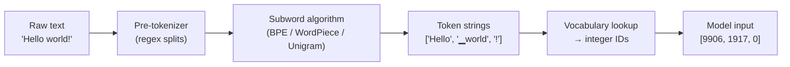
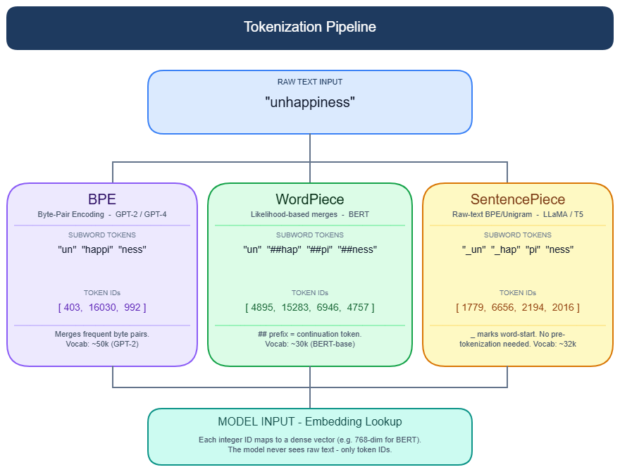

# Tokenization

---

## What it is

Think of tokenization like a currency exchange before you enter a foreign market — you hand over raw text at the door and receive a sequence of numbered chips (token IDs) that the model's internal machinery actually understands.

**Tokenization** is the process of splitting raw text into subword units and mapping each unit to an integer ID from a fixed vocabulary, producing the integer sequence that a language model processes during training and inference. The model never sees characters or words — only those integers.

It is not simply splitting text on whitespace or punctuation. Subword tokenizers learn merge rules or probability scores from a training corpus and split words into fragments that balance vocabulary coverage with sequence length — meaning the same surface text maps to very different token sequences depending on which model's tokenizer you use.

---

## How it works

### The full pipeline

The 10-second mental model: raw text enters, an integer sequence exits, and four stages connect them.



Each integer ID is then looked up in an embedding table to produce a dense vector before it enters any transformer layer. → see [Embeddings](embeddings.md) for what happens next.

The total number of tokens in a sequence determines how much of the context window the input consumes. → see [Context window](context-window.md) for how that budget is managed.



> Note: export the PNG from the `.excalidraw` source file using the VS Code Excalidraw extension.

---

### Stage 1: Pre-tokenization — the hidden layer

Before any subword algorithm runs, a regex-based pre-tokenizer splits raw text into coarse chunks. This step is rarely documented but is where many production surprises originate.

GPT-2's regex treats contractions as prefix patterns: `'re`, `'ve`, `'ll` are matched as prefixes, so `"really"` splits as `["re", "ally"]` in some positions because the pattern grabs `"re"` first. The regex is also case-sensitive: `"HOW'S"` splits differently from `"how's"`. GPT-4 improved this, but every model family has its own rules.

GPT-4's pre-tokenizer groups consecutive spaces: up to 83 consecutive spaces become one token instead of one token per space. This matters for Python indentation — GPT-2-era tokenizers charged one token per space, making deeply indented code significantly more expensive.

SentencePiece takes a different approach: it treats whitespace as a regular character (`▁`) and needs no pre-tokenizer at all. `"Hello world"` becomes `["▁Hello", "▁world"]`. This design is the only one that is truly language-agnostic.

---

### Stage 2a: Byte Pair Encoding (BPE) — the dominant algorithm

BPE (Sennrich et al., 2016) is used by GPT-4, GPT-4o, Llama 3, Gemma, Qwen2, Mistral, and most other production LLMs. It was originally a data compression algorithm, adapted for subword segmentation.

**Vocabulary construction (training):**

1. Pre-tokenize corpus into words with frequency counts: `("hug", 10), ("pug", 5), ("pun", 12)`.
2. Initialize vocabulary as all unique characters: `["b", "g", "h", "n", "p", "u"]`.
3. Find the most-frequent adjacent pair across all words — `"u"+"g"` appears 15 times — and merge it into a new token `"ug"`.
4. Repeat until vocabulary reaches the target size (base characters plus N merges).

**Inference:** Apply the learned merge rules in training order. The process is deterministic — the same string always produces the same tokens with the same tokenizer.

**Byte-level BPE** starts from all 256 byte values instead of Unicode characters. This guarantees zero unknown tokens for any input, including emoji, code, and every script on earth. GPT-2, GPT-3, GPT-4, GPT-4o, and Llama 1/2 all use byte-level BPE.

**Vocabulary sizes across models:**

| Model | Algorithm | Vocab size | Tokens per English word |
|-------|-----------|-----------|------------------------|
| GPT-2 | Byte-level BPE | 50,257 | ~1.3 |
| GPT-4 (cl100k) | Byte-level BPE | 100,256 | ~1.1–1.2 |
| GPT-4o (o200k) | Byte-level BPE | ~200,000 | ~1.1 |
| Llama 2 | SentencePiece BPE | 32,000 | ~1.3 |
| Llama 3 (tiktoken) | BPE | 128,000 | ~1.2 |
| BERT-base | WordPiece | 30,522 | ~1.3 |
| T5 | SentencePiece Unigram | 32,000 | ~1.3 |
| mT5 | SentencePiece Unigram | 250,000 | (multilingual) |

1 token ≈ 4 bytes of English text (tiktoken docs rule of thumb).

---

### Stage 2b: WordPiece — the BERT-family algorithm

WordPiece is used by BERT, DistilBERT, and Electra. The training procedure looks like BPE — bottom-up merges — but the merge criterion is different:

```
BPE selects:        pair with highest frequency("ug")
WordPiece selects:  pair with highest frequency("ug") / (frequency("u") × frequency("g"))
```

WordPiece prefers "informativeness" over raw frequency — it merges pairs that are surprising given each token's individual frequency. This produces more linguistically coherent splits. Tokens that continue a word (not the first piece) get a `##` prefix: `"hugging"` → `["hugg", "##ing"]`. BERT-base uses a 30,522-token vocabulary.

WordPiece is narrowly alive in encoder-only models. For any generative or decoder-based model, BPE is the operative algorithm.

---

### Stage 2c: Unigram Language Model (SentencePiece) — the multilingual algorithm

Unigram (Kudo, 2018), implemented in the SentencePiece library, works top-down — the opposite of BPE.

**Vocabulary construction:**

1. Start with a large candidate vocabulary (all substrings up to some length).
2. Score each token by its contribution to corpus likelihood.
3. Remove the lowest-impact 10–20% each round — tokens whose removal least reduces the model's ability to represent the corpus.
4. Repeat until the target vocabulary size is reached.

**At inference**, Unigram is not deterministic: a string can have multiple valid tokenizations and the algorithm selects the highest-probability one via Viterbi decoding. During training, it can sample alternative tokenizations as data augmentation (subword regularization).

SentencePiece's language-agnostic design makes it the standard for multilingual models: T5 (32K tokens), mT5 (250K tokens), and XLNet all use it. The `▁` whitespace marker is the visual tell — if you see that character in a tokenizer's output, you are working with SentencePiece.

---

### Recent evolution

**Vocabulary size inflation (2024–2025):** Larger vocabularies improve both multilingual coverage and context efficiency. Llama 3 grew from 32K to 128K tokens — a full retraining run was required because the vocabulary change breaks embedding weight compatibility. GPT-4o's o200k doubled GPT-4's cl100k. A NeurIPS 2024 paper identified 128K as approximately the optimal vocabulary size; returns diminish beyond that.

**tiktoken as de facto standard:** OpenAI's Rust-backed tiktoken is 3–6x faster than equivalent HuggingFace tokenizers. Llama 3's switch from SentencePiece to tiktoken signals convergence on a single high-performance implementation.

**Meta's Byte Latent Transformer (BLT, December 2024):** BLT groups raw bytes into variable-length patches based on entropy — no fixed vocabulary, no merge rules. At 8B parameters, BLT achieves 61.1% average benchmark score vs. Llama 3's 60.0%, using 50% fewer inference FLOPs. On character-level tasks (CUTE benchmark): 54.1 vs. Llama 3's 27.5. BLT proves that tokenization is not architecturally mandatory, but as of mid-2026 it has not displaced fixed-vocabulary tokenizers in production.

The [LLM, SLM & Foundation Models](llm-slm-overview.md) overview covers how tokenization fits into the broader pretraining pipeline.

---

### Gotchas & production behavior

**Character-level reasoning failures**

- LLMs fail at letter-counting and string reversal because the model never sees individual characters. "strawberry" tokenizes as `["st", "raw", "berry"]` under GPT-4o — the two r's in "berry" are fused into one token. Asking "how many r's in strawberry?" yields 2, not 3.
- Workaround: instruct the model to spell out the word with spaces (`"s t r a w b e r r y"`) before answering — this forces single-character tokens. Cost: roughly 5x more tokens than a direct question.

**Arithmetic errors follow token boundaries, not math difficulty**

- GPT-3.5 multi-digit addition accuracy: 75.6% with left-to-right tokenization, 97.8% with right-to-left. Claude 2.1: 28.3% L2R vs. 100% R2L. Error rates spike where a carry crosses a token boundary.
- Workaround: format numbers with comma separators in prompts (`"add 1,234,567 and 8,901,234"`) — this forces right-boundary splits at inference time. Anthropic adopted R2L integer tokenization in Claude 3, which is why Claude 3 Haiku outperformed GPT-4 on certain arithmetic benchmarks despite being a smaller model.

**The multilingual token tax**

- BPE trained on English-heavy corpora fragments non-Latin scripts into individual bytes. Arabic requires 68% more tokens than English in Qwen and 340% more in DeepSeek for equivalent text. African languages average 25 MMLU accuracy points below English on identical knowledge content.
- The cost equation is non-linear: 2x token fertility produces roughly 4x training cost due to O(n²) attention scaling. For multilingual applications, model selection should include tokenizer fertility as a primary criterion — Qwen tokenizers show the smallest inflation penalty for non-Latin scripts.
- Budget 2–3x more tokens per query for non-Latin scripts in cost estimates.

**Duplicate BOS tokens silently corrupt fine-tuning**

- When a chat template already injects a `<bos>` token and you call the tokenizer with `add_special_tokens=True` (the default), sequences start with two BOS tokens: `[128000, 128000, ...]`. Fine-tuning on this data produces models with degraded output quality — no error or warning is raised.
- Workaround: pass `add_special_tokens=False` when using `apply_chat_template()`. Audit the chat template source directly. Models differ: Qwen2.5-0.5B has no `bos_token`; Llama-3.2 places EOS at sequence end; DBRX omits it entirely. There is no unified convention. *(Source: vLLM issue #9519)*

**Fast vs. slow tokenizer implementations diverge**

- HuggingFace maintains Python ("slow") and Rust ("fast") tokenizer implementations that produce different token IDs for the same input. LlamaTokenizer differs in its first token (token 2 vs. token 1 for identical prompts). Out-of-vocabulary behavior also diverges: slow tokenizers raise exceptions; fast tokenizers return silent empty strings.
- Workaround: pin `use_fast=True` or `use_fast=False` explicitly, and use the same setting at training and inference time. *(Source: HuggingFace transformers issues #23889, #29159)*

**Invisible Unicode characters break RAG retrieval**

- U+200B (zero-width space), U+FEFF (byte order mark), and U+00AD (soft hyphen) are invisible to humans but create token splits that shift IDs and embedding vectors. A query that looks identical to indexed text fails to retrieve because one string was copy-pasted through a pipeline that injected a zero-width space.
- GPT-4's pre-tokenizer matches ASCII apostrophe (U+0027) but not the Unicode right single quotation mark (U+2019). Text typed on mobile or pasted from Word silently uses U+2019, producing a different tokenization for visually identical text.
- Workaround: apply `unicodedata.normalize('NFKC', text)` before tokenization and strip Unicode category Cf (format characters). Tradeoff: NFKC normalization is lossy for multilingual text with valid ligatures or fullwidth characters.

**Token count estimates using the wrong tokenizer are systematically wrong**

- LiteLLM defaults to tiktoken for all token counting even when the model uses a different tokenizer (documented issue #8244). For Llama, Mistral, and Qwen models this produces wrong counts that corrupt rate-limit logic, cost budgets, and context window management.
- For any count that feeds into rate limits or context window calculations, always use the model's own tokenizer.

**Perplexity benchmarks are not cross-tokenizer comparable**

- A tokenizer producing 13.8% more tokens per document shows lower raw per-token perplexity for an identical-quality model — each token simply carries less burden. Mixtral models experience up to 21.6% perplexity inflation versus other models purely from tokenizer differences.
- Use bits-per-byte (BPB) or bits-per-character (BPC) for cross-model comparisons. Artificial Analysis normalizes all models to tiktoken o200k_base for this reason.

**Prompt-boundary token healing**

- About 70% of common BPE vocabulary tokens are prefixes of longer tokens. When a prompt ends mid-token, the model is blocked from generating the full token it would normally predict. Classic symptom: prompting with `"The url is http:"` causes generation of `"http: //www.google.com"` with a spurious space because `"://"` is a single token but `":"` at the boundary signals that `"//"` is not the natural continuation.
- Workaround: the `guidance` library implements "token healing" — backing up one token and regenerating with the prefix as a constraint. HuggingFace transformers has an open issue for this (#28346).

---

## Why it matters

This topic sits at the **Model serving** layer — specifically at the entry point, before any attention computation or decoding. Every downstream decision in this section depends on tokenization outputs: context window consumption → [Context window](context-window.md), autoregressive prediction over token IDs → [Autoregressive decoding](autoregressive-decoding.md), and embedding vector quality → [Embeddings](embeddings.md).

Without understanding tokenization, you cannot diagnose why a model fails at arithmetic (token boundary effects), why multilingual costs are 2–5x your English estimates, why fine-tuned models produce degraded output with no error message (duplicate BOS), or why perplexity benchmarks comparing different models are misleading.

The concrete anchor: Llama 3's vocabulary expansion from 32K to 128K tokens required a full model retraining run — vocabulary changes are not hot-swappable. And that same change reduced token count for non-English text by 20–30%, directly reducing inference cost and improving multilingual reasoning quality.

---

## Key terms

| Term | Meaning in this context |
|------|------------------------|
| **Token** | The atomic unit of model input/output — a subword fragment mapped to a single integer ID in the vocabulary |
| **Vocabulary** | The fixed set of all token strings learned during tokenizer training; once frozen, adding new tokens requires retraining the model |
| **BPE (Byte Pair Encoding)** | A bottom-up merge algorithm that builds vocabulary by repeatedly fusing the most-frequent adjacent character pair; used by GPT-4, Llama 3, Mistral |
| **Byte-level BPE** | A BPE variant that starts from all 256 byte values instead of Unicode characters, guaranteeing zero unknown tokens for any input |
| **WordPiece** | A BPE variant that uses likelihood-based scoring instead of raw frequency; marks continuation pieces with `##`; used by BERT-family models |
| **Unigram / SentencePiece** | A top-down pruning algorithm that starts with a large vocabulary and removes low-impact tokens; can produce multiple valid tokenizations; language-agnostic by design |
| **Token fertility** | The ratio of tokens to words (or characters) for a given language — high fertility means more tokens for equivalent content, increasing cost and reducing effective context |
| **Pre-tokenizer** | The regex layer that splits raw text into coarse chunks before any subword algorithm runs; source of many case-sensitivity and punctuation surprises |
| **BOS / EOS tokens** | Special beginning-of-sequence and end-of-sequence markers injected by the tokenizer; vary by model family with no unified convention |
| **Token healing** | Technique for backing up one token and regenerating with a prefix constraint when a prompt ends at a token boundary, preventing spurious character insertion |

---

## Code / demo

```python
# pip install tiktoken transformers
import tiktoken

# GPT-4o tokenizer
enc = tiktoken.get_encoding("o200k_base")

examples = [
    "Hello world!",
    "strawberry",        # character-counting trap
    "1234567 + 8901234", # arithmetic boundary trap
    "مرحبا بالعالم",     # Arabic: token fertility demo
]

for text in examples:
    ids = enc.encode(text)
    tokens = [enc.decode([i]) for i in ids]
    print(f"Text:   {text!r}")
    print(f"Tokens: {tokens}")
    print(f"IDs:    {ids}")
    print(f"Count:  {len(ids)} tokens")
    print()
```

> Note: requires `pip install tiktoken`. Runs without a GPU or API key.

**Common fix — duplicate BOS prevention when using chat templates:**

```python
# Bad: may produce [128000, 128000, ...] for Llama-3 models
# tokens = tokenizer(text, add_special_tokens=True)

# Correct: let apply_chat_template handle special tokens
messages = [{"role": "user", "content": "Hello"}]
tokens = tokenizer.apply_chat_template(
    messages,
    add_special_tokens=False,  # template already includes BOS
    return_tensors="pt"
)
```

---

## My notes

- The pre-tokenizer regex is the least-documented part of the pipeline and the source of the most confusing production bugs. GPT-4's regex improvement over GPT-2 is real, but the exact rules are not in the official docs — you have to read the tiktoken source.
- Multilingual token fertility is a first-order model selection criterion for any non-English application, not an afterthought. The 2–5x token expansion for African languages compounds into 4–25x training cost differences when attention scales quadratically — this is rarely mentioned in model comparison benchmarks.
- The fast vs. slow tokenizer divergence (HuggingFace issues #23889, #29159) is particularly dangerous because the difference shows up silently at fine-tuning time and produces models that perform worse without any error. This deserves explicit CI testing.
- BLT's 50% inference FLOP reduction at matched accuracy is the most credible challenge to fixed-vocabulary tokenization yet. The open question is whether byte-patch architectures can scale to 70B+ parameters at competitive training cost — the 8B results are promising but not conclusive.
- The "token tax" formalization (arXiv:2509.05486) quantified that fertility explains 20–50% of accuracy variance across non-English languages — which means improving the tokenizer alone, without changing the model, can close a measurable fraction of the multilingual performance gap.

*Last researched: 2026-05-18*

---

## Resources

1. Sennrich et al. (2016) — "Neural Machine Translation of Rare Words with Subword Units" — the original BPE-for-NLP paper: https://arxiv.org/abs/1508.07909
2. HuggingFace Tokenizer Summary — covers BPE, WordPiece, Unigram, and SentencePiece with worked examples: https://huggingface.co/docs/transformers/en/tokenizer_summary
3. Meta BLT (2024) — "Byte Latent Transformer: Patches Scale Better Than Tokens" — the tokenization-free architecture paper: https://arxiv.org/abs/2412.09871
