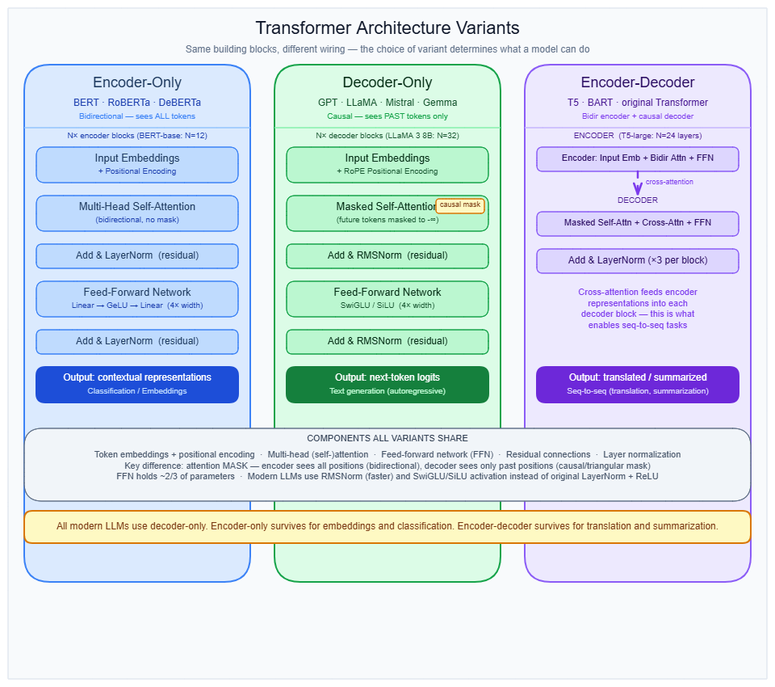
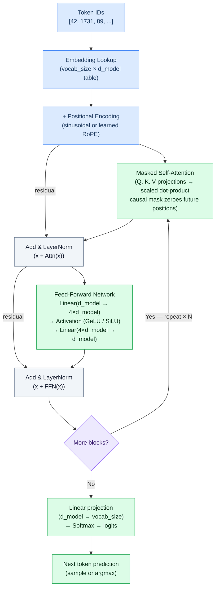

# Transformer architecture

---

## What it is

Think of a transformer like a document review committee where every reviewer can instantly read and cross-reference every part of the document simultaneously — rather than reading it word by word from left to right the way a human editor would.

A transformer is a neural network architecture built from a stack of identical blocks, each combining a self-attention sublayer (which routes information between token positions) and a feed-forward network sublayer (which processes each position independently), connected by residual connections and layer normalization.

It is not a single architecture — the term covers three distinct variants (encoder-only, decoder-only, and encoder-decoder) that share a block structure but differ fundamentally in what their attention layers are allowed to see and in whether they can generate text autoregressively.

---

## How it works

### The three variants

Every transformer variant is built from the same four primitives repeated across N layers: self-attention, a feed-forward network (FFN), layer normalization, and residual connections. What distinguishes the variants is the attention mask and the presence or absence of cross-attention.



**Encoder-only (BERT, RoBERTa, ModernBERT)**

Every token in the input attends to every other token — past and future — simultaneously. This bidirectional attention produces a sequence of contextualized hidden states, one per input token, that are then passed to a task-specific head for classification, tagging, or embedding extraction. Encoder-only models cannot generate text autoregressively — they have no causal structure. They are the right tool for classification, named entity recognition, semantic search, and embedding generation where labeled data is available.

BERT-base: 12 layers, d_model = 768, d_ff = 3,072, 12 attention heads, 110M parameters.
BERT-large: 24 layers, d_model = 1,024, d_ff = 4,096, 16 heads, 340M parameters.

**Decoder-only (GPT, LLaMA, Mistral, DeepSeek, Gemma)**

Each token can only attend to itself and tokens that came before it. This causal (masked) self-attention is enforced by a triangular mask applied to the attention score matrix before softmax — all future positions are set to -inf and vanish after softmax. There is no cross-attention sublayer. This structure makes decoder-only models the correct choice for autoregressive text generation.

LLaMA 3 8B: 32 layers, d_model = 4,096, 32 query heads / 8 KV heads (GQA), 8B parameters.
LLaMA 3 70B: 80 layers, d_model = 8,192, 64 query heads / 8 KV heads, 70B parameters.
GPT-3: 96 layers, d_model = 12,288, 175B parameters.

→ see [Autoregressive decoding](autoregressive-decoding.md) for how the causal mask enables token-by-token generation.

**Encoder-decoder (T5, BART, original 2017 Transformer)**

The encoder stack processes the full input with bidirectional attention, producing a sequence of hidden states. The decoder stack then generates output autoregressively using two attention sublayers per block: causal self-attention over the partially generated output, plus cross-attention where decoder queries attend over all encoder output states. That cross-attention connection is how the decoder accesses the encoded input at every generation step. The extra sublayer makes encoder-decoder decoder blocks roughly 50% more expensive per layer than decoder-only blocks. This architecture retains a niche in structured sequence-to-sequence tasks (translation, summarization with structured output, code generation from formal specs).

Original 2017 model: 6 encoder + 6 decoder layers, d_model = 512, d_ff = 2,048, 8 heads.

### Forward pass through one decoder block



### What each block component does

**Self-attention sublayer** routes information between token positions by computing compatibility scores between every pair of positions in the sequence. → see [Attention mechanism](attention-mechanism.md) for the Q, K, V projection mechanics and scaled dot-product computation.

**Feed-forward network (FFN) sublayer** applies the same two-layer fully connected network independently to each token position. It does not exchange information between positions — it deepens each position's representation in isolation. The original transformer used ReLU activation with d_ff = 4 × d_model, giving an FFN expansion ratio of 4. Modern LLMs use SwiGLU activation, which shifts the expansion ratio to (8/3) × d_model but adds a gating projection, keeping total parameters similar.

**Layer normalization** stabilizes activations. The original paper applied normalization after each sublayer (post-norm). Post-norm became dominant in BERT but was replaced by pre-norm (applying normalization to the input of each sublayer) in GPT-2 onward because pre-norm prevents gradient explosion in very deep models and trains stably without mandatory warmup schedules. As of 2025, ~77.4% of models use RMSNorm (a simpler variant of LayerNorm with no mean-centering).

**Residual connections** wrap every sublayer: `output = x + SubLayer(x)`. Gradients flow directly back through the network without passing through the sublayer computation, which is what makes 96+ layer models trainable. The more accurate mental model: the layers are writing refinements (deltas) to a shared residual stream that passes through largely unchanged — not transforming the representation wholesale at every step.

### Parameter distribution: where the weights actually live

The title "Attention Is All You Need" creates a persistent wrong intuition. In practice, the FFN sublayer holds roughly twice the parameters of the self-attention sublayer per layer.

Per-layer parameter counts at d_model = d (approximate):
- Multi-head attention (Q, K, V, O projections): ≈ 4d²
- FFN (two linear layers with 4× expansion): ≈ 8d²
- FFN:attention ratio ≈ **2:1**

In LLaMA 3 8B across all 32 layers:
- Attention parameters: ~1,344M (~17% of total)
- FFN parameters: ~5,632M (~70% of total)
- Embedding + output head: ~13%

This has direct implications for compression work: pruning attention aggressively while leaving FFN intact misses the dominant parameter mass. → see [Attention mechanism](attention-mechanism.md) for per-head parameter breakdowns.

### Modern evolution (2023–2025)

**Grouped-query attention (GQA) — now universal:** Standard multi-head attention allocates one set of key-value pairs per query head. GQA groups multiple query heads to share a single KV head, reducing KV cache memory proportionally. LLaMA 3 8B uses 32 query heads sharing 8 KV heads (4:1 ratio), cutting KV cache size by 4× with negligible accuracy loss. GQA is now the de facto standard. → see [KV cache](kv-cache.md) for how this affects memory allocation at inference.

**Multi-head latent attention (MLA) — DeepSeek V2/V3 (2024):** MLA compresses the key-value representation into a low-dimensional latent vector (dimension d_c ≪ n_h × d_h). Only this latent vector is stored in the cache and expanded back during attention computation. At 68.75% KV compression: -0.29% performance loss. At 87.5% compression: modest further degradation. MLA is appearing in Kimi K2, GLM-5, and other 2025 architectures.

**RoPE positional encoding — 69.8% adoption:** Rotary position embedding (RoPE) encodes position by rotating the query and key vectors in attention by a position-dependent angle, rather than adding a sinusoidal offset to the embedding. This enables better length extrapolation than the original sinusoidal encoding, though reliable extension to contexts beyond training still requires explicit methods like YaRN. → see [Context window](context-window.md) for how positional encoding limits and extensions interact with generation.

**SwiGLU activation — 71.7% adoption:** SwiGLU replaces ReLU in the FFN with a gated linear unit: `SwiGLU(x, W, V) = Swish(xW) ⊙ (xV)`. The gating mechanism provides smoother gradients and consistently outperforms GeLU and ReLU at the same parameter count.

**Hybrid transformer + SSM (2024–2025):** State Space Models (Mamba/Mamba-2) process sequences in linear time with no KV cache. NVIDIA's Nemotron-H replaces 92% of attention layers with Mamba-2 blocks, achieving up to 3× higher throughput at long contexts. AI21's Jamba combines Mamba, transformer, and mixture-of-experts (MoE) layers for 256K context windows. This is an active research front, not yet production-settled.

**Post-norm revisited:** Five years of pre-norm dominance is being challenged. OLMo 2 and Gemma 3 return to post-norm paired with QK-normalization (normalizing query and key vectors before attention) to prevent logit explosion at depth, claiming better training stability at scale. Whether this trend continues is unresolved as of May 2026.

### What the 2017 paper got right and wrong

| Component | 2017 original | 2025 default |
|-----------|--------------|-------------|
| Positional encoding | Sinusoidal (absolute) | RoPE (relative, rotary) |
| Normalization placement | Post-norm | Pre-norm (RMSNorm) |
| FFN activation | ReLU | SwiGLU |
| Generative architecture | Encoder-decoder | Decoder-only |
| Residual connection structure | Retained unchanged | Retained unchanged |
| Multi-head attention concept | Retained (adapted to GQA/MLA) | Retained (adapted) |
| Alternating attention-FFN blocks | Retained unchanged | Retained unchanged |

The residual connection structure, the multi-head attention concept, and the alternating attention-FFN block pattern survived intact. Everything else was replaced.

### Gotchas & production behavior

**Model selection pitfalls**

- **Encoder-only for generation, decoder-only for classification.** BERT cannot generate text — it produces bidirectional representations with no causal ordering. Using a GPT-style decoder for classification when you have 500+ labeled samples wastes compute: fine-tuned BERT achieves ~57.6% accuracy on text classification vs ~18% from prompting a decoder-only model zero-shot on the same task. The rule: if you have labels, use an encoder; if you're generating, use a decoder.
- **"Decoder-only won because it's architecturally superior."** The actual driver was the shift to instruction-following — encoder-decoder required per-task classification heads, decoder-only simplified fine-tuning to a single objective. When compute is held constant and instruction tuning is applied, encoder-decoder matches or exceeds decoder-only (RedLLM 8B: 59.69 vs DecLLM 58.26 zero-shot). The architectural victory was cultural, not empirical.

**Depth and width allocation pitfalls**

- **"More layers = better."** Research shows optimal hidden dimension width grows 2.8× faster than depth. At 7B scale, a 64-layer model (6.38B params) underperforms a 32-layer model (6.86B params) by 0.12 nats — strictly worse despite more layers. Around 50% of layers in deep pre-norm models are near-identity in practice. Prefer adding width before adding layers once you are past 32 layers. Never use layer count as a proxy for model quality.
- **Layer count in model names is not standardized.** A "32-layer" model in one family may use different d_model, heads, and GQA configurations than a "32-layer" in another. Always look at d_model and active parameters, not layer count alone.

**Normalization placement pitfalls**

- **Swapping pre-norm and post-norm configs is not cosmetic.** Post-norm (BERT, original Transformer) requires a mandatory learning rate warmup — without it, training diverges from gradient explosion. Pre-norm (LLaMA, Mistral) is stable without warmup. Copying a modern LLaMA config into a post-norm architecture and omitting warmup produces silent training failures that may not surface until after hours of compute.
- **Adding QK-normalization for deep models.** At depths beyond 30 layers with post-norm, attention logits can explode. QK-norm (normalizing Q and K vectors before the dot product) prevents this. It appeared in Gemma and is required when reviving post-norm at scale.

**FFN parameter mass is ignored during compression**

- Practitioners focus on attention heads during pruning and quantization because of the paper's name and the conceptual prominence of attention. FFN parameters outnumber MHA parameters at ~2:1 per layer. In GPT-2: MHA ≈ 2.36M parameters per layer; FFN ≈ 4.7M per layer. Token embeddings ≈ 38.6M total — nearly matching all attention parameters combined across the whole model. Compute the FFN-vs-attention ratio explicitly before any compression work.

**Residual stream mental model**

- The common description ("residual connections add back what the layer missed") produces wrong intuitions about pruning. The accurate model: layers write small deltas to a shared residual stream that passes through largely unchanged. This explains why removing individual layers produces small quality drops — any single layer's contribution is marginal — and why gradient flow stays healthy in 100+ layer models.

---

## Why it matters

This topic sits at the **Model serving** layer and is the structural prerequisite for every topic in section 01. Without knowing which transformer variant is in use — encoder-only, decoder-only, or encoder-decoder — the downstream decisions in this section (KV cache sizing, batching strategy, attention mechanism choice, context window limits) are made without a coherent model of the system being optimized.

The parameter distribution fact alone has direct dollar consequences: a quantization pass that compresses attention from FP16 to INT4 while leaving FFN at FP16 reduces total model size by roughly 17%, not 50%. In a 70B model, that gap is tens of gigabytes of VRAM that an engineer might have incorrectly planned away.

The concrete anchor: LLaMA 3 8B's GQA configuration (32 query heads, 8 KV heads) reduces KV cache memory by 4× compared to full multi-head attention — directly determining whether a 100K-token context fits on a single A100 or requires multi-GPU serving.

---

## Key terms

| Term | Meaning |
|------|---------|
| Encoder-only | Transformer variant where every token attends to every other token bidirectionally; produces contextualized representations, cannot generate autoregressively |
| Decoder-only | Transformer variant using causal (masked) self-attention; each token sees only prior tokens; the dominant architecture for generative LLMs |
| Encoder-decoder | Transformer variant with a bidirectional encoder stack and a separate autoregressive decoder stack connected via cross-attention |
| Causal mask | Triangular mask applied to attention scores that sets future-position scores to -inf, preventing each token from attending to tokens not yet generated |
| Residual stream | The vector that passes through all N transformer layers, with each sublayer writing a small delta rather than transforming it wholesale |
| Pre-norm | Layer normalization applied to the input of each sublayer (before attention or FFN), the dominant configuration since GPT-2; stable without warmup |
| Post-norm | Layer normalization applied to the output of each sublayer (after adding the residual); requires warmup to avoid gradient explosion |
| GQA (Grouped-query attention) | Attention variant where multiple query heads share one KV head, reducing KV cache size proportionally; standard since LLaMA 2 |
| MLA (Multi-head latent attention) | DeepSeek's KV compression technique: caches a low-dimensional latent vector per layer instead of full KV heads; 68–88% KV reduction |
| SwiGLU | Gated activation function used in modern FFN sublayers: `Swish(xW) ⊙ (xV)`; adopted in LLaMA, Mistral, and ~72% of 2025 models |

---

## Code / demo

The snippet below calculates the parameter count for the attention and FFN sublayers of a single transformer block given d_model and the expansion ratio, then shows the FFN:attention ratio. No GPU or API key required.

```python
# No pip install needed — standard library only

def block_params(d_model, n_heads, n_kv_heads=None, ffn_expansion=4.0):
    if n_kv_heads is None:
        n_kv_heads = n_heads
    d_head = d_model // n_heads
    attn = (d_model * n_heads * d_head       # Q
            + d_model * n_kv_heads * d_head  # K
            + d_model * n_kv_heads * d_head  # V
            + n_heads * d_head * d_model)    # O
    d_ff = int(ffn_expansion * d_model)
    ffn = d_model * d_ff + d_ff * d_model
    return attn, ffn, round(ffn / attn, 2)

configs = [
    ("BERT-base",   768,  12, None, 4.0),
    ("LLaMA 3 8B", 4096,  32,    8, 8/3),  # SwiGLU expansion ratio
]

print(f"{'Model':<14} {'Attn params':>14} {'FFN params':>14} {'FFN:Attn':>10}")
print("-" * 56)
for name, d, nh, nkv, exp in configs:
    attn, ffn, ratio = block_params(d, nh, nkv, exp)
    print(f"{name:<14} {attn:>14,} {ffn:>14,} {ratio:>10.2f}")
```

Expected output:
```
Model          Attn params     FFN params   FFN:Attn
--------------------------------------------------------
BERT-base        2,359,296      4,718,592       2.00
LLaMA 3 8B      18,874,368     45,088,768       2.39
```

---

## My notes

- The post-norm vs pre-norm debate is not settled. OLMo 2 and Gemma 3 are actively revisiting post-norm with QK-normalization, arguing it achieves better training stability at scale than pre-norm. Five years of consensus is being challenged — worth watching over the next 12 months.
- Encoder-decoder models may be underused for long-context tasks. The research shows they extrapolate to longer contexts better than decoder-only, and match decoder-only quality when instruction-tuned with equal compute. The industry shift to decoder-only was driven by the GPT cultural moment, not a clean empirical victory.
- The "residual stream as shared memory" mental model (layers write deltas, not transformations) changes how you reason about layer pruning. A layer that appears near-identity isn't broken — it's doing very little, which is why removing it hurts minimally. About 50% of layers in deep pre-norm models are near-identity; this is normal and expected behavior.
- GQA is now table stakes for any new decoder-only model, but the KV head count is a tunable hyperparameter that interacts directly with both quality and cache memory. Engineers often accept the published ratio (e.g., 4:1) without evaluating whether their serving context length and batch size would benefit from a different ratio. → see [KV cache](kv-cache.md) for the memory arithmetic.
- Hybrid SSM + transformer architectures (Nemotron-H, Jamba) claim 3× throughput improvements at long contexts. These are early production numbers on specific workloads — not yet generalizable benchmarks. The tradeoff is that SSM layers lack the KV cache interpretability tools and may behave differently during speculative decoding.

*Last researched: May 2026*

---

## Resources

1. Vaswani et al., "Attention Is All You Need" (2017) — https://arxiv.org/abs/1706.03762
2. "The Crystallization of Transformer Architectures (2017–2025)" — a 53-model empirical analysis of which design choices survived — https://jytan.net/blog/2025/transformer-architectures/
3. "Towards Economical Inference: MLA in Any Transformer-based LLMs" (2025) — https://arxiv.org/abs/2502.14837
