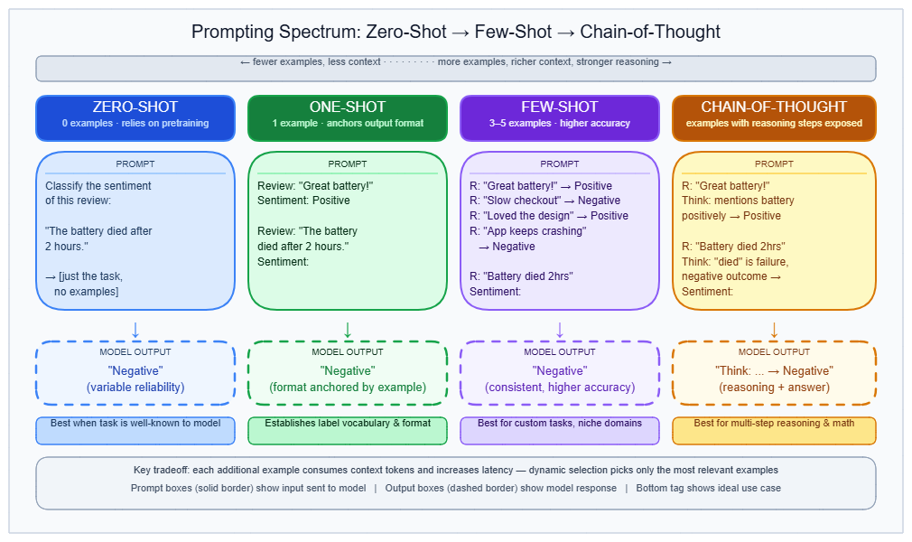
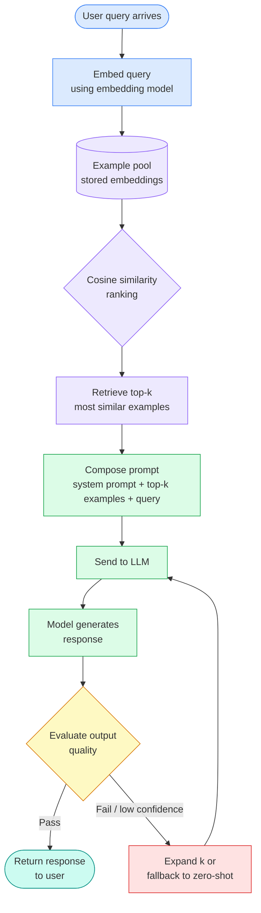

# Few-Shot & Zero-Shot Prompting

---

## What it is

Think of zero-shot prompting like giving a new hire a job description and asking them to get to work — you describe the task but provide no worked examples. Few-shot prompting is giving that same hire two or three annotated examples alongside the description so they understand the expected format and style before they start.

Zero-shot prompting is asking a language model to perform a task from a description alone, with no demonstrations. Few-shot prompting adds k input-output example pairs to the same prompt, directly before the actual query.

It is not the case that few-shot examples teach the model the underlying task mapping. Research shows randomly replacing the correct labels in demonstrations barely hurts performance — what the examples actually do is signal the output format, the input distribution, and the label space the model should work within.

---

## How it works

### Zero-shot: task description without examples

The simplest version of zero-shot is a plain instruction followed by the input:

```
Classify the sentiment of this review as positive, negative, or neutral.
Review: "The product broke on the second day."
```

This works because modern instruction-tuned models have absorbed the meta-pattern of tasks like this during pretraining, and fine-tuning on instruction-described datasets amplifies that capability. The model does not need examples — it needs a clear task description. → see [Prompt engineering](prompt-engineering.md) for the principles behind writing effective task descriptions.

**Zero-shot chain-of-thought (CoT)** extends this by appending a reasoning cue — the phrase "Let's think step by step" — to the prompt, with no examples at all. Kojima et al. (NeurIPS 2022) showed this single addition improved InstructGPT on MultiArith from 17.7% to 78.7% (+61 percentage points) and on GSM8K from 10.4% to 40.7% (+30 percentage points). The mechanism is not teaching the model to reason but cueing it to deploy reasoning behavior already latent from training.

As of 2025–2026, zero-shot CoT equals or exceeds few-shot CoT on strong instruction-tuned models (Qwen2.5, LLaMA 3, Gemma 2). The practical default for reasoning tasks is now zero-shot CoT rather than few-shot CoT unless the model is small (below ~7B parameters).

### Few-shot: examples as format and distribution signals

A few-shot prompt prepends k demonstration pairs before the real query:

```
Review: "Excellent build quality." → Positive
Review: "Stopped working in a week." → Negative
Review: "Decent, but pricey." → [model generates]
```

Min et al. (EMNLP 2022) tested what actually matters in these demonstrations across 12 models. Randomly replacing ground-truth labels barely degraded performance. What did matter:

1. **Label space exposure** — demonstrations show the model what output categories exist
2. **Input text distribution** — demonstrations reflect the domain and style of real inputs
3. **Sequence format** — the structural template primes the generation format

Few-shot prompting is fundamentally a format-signaling mechanism, not a mapping-teaching mechanism. This explains why it is especially valuable for format enforcement, domain-specific output style, and models below ~7B parameters that have weaker instruction-following from pretraining alone.

**Optimal k:** gains are largest from 0 → 1 example. Diminishing returns set in above 4–5 examples. Performance peaks at 3–8 for most tasks; adding more can degrade results. → see [In-context learning](in-context-learning.md) for the theoretical account of why context examples shift model behavior.

**Few-shot CoT** adds intermediate reasoning steps inside each demonstration:

```
Q: If there are 5 apples and you take 3, how many do you have?
A: Let's think step by step. You took 3 apples, so you have 3. Answer: 3.
Q: [actual question]
```

This remains useful for smaller models that cannot reason zero-shot, but for strong models it no longer beats zero-shot CoT.

### Many-shot and dynamic few-shot: emerging production patterns

**Many-shot prompting** (Agarwal et al., NeurIPS 2024 Spotlight) uses hundreds to thousands of examples instead of 2–10, made practical by context windows of 1M+ tokens. It significantly outperforms few-shot ICL, overrides pretraining biases, and is comparable to fine-tuning on some tasks without any training cost. For low-resource machine translation: +15.3% on Bemba and +4.5% on Kurdish versus 1-shot.

**Dynamic few-shot selection** replaces static example sets with per-request retrieval: embed the current query → retrieve k nearest examples from a vector store → compose the prompt. TF-IDF retrieval improved average F1 by 7.3% over static examples on 5-shot biomedical NER. This is the recommended production pattern for high-variability inputs. The diagram below shows the full flow.

---



---



---

### Gotchas & production behavior

**Example ordering and position bias**

- Permuting the same few-shot examples produces accuracy swings from near-state-of-the-art to near-random on the same model. MSMARCO showed 6–12% accuracy drops from reordering alone; MedMCQA showed 1–8% degradation.
- Models weight the last example most heavily (recency bias). Moving an answer option to the final position increased its selection frequency by 20x for Llama-3.1-8B. A single trailing space after the last prompt instruction triggered hallucinated outputs in an address-extraction task.
- Fix: test 3–5 permutations at development time and lock order in production as a versioned hyperparameter. Distribute label classes evenly across positions — never group by class. For high-stakes classification, use self-consistency (multiple permutations, majority vote) to nearly eliminate ordering sensitivity, at the cost of extra inference calls.

**Label distribution bias**

- Skewed label counts across demonstrations bias the model toward the majority class for all inputs, measurably and systematically. Multilingual and cross-domain tasks show especially pronounced effects.
- Fix: balance label counts (equal per class). If you cannot balance, apply contextual calibration: run the prompt with a null input ("N/A") to measure the model's prior label probabilities, then subtract those priors at inference time. Batch calibration is a lower-effort, zero-cost alternative.

**Reasoning models perform worse with few-shot**

- For reasoning models (OpenAI o1/o3/o4-mini, DeepSeek R1), adding examples constrains internal reasoning and produces repetitive or illogical outputs. o1-mini: zero-shot pass@1 = 40.6, few-shot = 38.6, CoT few-shot = 36.6. DeepSeek explicitly warns against few-shot for R1-series in their documentation.
- Fix: default to zero-shot for all reasoning models. Use clear task descriptions with explicit output format constraints instead of examples. Cap at 1 example maximum if any example is needed at all.

**Over-prompting: the inverted U-curve**

- Adding examples beyond an optimal count degrades performance. For small models (3B–4B), accuracy declines monotonically beyond ~10 examples. The curve is model-dependent: Mistral 7B, Llama 3.1 8B, and GPT-4o all peak at different k values.
- Fix: test example counts 2, 5, 10, 20 against your eval set before deploying. Community consensus is 2–5 examples for the bulk of gains on instruction-following models; never exceed 8 without evidence from your own evaluation.

**CoT reasoning chain contamination**

- When intermediate reasoning steps in a CoT example contain errors — even if the final answer is correct — the model replicates the faulty reasoning. GPT-4's accuracy on 4-shot last-letter-concatenation dropped to 52% when one flawed example was included.
- Fix: audit every reasoning chain in CoT examples, not just final answers. Use Auto-CoT: let the model generate chains for simple/representative examples, then human-review only hard or edge-case chains before committing them.

**Format sensitivity amplified in few-shot**

- Identical few-shot content packaged in different formats (plain text, Markdown, JSON, YAML) produces dramatically different outputs. GPT-3.5-turbo performance varies up to 40% on code translation depending solely on template format. Changing `Q:` to `Question:` in example headers measurably improves some tasks.
- Fix: test format variants empirically per model. For chat-model APIs (OpenAI, Anthropic), present examples as interleaved user/assistant message turns, not a single system message text block — this aligns with the instruction-tuned training format.

**Example content leaking into answers**

- Models treat example information as factual evidence and cite it in unrelated queries, returning example data instead of "not found." More likely when examples contain plausible real content (realistic names, actual dates) and when presented as chat history rather than clearly marked instructional content.
- Fix: use obviously fictional data in examples. Prefix examples explicitly: `[EXAMPLE INPUT]` / `[EXAMPLE RESPONSE STYLE — NOT REAL DATA]`. Use the API `name` field alongside `role` in chat messages to label messages as examples.

**LangChain `FewShotPromptTemplate` and JSON content**

- `FewShotPromptTemplate` parses JSON field names inside example strings as template substitution variables, throwing errors at runtime when example content contains curly braces.
- Fix: escape curly braces in JSON examples as `{{` and `}}`, or switch to the Jinja2 template format.

**Dynamic example selection: semantic similarity is not task-structural similarity**

- `SemanticSimilarityExampleSelector` selects on embedding cosine similarity, which does not guarantee task-structural relevance. A poetry example may outrank a correct math example if embeddings cluster on surface-level keywords.
- Fix: use hybrid BM25 + embedding ranking with structure-aware filtering. For heterogeneous example banks, treat semantic retrieval as a first-pass filter only, then apply manual curation or task-type classifiers to the retrieved set.

---

## Why it matters

This topic sits at the **Orchestration** layer — zero-shot and few-shot are the two primary levers you reach for before any other technique in the prompting toolbox. → see [Prompt engineering](prompt-engineering.md) for the broader framework.

Without understanding which regime to use and when, you will add examples to reasoning models that already perform better without them (degrading accuracy), choose static example sets that drift as domain policies change, and miscalibrate label-heavy classification prompts that silently bias toward majority classes.

The stakes are concrete: zero-shot CoT on a strong model improved MultiArith from 17.7% to 78.7% with a single phrase change, and the wrong example order alone produced a 12% accuracy drop on MSMARCO with identical examples. At production scale — millions of calls per day — 5 few-shot examples at 200 tokens each adds 1,000 extra tokens per request, a direct cost multiplier.

---

## Key terms

| Term | Meaning |
|------|---------|
| Zero-shot prompting | Asking the model to perform a task with a description only — no examples |
| Few-shot prompting | Including k input-output demonstration pairs in the prompt before the real query |
| Zero-shot CoT | Appending "Let's think step by step" to elicit reasoning without any examples |
| Few-shot CoT | Including demonstration pairs that contain intermediate reasoning steps, not just final answers |
| Many-shot prompting | Using hundreds to thousands of in-context examples; enabled by large context windows; comparable to fine-tuning on some tasks |
| Dynamic few-shot | Selecting examples per-request via embedding similarity retrieval from a vector store, rather than using a fixed static set |
| Recency bias | The tendency of models to weight the last few-shot example disproportionately when generating output |
| Label space exposure | The mechanism by which few-shot examples tell the model what output categories exist |
| Contextual calibration | Measuring a model's prior label probabilities using a null input, then subtracting them at inference to remove label bias |
| Over-prompting | Adding more examples than the model's optimal k, producing performance degradation rather than improvement |

---

## Code / demo

```python
# pip install openai
import os
from openai import OpenAI

client = OpenAI(api_key=os.environ["OPENAI_API_KEY"])

EXAMPLES = [
    {"role": "user", "content": 'Review: "Excellent build quality."'},
    {"role": "assistant", "content": "Positive"},
    {"role": "user", "content": 'Review: "Stopped working in a week."'},
    {"role": "assistant", "content": "Negative"},
    {"role": "user", "content": 'Review: "Decent product, but overpriced."'},
    {"role": "assistant", "content": "Neutral"},
]

def classify(review: str, shots: int = 3) -> str:
    """Classify sentiment using few-shot or zero-shot depending on shots=0."""
    system = "Classify review sentiment as exactly one word: Positive, Negative, or Neutral."
    messages = [{"role": "system", "content": system}]
    if shots > 0:
        messages.extend(EXAMPLES[: shots * 2])
    messages.append({"role": "user", "content": f'Review: "{review}"'})
    resp = client.chat.completions.create(model="gpt-4o-mini", messages=messages, max_tokens=5)
    return resp.choices[0].message.content.strip()

# Note: requires OPENAI_API_KEY to run
print(classify("Best purchase I have made this year.", shots=0))  # zero-shot
print(classify("Best purchase I have made this year.", shots=3))  # 3-shot
```

> Note: examples are passed as interleaved user/assistant turns — the recommended format for chat-model APIs. Set `shots=0` to test zero-shot. Compare outputs and latency across shot counts before choosing a production default.

---

## My notes

- The Min et al. (2022) finding that random labels barely hurt performance is underappreciated. It shifts the mental model from "examples teach the mapping" to "examples anchor the format and label space" — which means bad examples are mostly harmful through format pollution, not label confusion.
- Recency bias is the least-documented gotcha in production. Practitioners fix ordering sensitivity by permuting examples, but the impact of a single trailing space (a typographic artifact) producing hallucinated outputs suggests format sensitivity operates at a much finer granularity than most teams audit for.
- The reasoning model exception (zero-shot outperforming few-shot on o1, o3, DeepSeek R1) creates a model-version migration risk: a prompt tuned with 3-shot examples on GPT-4o may actively hurt on GPT-4o with extended thinking enabled. Prompt libraries need model-tier tagging, not just content versioning. → see [Prompt engineering](prompt-engineering.md) on versioning.
- Many-shot as a fine-tuning alternative is compelling but introduces a hidden cost: 500 examples × 200 tokens = 100k tokens of context per call. At scale this may exceed the cost of one-time fine-tuning. The breakeven depends on call volume and fine-tuning amortization — worth modeling before choosing many-shot over LoRA. → see [In-context learning](in-context-learning.md) for the formal account of how ICL differs from fine-tuning.
- Dynamic example selection improves average performance but adds retrieval latency and a new failure mode (semantically close but task-wrong examples). The SemanticSimilarityExampleSelector gotcha from LangChain is a real production trap. Hybrid BM25 + embedding retrieval with structure filters is the correct approach, not raw cosine similarity.

*Last researched: 2026-06-19*

---

## Resources

1. Min et al. (2022) — "Rethinking the Role of Demonstrations: What Makes In-Context Learning Work?" [arXiv:2202.12837](https://arxiv.org/abs/2202.12837)
2. Kojima et al. (2022) — "Large Language Models are Zero-Shot Reasoners" [arXiv:2205.11916](https://arxiv.org/abs/2205.11916)
3. Agarwal et al. (2024) — "Many-Shot In-Context Learning" [arXiv:2404.11018](https://arxiv.org/abs/2404.11018)
