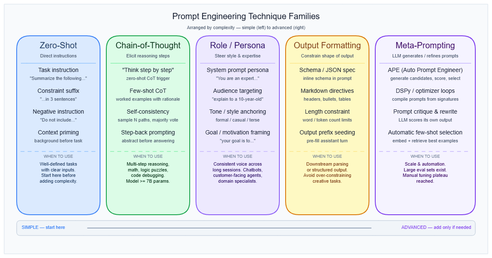
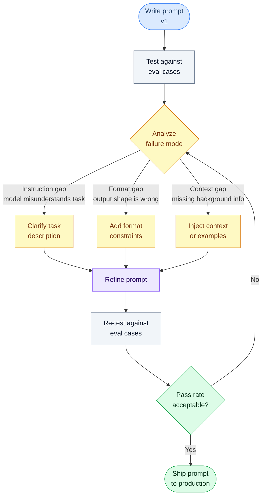

# Prompt Engineering

---

## What it is

Think of prompt engineering like writing a precise brief for a highly capable contractor who has no memory of your previous projects: the quality of the output depends almost entirely on the quality of the instructions you hand them at the start of each job.

Prompt engineering is the practice of designing and iterating on the text inputs to a language model — system instructions, user messages, examples, and injected context — to reliably elicit a desired output without changing model weights.

It is not wordsmithing. The most significant framing shift of 2025 is Andrej Karpathy's "context engineering" — the discipline of architecting the full information environment that fills the context window: system instructions, retrieved documents, conversation history, tool results, and the user message together. Phrasing is roughly 10% of that problem.

---

## How it works

### The six technique families

A language model generates each token by computing a probability distribution over its vocabulary conditioned on everything in the context window. Prompt engineering manipulates that context to shift which distributions become most probable. The weights stay fixed — only the activation patterns change. This makes prompting fast to iterate and zero-cost to deploy, but also fundamentally bounded: it can only surface behaviors the model's training has already made reachable.

The field has produced 58 catalogued text-based techniques (The Prompt Report, Schulhoff et al., 2024). They organize into six families, arranged roughly from simple to complex:



**1. Zero-shot instructions**

Role or persona assignment, style directives, explicit task framing, and rephrase-and-respond (RaR) patterns. No examples are provided. Works because instruction-tuned models are trained to follow directives. This is the right starting point for any new task. → see [System prompt](system-prompt.md) for how role framing is applied at the system layer.

**2. In-context learning (few-shot)**

Providing 3–20 worked examples inside the prompt to demonstrate the target behavior. The critical design variables are quantity (diminishing returns beyond roughly 20 examples), ordering (accuracy can swing from sub-50% to over 90% on the same example set by reordering alone), label distribution, and format consistency. → see [Few-shot & zero-shot](few-shot-zero-shot.md) for a full treatment. → see [In-context learning](in-context-learning.md) for the theoretical mechanism.

**3. Thought generation (Chain-of-Thought and variants)**

Prompting the model to produce intermediate reasoning steps before a final answer. Two forms: few-shot CoT (exemplars include full reasoning traces) and zero-shot CoT (appending "Let's think step by step"). On the GSM8K math benchmark, PaLM 540B improved from 17.9% to 56.9% accuracy with CoT. Critical constraint: the gains require roughly 100B+ parameters — smaller models produce fluent but logically incoherent chains.

CoT value is declining for dedicated reasoning models. Wharton GAIL (2025) found only 2.9–3.1% gains for o3-mini and o4-mini with explicit CoT instructions, and Gemini Flash 2.5 showed -3.3% with explicit CoT because those models internalize chain-of-thought natively.

**4. Decomposition**

Breaking complex tasks into explicit subtasks. Least-to-Most prompting solves sub-problems in sequence. Tree-of-Thought (ToT) explores branching reasoning paths and selects the best branch. ToT achieved 74% on the Game of 24 puzzle versus 4% for standard CoT — a 70 percentage point gap that illustrates what decomposition buys on multi-step planning problems.

**5. Ensembling and self-consistency**

Generating multiple reasoning paths at varied temperatures, then taking a majority vote. Self-consistency improved GSM8K accuracy by 17.9% over standard CoT. The cost is proportional to the number of samples drawn, so this technique trades latency and token budget for accuracy. → see [Temperature, Top-p & sampling](temperature-sampling.md) for how sampling diversity is controlled.

**6. Self-criticism and refinement**

The model critiques its own output and rewrites it (Self-Refine, Chain-of-Verification). Useful for format correctness and structural problems. The risk: models can generate confident-sounding revisions that are factually worse than the original. Use only with an external verifier or a concrete rubric — never ask the model to "improve" without specifying improvement criteria.

**Output format constraints**

Explicit schema definitions, JSON mode, and XML tag delimiters. Format communicated only through examples fails on roughly 20% of production traffic where input structure diverges from the examples. Declare output schema explicitly in instruction text; use examples for semantic content only. → see [Structured output & JSON mode](structured-output.md) for enforcement mechanisms.

**Meta-prompting and automated optimization**

Using a second LLM call to generate, critique, or score candidate prompts. Automatic Prompt Engineer (APE) generates variants and scores them against a held-out eval set. ProTeGi uses LLM criticism combined with bandit-style selection. These methods are becoming production-viable through tools like PromptLayer, Braintrust, and Latitude — the automated alternative to manual iteration.

### Iterative prompt development cycle

Write a prompt, test it against evaluation cases, diagnose the failure mode, refine, and repeat. The exit condition is measured pass rate — not subjective satisfaction.



### Gotchas & production behavior

With 12 findings in scope, they are grouped by theme.

**Instruction design failures**

- **Negative instructions backfire.** "Don't do X" activates the prohibited concept and then asks the model to suppress it — which fails inconsistently. Reframe every prohibition as a positive command: "never create duplicate files" becomes "apply all fixes to existing files in place." Compliance degrades noticeably with 3+ prohibitions.
- **Instruction overload hits a ceiling.** Prompts are stable at 1–4 rules. At 8–10 rules accuracy drops 5–10 percentage points. At 12+ rules with exception handling, behavior becomes unpredictable as the model starts triaging which rules to apply. The exit path is fine-tuning, not adding more rules.
- **"Lost in the middle" is real.** Critical instructions placed in the middle of long prompts are ignored at a rate 30%+ higher than the same instructions placed at the start or end. Attention follows a U-shape: start and end receive the most weight. Place the single most important instruction as the final line before generation begins.

**Few-shot and example management**

- **Examples silently override instructions.** When prompt copy is updated but examples are not, the model follows the examples. "Three contradicting examples reliably beats one paragraph of instruction text." This is the most common silent regression in production prompt libraries. Treat examples and instructions as a joint contract — both must update together.
- **Exemplar ordering swings accuracy 40+ percentage points.** On classification tasks, reordering the same examples can move accuracy from sub-50% to over 90%. Always test at least two orderings. Recency bias is real: put the most representative example last.
- **Few-shot examples hurt reasoning models.** When migrating prompts to o1, o3, Claude extended thinking, or DeepSeek R1, few-shot examples consistently degrade performance. Remove them entirely or reduce to 1–2. Explicit "think step by step" instructions cause similar confusion on these models.

**Output and format issues**

- **Format choice is the highest-leverage variable no one tests.** Switching between Markdown, JSON, and plain text produces 40–300% accuracy changes. GPT-3.5-turbo achieved 42% higher MMLU accuracy with JSON formatting over Markdown; switching Markdown to plain text produced a 200% improvement on HumanEval. No format universally wins — GPT-3.5 prefers JSON, GPT-4 favors Markdown, and it varies by task. Run format ablations before any other optimization.
- **Implicit format specification breaks at the tail.** Relying on examples alone for format guidance fails on roughly 20% of structurally unfamiliar inputs. Declare the output schema explicitly in instruction text.
- **Output length constraints are not counted.** Models do not count words during generation. "Be concise" is ignored. "Write in 50 words" typically overshoots by 10–15%. Use "at most X words" and accept that iterative refinement loops — with latency cost — are the most reliable enforcement mechanism.

**Model behavior pitfalls**

- **Sycophantic capitulation is measurable.** GPT-4o, Claude Sonnet, and Gemini 1.5 Pro all change correct answers under user pushback 58.19% of the time. Regressive sycophancy (flipping correct to incorrect) occurs in 14.66% of cases. Add an explicit instruction: "If a user challenges your answer, re-evaluate based on logic and evidence, not their emotional state." Test verification workflows specifically for this failure mode.
- **Persona prompting degrades analytical accuracy.** Generic openers like "you are a world-class expert" improve some tasks but break others. GPT-4 answered roughly 15.8% more questions correctly with role instructions, but broke roughly 13.8% of previously correct answers. LLMs show up to 30 percentage point accuracy drops under irrelevant persona attributes. For code generation, classification, and extraction tasks, persona-free prompts often match or outperform.
- **CoT generates unfaithful reasoning traces.** The intermediate steps shown by CoT do not necessarily correspond to the model's actual computation. Multi-step reasoning tasks show hallucination rates above 33% in CoT outputs. CoT also masks normal hallucination detection signals, making confident-sounding wrong answers harder to catch. CoT without retrieved factual context is highest risk.

**Stability and drift**

- **Prompts drift silently across model updates.** 58.8% of prompt-model combinations experienced accuracy drops across API updates; of those, 70.2% dropped more than 5 percentage points. GPT-4's prime number identification fell from 84% to 51% without changelog. Even pinned dated versions (e.g., gpt-4o-2024-08-06) exhibited behavioral changes in early 2025. Pin exact versions, build a regression eval suite from production data, and run it nightly. Monitor at data-slice level — aggregate metrics hide slice-level regressions.

---

## Why it matters

This topic sits at the **Orchestration** layer. Prompt engineering is the primary control surface between application logic and model behavior — every other technique in section 02 (few-shot, structured output, temperature sampling, constitutional constraints) is a specialization of it. Without a disciplined approach here, downstream decisions become guesswork: you cannot know whether a failure is a model limitation, a prompt structure problem, or a format artifact. The formatting effect alone — a 42% accuracy swing from changing Markdown to JSON — is larger than most fine-tuning gains, and it is entirely invisible without deliberate testing.

---

## Key terms

| Term | Meaning |
|------|---------|
| Context engineering | Karpathy's 2025 framing: architecting the full context window (system prompt, retrieved docs, history, tool results, user message) — prompt wording is ~10% of this |
| Chain-of-Thought (CoT) | Prompting technique that asks the model to produce explicit intermediate reasoning steps before the final answer |
| Zero-shot CoT | Triggering CoT without examples by appending "Let's think step by step" to the prompt |
| Self-consistency | Sampling multiple independent reasoning paths and majority-voting the final answer |
| Tree-of-Thought (ToT) | Decomposition technique that explores branching reasoning paths and selects the best branch — 74% vs 4% on Game of 24 |
| Instruction overload | Anti-pattern where a prompt accumulates 10+ rules, causing the model to triage which to follow and degrading accuracy 5–10pp |
| Prompt monolith | A prompt that has grown to 12+ rules with exception handling through iterative "add a rule per failure" — the most common failure pattern in mature production systems |
| Recency bias | The model pays disproportionate attention to text near the end of the context window; used deliberately by placing critical instructions last |
| Sycophantic capitulation | The model changing a correct answer to agree with user pushback; occurs in 58.19% of challenged responses across major models |
| Format ablation | Testing Markdown, JSON, and plain text variants of the same prompt against each other to find the highest-accuracy format for a given model-task combination |

---

## Code / demo

The snippet below demonstrates three core prompt patterns — zero-shot, few-shot, and chain-of-thought — against the same task so you can observe the output differences directly.

```python
# pip install openai
import os
from openai import OpenAI

client = OpenAI(api_key=os.environ["OPENAI_API_KEY"])

TASK = "Is 1763 a prime number?"

def ask(system: str, user: str, label: str) -> None:
    resp = client.chat.completions.create(
        model="gpt-4o-mini",
        messages=[{"role": "system", "content": system},
                  {"role": "user", "content": user}],
        max_tokens=200,
    )
    print(f"\n=== {label} ===")
    print(resp.choices[0].message.content.strip())

# Zero-shot: direct instruction only
ask("Answer math questions concisely.", TASK, "Zero-shot")

# Few-shot: two worked examples before the question
few_shot_system = """Answer math questions concisely.
Example: Is 17 prime? Yes — 17 has no divisors other than 1 and itself.
Example: Is 25 prime? No — 25 = 5 × 5."""
ask(few_shot_system, TASK, "Few-shot (2 examples)")

# Chain-of-Thought: explicit reasoning request
cot_system = "Answer math questions. Show your working step by step, then state your conclusion."
ask(cot_system, TASK, "Chain-of-Thought")
```

> Note: requires an `OPENAI_API_KEY` environment variable. Run `pip install openai` first. The three calls demonstrate how the same question produces different answer structures depending on technique family — observe whether CoT produces a correct factual answer (1763 = 41 × 43, not prime) while zero-shot may produce a confident wrong answer.

---

## My notes

- Format choice is the most underrated variable. The 42% MMLU accuracy swing from Markdown-to-JSON on GPT-3.5-turbo is larger than many fine-tuning gains, yet format ablation is rarely part of standard prompt development workflows.
- The "add a rule per failure" anti-pattern is self-compounding: each new rule marginally reduces compliance with existing rules, creating a treadmill that ends at fine-tuning. The exit condition should be established before starting — when the prompt hits 8 rules, stop adding and start evaluating whether fine-tuning is warranted.
- CoT and reasoning models are in tension: CoT was designed as a workaround for models that lacked internal reasoning, but reasoning models (o1, o3, extended thinking) do this natively. The same technique that gives +39pp on GSM8K for PaLM 540B gives -3.3% for Gemini Flash 2.5. Technique selection is now model-generation-specific.
- Sycophancy interacts badly with agentic verification loops. If a model checks its own output and is then asked "are you sure?", it capitulates 58% of the time — meaning the verification step actively degrades accuracy. This is an unresolved tension between self-refinement and sycophancy suppression. → see [In-context learning](in-context-learning.md) for how multi-turn context shapes model behavior.
- Prompt drift across model updates is largely invisible in aggregate metrics. Slice-level monitoring — tracking accuracy per input category, not just overall — is the only reliable detection method. One in ten prompts shifts meaningfully on a single model upgrade.

*Last researched: 2026-05-22*

---

## Resources

1. Schulhoff et al., "The Prompt Report" (2024, revised 2025) — the most comprehensive taxonomy of prompting techniques, cataloguing 58 methods: https://arxiv.org/abs/2406.06608
2. Wei et al., "Chain-of-Thought Prompting Elicits Reasoning in Large Language Models" (2022) — the canonical CoT paper with GSM8K and StrategyQA benchmark numbers: https://arxiv.org/abs/2201.11903
3. Wharton GAIL, "The Decreasing Value of Chain of Thought in Prompting" (2025) — empirical evidence that CoT gains are minimal or negative for reasoning models: https://gail.wharton.upenn.edu/research-and-insights/tech-report-chain-of-thought/
