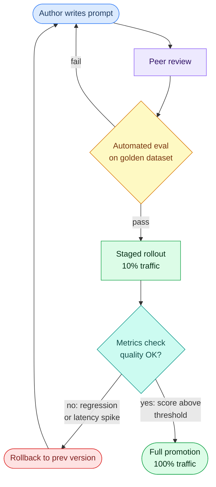

# Prompt Versioning

---

## What it is

Think of prompt versioning like Git for configuration files in a regulated system: every state of the configuration is stored permanently with a timestamp and author, a label like `production` points to whichever version is currently live, and rolling back means repointing the label — not rewriting history.

Prompt versioning is the practice of assigning unique, immutable identifiers to each distinct state of a prompt, storing those states with metadata (author, timestamp, rationale, model config, evaluation scores), and controlling which version runs in each deployment environment through mutable labels rather than mutable content.

It is not the same as saving prompts in a Git repository. Git captures text history, but production prompt versioning requires out-of-process update capability, environment label management, non-engineer access, and evaluation integration — none of which Git provides natively.

---

## How it works

### The three-layer storage model

Every production prompt versioning system, regardless of tooling, operates across three distinct layers.

**Layer 1 — Immutable version snapshots.** Once you save a prompt, its content never changes. Version v3 is always v3. Any edit creates v4. This immutability is what makes rollback and reproduction meaningful — you can always re-run exactly the prompt that ran in production on a given date.

**Layer 2 — Mutable deployment labels.** Labels like `production`, `staging`, and `canary` act as pointers that reference a specific version. Rolling back is repointing `production` from v12 to v11 — a configuration change that takes seconds. In Langfuse, protected labels restrict `production` repointing to admins only, preventing accidental promotion.

**Layer 3 — Metadata envelope.** Each version captures the full execution context: the prompt template with its variable placeholders, model and parameter configuration (model name, temperature, top-p, max_tokens), author, change rationale, and linked evaluation scores. Storing the template is not enough — a change from `{{user_input}}` to `{{user_query}}` is a breaking change to downstream code even if the instruction text is identical.

<!-- Excalidraw lifecycle diagram: assets/images/topics/02-prompting-control/prompt-versioning.excalidraw — export to PNG via VS Code Excalidraw extension to render here -->

### The deployment pipeline

The standard promotion flow moves a candidate prompt through automated evaluation before any production traffic sees it.



The golden dataset evaluation gate is the critical checkpoint. A concrete threshold: require a score of ≥ 0.85 before unblocking deployment. The dataset should cover 50–200 cases across core use cases, edge cases, and adversarial inputs (the MVES framework from agenta). A canary rollout runs the new version on 5–10% of production traffic for 24–48 hours before full promotion.

### Versioning schemes

| Scheme | How it works | Best for |
|--------|-------------|----------|
| Incremental integer (v1, v2, v3) | Assigned sequentially on each save | Audit trail, simple ordering |
| Semantic (v1.2.0) | Major.minor.patch signals risk level | Risk communication across roles |
| Content-addressable hash | ID derived from content; duplicate saves detected | Deduplication, reproducibility |

In practice, production systems combine schemes: a sequential integer for human-readable ordering and a content hash for exact reproducibility when referencing a specific version in code.

### Tooling landscape

The dominant platforms as of mid-2026: **Langfuse** (open-source, self-hostable, framework-agnostic, MCP server integration), **LangSmith** (closed-source, tightly LangChain-coupled), **PromptLayer** (Git-style registry with release labels), **Braintrust** (evaluation-first with versioning), **Agenta** (CI/CD focused), and **Humanloop** (product-team-oriented with visual editing).

Git-only versioning fails in three specific conditions: non-engineers need to iterate prompts, experimentation needs to happen faster than deploy cycles allow, or you need prompt-specific change visibility separate from application code. Dedicated registries solve all three — at the cost of a runtime dependency. If the registry is unavailable, your application must fall back to a hardcoded version.

A/B testing routes a fraction of production traffic to a challenger version while the incumbent handles the rest. Metrics tracked per variant include LLM-as-a-judge quality scores, [Structured output & JSON mode](structured-output.md) format compliance rates, response latency, token cost per request, and human feedback signals. Shadow mode runs the new version against real production inputs without surfacing results to users — catching regressions with zero user-facing risk.

The "promptware engineering" paper (arXiv:2503.02400, ACM TOSEM, March 2025) formally established this discipline, finding that only **21.9% of real-world prompt changes are documented** — meaning 78% of prompt changes in typical teams leave no traceable history when debugging a regression.

### Gotchas & production behavior

**Silent regressions and "improved" prompts**

- Research (arXiv:2601.22025) demonstrated that adding a generic helpful-assistant template to Llama 3 8B — an apparently safe "improvement" — caused extraction task pass rate to drop from 100% to 90% (−10 pp) and RAG compliance from 93.3% to 80% (−13 pp), while instruction-following improved 13%. An aggregate metric improvement masked a catastrophic regression in specific task categories.
- Three words added to improve "conversational flow" caused [Structured output & JSON mode](structured-output.md) error rates to spike and halted a revenue pipeline within hours. Eight hours elapsed before root-cause attribution because there was no prompt version history to diff against.
- Minor prompt wording changes shift output formatting enough to break downstream JSON parsers — creating a hard coupling between prompt versions and downstream parsing code.

**Model provider silent updates**

- 58.8% of prompt + model combinations drop accuracy across API updates, with 70.2% of those drops exceeding 5% accuracy loss. In February 2026, a pinned GPT-4o version received a behavioral update causing JSON extraction prompts to return preamble text, making `json.loads()` throw exceptions on ~15% of calls.
- Even dated snapshots like `gpt-4o-2024-08-06` can receive silent behavioral updates. The full stack that can change without announcement: model weights, inference engine version, tokenizer and chat templates, injected platform system prompts, and safety/moderation layers.
- Rolling back the prompt version does not restore previous production behavior if the model provider updated the substrate in the interim. The old prompt runs against a different model. Most versioning systems capture prompt text but not the full execution context — to reproduce a result, you need the text, model snapshot ID, temperature, and system fingerprint together.

**A/B testing assignment errors**

- Per-request A/B assignment (not per-session) causes users to see different response styles within the same conversation. This contaminates quality signals and creates a degraded user experience where tone and format shift mid-session.
- Aggregate metrics hide catastrophic edge cases: a 3% average improvement can mask confident wrong outputs in legal or medical edge cases. Always segment metrics by use-case category, not just by overall score.
- Sample size matters: 10–20 golden examples only catch complete failures; 50–100 examples detect 5–10% shifts; 200–500 examples detect 1–3% changes reliably.

**LangSmith default behavior**

- `hub.pull("owner/name")` silently fetches the latest version in production. The correct production form is `hub.pull("owner/name:abc123de")` with the explicit commit hash. In horizontally scaled deployments, different pods refresh at different offsets within the 5-minute TTL window, causing temporary version drift across the fleet during transitions.

**Stale golden evaluation sets**

- Static golden datasets become unrepresentative within approximately 90 days due to input drift (user language evolves), concept drift (underlying patterns change), and metric drift (different teams implement the same metric differently). Mark existing golden rows stale after 90 days and pull fresh samples from production weekly.
- LLM-as-a-judge evaluators compound this: position bias, verbosity bias, and self-enhancement bias cause systematic evaluator drift without periodic calibration against human labels. Target Cohen's kappa ≥ 0.41 between the judge and human raters.

**Prompt sprawl and governance failures**

- Without access control, multiple engineers editing the same prompt create overwrites. A single feature accumulates separate prompts for paid vs. free users, English vs. French, GPT-4o vs. cheaper models, plus experimental variants from three different engineers.
- Non-engineer stakeholders (PMs, domain experts) iterate prompts via vendor UIs that don't sync with Git — creating a fork between the registered version and the deployed version.
- Multi-step prompt chains require integration-level regression tests. Unit tests on individual prompts miss chain-level failures: a version update to prompt #1 changes its output format, which silently breaks prompt #3's parsing even if prompt #3 was unchanged.

---

## Why it matters

This topic sits at the **Orchestration** layer — prompt versioning is the change management infrastructure that makes every other prompting technique (→ see [Prompt engineering](prompt-engineering.md), [Few-shot & zero-shot](few-shot-zero-shot.md), [System prompt](system-prompt.md)) safe to evolve in production.

Without it, prompt changes are the #1 source of LLM regressions in production, ahead of code changes and infrastructure changes. A change with no version history cannot be rolled back, its before/after cannot be diffed, and its regression cannot be attributed without reviewing commit logs across the entire codebase. The mean time to attribution in the documented incident above was eight hours for a change that took seconds to make.

The concrete stakes: 58.8% of prompt + model combinations degrade across API updates. Without a versioning system that decouples prompt changes from model state, the only way to detect a regression is a user complaint or a monitoring alert — not a diff.

---

## Key terms

| Term | Meaning |
|------|---------|
| Version snapshot | An immutable, permanently stored state of a prompt template — content never changes after creation |
| Deployment label | A mutable pointer (`production`, `staging`, `canary`) that references a specific version; rollback is repointing the label |
| Metadata envelope | The full execution context stored per version: template text, variable schema, model name, temperature, author, and linked eval scores |
| Golden dataset | A curated set of 50–200 input/expected-output pairs used as an automated evaluation gate before deployment |
| Canary rollout | Routing 5–10% of production traffic to a new prompt version for 24–48 hours before full promotion |
| Shadow mode | Running a new prompt version against live production inputs without surfacing outputs to users — catching regressions with zero user-facing risk |
| Promptware engineering | The formal SE discipline of treating prompts as first-class software artifacts with full lifecycle management (requirements, versioning, testing, deployment) |
| Content-addressable hash | A version ID derived from the content itself; identical prompts saved twice receive identical IDs, enabling deduplication |
| Prompt sprawl | The accumulation of undocumented, overlapping prompt variants across a team without a central registry or governance policy |
| MVES framework | Minimum Viable Evaluation Set — a structured approach to building golden datasets covering core cases, edge cases, and adversarial inputs |

---

## Code / demo

```python
# pip install (none — standard library only)
import hashlib, json, datetime

class PromptRegistry:
    """Minimal local prompt registry: immutable snapshots + mutable labels."""
    def __init__(self):
        self._versions = {}   # hash -> {template, config, author, ts, rationale}
        self._labels   = {}   # label -> hash

    def save(self, template: str, config: dict, author: str, rationale: str) -> str:
        payload  = json.dumps({"template": template, "config": config}, sort_keys=True)
        vid      = hashlib.sha256(payload.encode()).hexdigest()[:8]
        self._versions[vid] = {
            "template": template, "config": config,
            "author": author, "rationale": rationale,
            "ts": datetime.datetime.utcnow().isoformat()
        }
        return vid

    def promote(self, label: str, vid: str):
        assert vid in self._versions, f"Unknown version {vid}"
        self._labels[label] = vid

    def get(self, label: str) -> dict:
        vid = self._labels.get(label)
        return self._versions[vid] if vid else None

registry = PromptRegistry()
v1 = registry.save("Summarize: {{text}}", {"model": "gpt-4o", "temperature": 0.2}, "alice", "initial")
v2 = registry.save("Summarize in 2 sentences: {{text}}", {"model": "gpt-4o", "temperature": 0.1}, "bob", "tightened")

registry.promote("production", v1)  # v1 is stable
registry.promote("staging", v2)     # v2 under evaluation

prod = registry.get("production")
print(f"production -> {registry._labels['production']}: {prod['template']!r}")
print(f"staging    -> {registry._labels['staging']}: {registry.get('staging')['template']!r}")
```

> Note: no API key required. This demonstrates the core invariant — version content is immutable, labels are the only thing that moves. In production, replace this with Langfuse's prompt management API or LangSmith's hub, which add evaluation integration, access control, and TTL-based caching.

---

## My notes

- The rollback illusion is the most dangerous failure mode: rolling back to v11 of the prompt does not restore v11-era behavior if the model provider silently updated the underlying model between then and now. True reproducibility requires versioning the full execution bundle (prompt text + model snapshot ID + temperature), not just the text. No major prompt versioning tool does this natively as of mid-2026 — workarounds involve storing parameters in a config sidecar alongside the prompt.
- The 21.9% change documentation rate (arXiv:2503.02400) is striking because it means the average production LLM application has no traceable history for roughly 4 out of every 5 prompt changes. Most teams discover they need versioning the first time they face an unexplained regression and cannot identify what changed.
- The LangSmith `hub.pull()` default (pulling latest without a pinned hash) is a quiet footgun in horizontally scaled deployments — different pods can run different prompt versions during the TTL refresh window. This is the prompt-layer equivalent of a floating `latest` container tag and deserves the same discipline: always pin.
- The unresolved tension between eval automation and golden dataset currency: LLM-as-a-judge evaluators are themselves non-deterministic, subject to positional and verbosity biases, and need periodic recalibration. The tool used to gate prompt deployments requires its own versioning and validation — a meta-problem that the tooling ecosystem hasn't fully solved.
- Multi-prompt chains (agent workflows, RAG pipelines) require integration-level regression tests because prompt #1's output schema change silently breaks prompt #3. Teams that build unit tests per prompt but skip chain-level tests will not catch this failure mode until it reaches production. → see [System prompt](system-prompt.md) for how system prompt changes interact with chain behavior.

*Last researched: 2026-06-19*

---

## Resources

1. "Promptware Engineering: Software Engineering for Prompt-Enabled Systems" (arXiv:2503.02400, ACM TOSEM, March 2025) — establishes prompt lifecycle management as a formal SE discipline, source of the 21.9% documentation rate finding: https://arxiv.org/abs/2503.02400
2. Langfuse Prompt Version Control documentation — authoritative reference for labels, protected environments, TTL caching, and MCP integration: https://langfuse.com/docs/prompt-management/features/prompt-version-control
3. "When 'Better' Prompts Hurt: Evaluation-Driven Iteration for LLM Applications" (arXiv:2601.22025) — empirical data on the MVES framework and prompt regression rates: https://arxiv.org/abs/2601.22025
