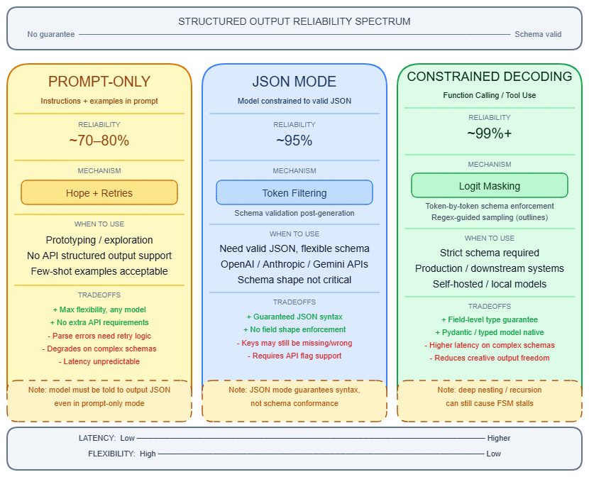
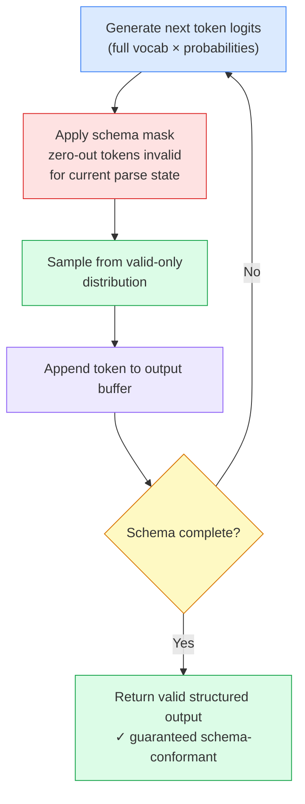

# Structured Output & JSON Mode

---

## What it is

Think of structured output like a customs form at an airport: the traveller (the model) can say anything in freeform conversation, but when they need to cross the border (reach your application code), they must fill in specific labelled boxes in a specific order — or the form is rejected.

Structured output is the set of techniques that constrain an LLM's generation to produce responses that conform to a predefined schema — typically JSON — so that downstream code can parse and consume them reliably without fragile string manipulation.

It is not the same as asking the model to "respond in JSON." That is a prompt instruction the model can ignore, forget, or partially follow. Genuine structured output means the model's token sampling is mechanically constrained so that non-conforming output is rendered impossible to generate.

---

## How it works

Three fundamentally different mechanisms exist, each with different reliability guarantees. The choice between them determines your schema compliance rate — which ranges from 35% to 100% depending on which tier you use.



### The three tiers

**Tier 1 — Prompt-only JSON extraction**

You instruct the model via the [System prompt](system-prompt.md) or user message to return JSON matching a schema. Nothing constrains the decoding process. The model generates tokens freely and attempts to follow the schema through instruction-following alone.

Failure rate: 5–20% in production depending on schema complexity and model size. Failure modes are predictable: preamble contamination ("Sure! Here's the JSON: `{...}`") that breaks `json.loads()`, hallucinated keys absent from your schema, and output truncated mid-brace when approaching the token limit. Prompt engineering → [Prompt engineering](prompt-engineering.md) can reduce but not eliminate these failures. Pre-2024 benchmarks found only 35.9% reliable schema compliance on complex schemas using this approach alone.

**Tier 2 — JSON mode (syntax guarantee, not schema guarantee)**

Setting `response_format: {"type": "json_object"}` on OpenAI, or the equivalent on Mistral, applies a logit mask that zeroes out any token that would break JSON syntax validity. The output is always parseable by `json.loads()`.

What JSON mode does NOT do: enforce specific fields, types, or schema shape. GPT-4o-mini with JSON mode enabled scores only 19.8% on function-calling benchmarks, because the model produces syntactically valid JSON that ignores the intended schema. JSON mode is a syntax contract, not a structure contract. Your application can still receive `{"result": "unknown"}` when you expected `{"score": 0.87, "label": "positive", "confidence": 0.95}`.

**Tier 3 — Constrained decoding (schema guarantee)**

This is the mechanism behind OpenAI Structured Outputs, Anthropic's structured outputs (GA on the Claude 4.x family as of mid-2026), and open-source libraries like Outlines and XGrammar. It achieves near-100% schema compliance by changing how tokens are sampled.

The mechanism:

1. Your JSON Schema is compiled into a context-free grammar (CFG) or finite state machine (FSM) that encodes all valid output states.
2. At each decoding step, the system tracks the current parse state — where in the grammar the output currently sits.
3. Before sampling, a **logit mask** is computed: tokens that would produce an invalid grammar continuation have their logits set to −∞ (probability forced to zero). Only tokens that keep the grammar in a valid state remain.
4. The model samples from the masked distribution. The result is guaranteed to be grammar-valid.
5. This repeats token-by-token until the grammar reaches a terminal state.



The key engineering challenge is that LLM tokenizers use subword BPE (Byte Pair Encoding) tokens that do not align cleanly with JSON grammar boundaries. XGrammar solves this by pre-classifying tokens as "context-independent" (can be decided offline from grammar state alone — ~99% of vocabulary for JSON) versus "context-dependent" (require full stack inspection at runtime — less than 1% for JSON). The adaptive mask cache precomputes context-independent decisions, achieving per-token mask generation in under 40 microseconds on H100 hardware, compared to 30–46 ms per token in Outlines' earlier approach.

**GBNF (GGML BNF)** is the equivalent mechanism in llama.cpp and Ollama for local inference. It expresses grammars as BNF-like rules applied during sampling. Simpler and less optimized than XGrammar, but available on consumer hardware with no extra setup.

**Function calling vs. structured output** — these are mechanically identical under modern APIs: both compile a JSON Schema to a grammar and apply constrained decoding. OpenAI's `strict: true` on function definitions uses the same engine as `response_format: {"type": "json_schema"}`. The semantic difference: function calling signals "choose whether to call a tool and with what arguments"; structured output signals "always return this exact shape." Anthropic implements structured outputs via its tool-use engine internally.

**Schema-Aligned Parsing (SAP)** — used by BAML/BoundaryML — takes a fourth approach: generate completely freeform, then apply a schema-aware parser with a cost function that corrects predictable LLM errors (unquoted strings, missing commas, trailing prose before the JSON block). SAP achieves 92–94% compliance across GPT-4o, Claude 3.5 Sonnet, and GPT-4o-mini without restricting generation at inference time.

### The format tax

A 2026 paper from UC San Diego (arXiv:2604.03616) documented a newly identified cost: requiring structured output degrades reasoning accuracy on open-weight models. On MATH-500, the average drop is 6.6 percentage points when JSON output is required versus freeform. On ZebraLogic, 5–8pp losses are typical.

The surprising finding: approximately 70% of this degradation comes from the format-requesting prompt instruction alone, before any decoder constraint activates. The decoder's logit masking adds only ~1.6pp of additional degradation. Closed-weight frontier models show near-zero format tax.

Two mitigations recover most of the loss:
- **Two-turn generation**: ask the model to reason freely in turn 1, then extract the structured answer in turn 2. Recovers +6.8pp average.
- **Extended thinking / chain-of-thought before the schema**: recovers +9.2pp average.

The CRANE technique (alternating unconstrained reasoning with constrained output, arXiv February 2025) formalizes this: on GSM-Symbolic, CRANE achieves 38% accuracy versus 29% for constrained-only and 29% for unconstrained chain-of-thought alone (Qwen2.5-Math-7B).

The practical implication: **put reasoning fields before answer fields in every schema**. Placing a conclusion field first forces the model to commit before generating its chain of thought — a measured 10–15% degradation on complex tasks.

### API landscape

| Provider | JSON mode | Schema-constrained | Notes |
|---|---|---|---|
| OpenAI | `response_format: {type: json_object}` | `response_format: {type: json_schema}` with `strict: true` | GA on gpt-4o-2024-08-06+; 100% compliance on eval suite |
| Anthropic | No dedicated JSON mode | `output_config.format` + `strict: true` on tools | GA on Claude 4.x family |
| Google Gemini | Yes | `response_schema` with JSON Schema | GA on Gemini 2.5+; preserves property ordering |
| Mistral | `response_format: {type: json_object}` | Custom structured outputs | JSON mode available on all models |
| Open-source (vLLM, SGLang) | Yes | XGrammar/Outlines integration | Near-zero overhead via XGrammar; GBNF for llama.cpp/Ollama |

Schema complexity limits are hard constraints, not soft suggestions. OpenAI enforces a cap on total schema size. Anthropic enforces: 20 strict tools per request, 24 total optional parameters, and 16 parameters with union types. Complex recursive schemas are not supported on any major provider. → see [Temperature, Top-p & sampling](temperature-sampling.md) for the interaction between sampling parameters and constrained decoding.

### Gotchas & production behavior

**Schema design failures**

- Placing an answer or conclusion field before reasoning fields forces the model to commit before generating chain-of-thought. Measured effect: 10–15% degradation on complex tasks. Always put `reasoning` or `thinking` fields first in your schema.
- OpenAI strict mode requires every property to be in the `required` array. The model cannot omit a field when it has no valid answer — it must hallucinate a value. Mitigation: use `"type": ["string", "null"]` to allow null. Documented edge case: GPT-4o-mini sometimes drops the key entirely rather than returning null, contradicting documented behavior.
- `additionalProperties: false` must be set on every nested object explicitly, not just at the top level. Forgetting this on any nested object silently allows the model to hallucinate keys in that sub-object.
- Keep schemas flat: fewer than 20 properties, nesting depth under 3, enum lists under 50 values. Complexity above these thresholds increases first-request compilation time and occasionally produces unexpected behavior at schema edges. Build a warm-up request into your deployment process for any new schema — the first real user request will otherwise absorb the compilation latency.

**Syntax vs. schema confusion**

- JSON mode guarantees a parseable response — not a correctly structured one. Production systems using JSON mode alone observe 5–20% schema failure rates. Field hallucination occurs silently: the model invents semantically plausible key names, returns HTTP 200 with valid JSON, and breaks downstream consumers without a parse error to catch.
- Monitoring parse error rates as a proxy for structured output reliability misses the entire class of semantic failures. A risk assessment pipeline that marks every item "low" in valid, schema-conformant JSON will never surface a parse error — it will silently produce wrong answers for weeks. Schema validation confirms structure; it cannot confirm correctness.

**Silent failures in client libraries**

- Sending a Pydantic model with `default=` field values to OpenAI strict mode returns HTTP 200 where the `parsed` attribute is `None`. No exception is raised. The failure surfaces later as `AttributeError` on the attribute you expected. Always check `completion.choices[0].message.parsed is not None` before accessing the result.
- Zod v3 schemas with `.optional()` fields trigger HTTP 400 errors when used with OpenAI strict mode. OpenAI strict mode requires all fields to be either required or typed as nullable — `.optional()` does not map to nullable.

**Token truncation and special characters**

- When `max_tokens` is reached mid-generation, the output is truncated with unclosed braces. Most application code does not check `finish_reason == "length"`. Always check finish_reason and treat `"length"` as a hard failure — do not attempt to parse the response.
- LaTeX mathematical expressions (backslashes, braces) cause the model to generate JSON with unescaped backslashes, producing "Unterminated string" errors in standard JSON parsers. Fix: add a preprocessing pass to escape backslashes in field values, or instruct the model explicitly in the system prompt to use `\\` for LaTeX backslashes.

**Refusals bypass the schema**

- When content triggers safety filters, a refusal object is returned that does not conform to your schema. This is a separate code path that schema validation will not catch. Applications must explicitly check for refusal before attempting to parse structured output.

**Community consensus settings:**

- Use schema-constrained generation (strict mode, native structured outputs) in production — not plain JSON mode
- Set `temperature` to 0.0–0.1 for JSON extraction tasks → see [Temperature, Top-p & sampling](temperature-sampling.md)
- Set `frequency_penalty=0.0` for all structured output tasks — values above 0.3 suppress repeated JSON field names and cause the model to invent synonyms or drop keys
- Two-pass generation is the right pattern for complex reasoning: freeform reasoning in turn 1, schema extraction in turn 2

---

## Why it matters

This topic sits at the **Orchestration** layer — structured output is the boundary between a language model and every downstream system that consumes its responses (databases, APIs, business logic, agent tool results).

Without reliable structured output, LLM integration degrades from a system component into a best-effort text parser. Any pipeline that sends LLM responses to a typed consumer — a database insert, an API call, a typed function argument — either needs 20–30 lines of fragile post-processing per field or silently propagates malformed data. Production systems that rely on prompt-only JSON extraction see 5–20% failure rates, and those failures are silent: HTTP 200, valid JSON, wrong structure.

The stakes are concrete: OpenAI Structured Outputs with `strict: true` achieves 100% schema compliance on their evaluation suite, versus 35.9% for prompt-only extraction on the same benchmark. That gap is the difference between a reliable pipeline component and a component that requires a human retry loop.

---

## Key terms

| Term | Meaning |
|------|---------|
| JSON mode | API setting that guarantees syntactically valid JSON output but does not enforce field names, types, or schema shape |
| Structured Outputs | API feature (OpenAI `strict: true`, Anthropic native) that enforces a specific JSON Schema via constrained decoding |
| Constrained decoding | Decoding technique that applies a logit mask at each step to zero out tokens that would violate the grammar, guaranteeing schema-valid output |
| Logit mask | A vector applied before sampling that sets the logit of any schema-invalid token to −∞, making it unsamplable |
| FSM (Finite State Machine) | The parse-state representation compiled from a JSON Schema; tracks which grammar states are valid at each decoding step |
| GBNF (GGML BNF) | The grammar format used by llama.cpp and Ollama for local constrained decoding; BNF-like rules applied during sampling |
| Format tax | The measured reasoning accuracy degradation (~6.6pp on MATH-500) caused by requiring structured output; ~70% caused by the format instruction itself |
| Schema-Aligned Parsing (SAP) | Post-generation approach that lets the model generate freely and corrects predictable schema violations in a parsing step; achieves 92–94% compliance |
| CRANE | Decoding strategy that alternates unconstrained reasoning steps with constrained output steps to recover reasoning accuracy lost from full constrained decoding |
| Preamble contamination | When the model prepends conversational text ("Sure! Here's the JSON:") before the JSON block, causing `json.loads()` to fail |

---

## Code / demo

```python
# pip install pydantic jsonschema
import json
from pydantic import BaseModel
from typing import Literal
import jsonschema

class SentimentResult(BaseModel):
    reasoning: str
    label: Literal["positive", "negative", "neutral"]
    confidence: float

schema = SentimentResult.model_json_schema()

good_output = '{"reasoning": "Strong positive language.", "label": "positive", "confidence": 0.95}'
bad_output  = '{"sentiment": "good", "score": 0.95}'
preamble    = 'Sure! Here is the JSON: {"reasoning": "...", "label": "positive", "confidence": 0.9}'

for name, raw in [("Schema-conformant", good_output), ("Hallucinated keys", bad_output), ("Preamble contamination", preamble)]:
    try:
        parsed = json.loads(raw)
        jsonschema.validate(parsed, schema)
        result = SentimentResult(**parsed)
        print(f"{name}: OK — label={result.label}, confidence={result.confidence}")
    except json.JSONDecodeError as e:
        print(f"{name}: JSON parse FAILED — {e}")
    except jsonschema.ValidationError as e:
        print(f"{name}: Schema FAILED — {e.message}")
    except Exception as e:
        print(f"{name}: Error — {e}")
```

> Note: this snippet requires only `pydantic` and `jsonschema` — no API key. It demonstrates why JSON mode alone (which would pass `good_output` and `bad_output` both as "valid JSON") is insufficient, and why schema validation is a separate required step. In production, replace the manual `json.loads` + `jsonschema.validate` chain with the provider SDK's native parsing: `completion.choices[0].message.parsed` (OpenAI) or equivalent.

---

## My notes

- The format tax finding (arXiv:2604.03616) changes the calculus for using structured output on reasoning tasks. For high-stakes reasoning (math, logic, multi-step planning), the two-turn pattern — free reasoning first, schema extraction second — is now the correct default, not an optimization. The question is whether orchestration frameworks will bake this pattern in, or whether developers will have to implement it manually.
- Strict mode's forced hallucination problem (required fields that the model has no valid answer for) has no clean resolution within the current schema spec. Using `"type": ["string", "null"]` everywhere defeats some of the value of typed schemas. The unresolved tension: schema strictness that catches application bugs also forces semantic incorrectness when data is genuinely missing.
- XGrammar's 40 µs per-token mask generation makes constrained decoding overhead effectively zero on H100s, but first-request compilation latency (up to a minute for complex schemas) is a real deployment gotcha that documentation understates. Any new schema should be warmed up in a staging environment before production traffic hits it.
- The equivalence of function calling and structured outputs at the mechanical level (both compile to grammar + constrained decoding) means the choice between them is purely semantic. Anthropic's decision to route structured outputs through its tool-use engine is consistent with this — but it means structured output limits inherit tool-use limits, which catches developers off guard.
- The CRANE result (38% vs. 29% for either pure constrained or pure unconstrained) suggests the field is converging on alternating generation as the standard pattern for tasks requiring both reasoning and schema compliance. Worth watching whether vLLM and SGLang expose this natively rather than requiring two separate API calls.

*Last researched: 2026-05-25*

---

## Resources

1. "The Format Tax: How Structured Output Requirements Degrade LLM Reasoning" (arXiv:2604.03616, UC San Diego, April 2026): https://arxiv.org/abs/2604.03616
2. OpenAI Structured Outputs documentation (authoritative API reference for `strict: true`, schema constraints, and supported JSON Schema subset): https://platform.openai.com/docs/guides/structured-outputs
3. XGrammar paper — "XGrammar: Flexible and Efficient Structured Generation Engine for Large Language Models" (arXiv:2411.15100, November 2024): https://arxiv.org/abs/2411.15100
