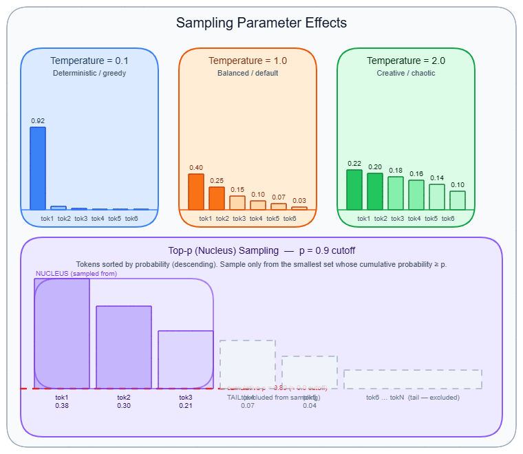
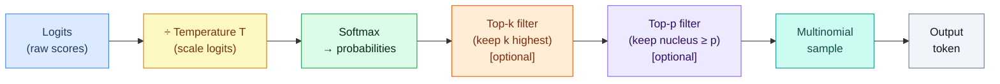

# Temperature, Top-p & Sampling Parameters

---

## What it is

Think of sampling parameters like the knobs on a music mixer: the model has already learned to play every instrument (the probability distribution over tokens), and these controls decide how strictly it should follow its own instincts — picking the safe, obvious note every time, or occasionally reaching for something surprising.

Sampling parameters are the set of numerical controls that govern how a language model converts its internal probability distribution over vocabulary tokens into a single output token at each generation step. They sit between the model's raw logits and the final chosen token, shaping the trade-off between predictability and variety.

It is not the case that these parameters make the model smarter or change what it knows — they only change *how* the model selects from what it already believes is plausible. A well-designed prompt matters far more than any sampling setting. → see [Prompt engineering](prompt-engineering.md) for the fuller picture on output quality levers.

---

## How it works

Every token generation follows a shared pipeline. The model's final linear layer produces one unnormalized score — a **logit** — per vocabulary entry (typically 32,000–128,000 tokens for modern models). Sampling parameters then filter, reshape, and sample from those scores before a single token is emitted. This happens independently at every single generation step.



### Core sampling pipeline



The five steps always execute in this order. Each parameter operates on the output of the previous step, not on the raw logits independently. This ordering is why combining multiple parameters produces non-obvious interactions.

### Temperature

Temperature is the most influential single parameter. Before softmax is applied, every logit `l_i` is divided by scalar T: `P(i) = exp(l_i / T) / Σ_j exp(l_j / T)`.

- **T = 0**: collapses to argmax (greedy decoding — always pick the single highest-logit token)
- **T = 1.0**: applies softmax unmodified — the model's trained distribution is used as-is
- **T > 1.0**: logit differences compress, flattening the distribution and making lower-probability tokens competitive

**Concrete numbers:** If the top token has logit 8.0 and the second-best has logit 5.0, at T=1.0 their probability ratio is e^8 / e^5 ≈ 20:1. At T=2.0 it becomes e^4 / e^2.5 ≈ 4.5:1 — the second token is now meaningfully competitive. At T=0.5 it becomes e^16 / e^10 ≈ 400:1 — the top token dominates completely.

**Task-specific consensus ranges:**

| Task | Temperature |
|------|------------|
| Extraction / classification / JSON schema | 0.0–0.2 |
| Code generation | 0.0–0.3 |
| Tool use / RAG answering | 0.2–0.5 |
| General chat | 0.7–1.0 |
| Creative writing / brainstorming | 0.8–1.2 |

Above T=1.2, output quality degrades rapidly on most models. Above T=2.0, outputs are typically incoherent.

**Provider scale difference:** OpenAI and Gemini use a 0–2 range (default 1.0). Anthropic uses 0–1 (default 1.0). Anthropic's 1.0 is their *maximum*, not their midpoint. Migrating settings between providers requires recalibration.

### Top-k sampling

Top-k retains the k highest-probability tokens and discards all others before sampling. It is a blunt instrument: k=50 forces the model to consider exactly 50 candidates regardless of whether its distribution is sharply peaked (confident) or flat (uncertain).

Because the count is fixed, top-k works against itself in both confidence extremes. When the model is sure, 49 of those 50 tokens are noise. When the model is genuinely uncertain, 50 may not be enough. Top-k is rarely set alone in production — it appears as a safety cap alongside top-p (e.g., top-k=100 AND top-p=0.9). Google's Gemini API has historically emphasized top-k more than other providers. Typical production range: k=40–100.

### Top-p (nucleus sampling)

Top-p sampling (nucleus sampling) fixes the weakness of top-k by making the candidate count *dynamic*. Tokens are sorted by descending probability. The model accumulates them until their cumulative probability reaches p, then discards everything below the cutoff and samples from the surviving set.

When the model is confident (peaked distribution), the nucleus might contain only 3–5 tokens to reach p=0.95. When the model is uncertain (flat distribution), it might need hundreds of tokens to reach the same threshold. The nucleus shrinks and expands automatically.

**Paper:** "The Curious Case of Neural Text Degeneration" — Holtzman et al. (arXiv 1904.09751, ICLR 2020). The paper showed that beam search produces 28.94% repetitive text; nucleus sampling at p=0.95 drops that to 0.36%, and achieves perplexity of 13.13 — closest to human text at 12.38.

**Core weakness:** In a genuinely flat distribution (model confused), reaching p=0.95 may require hundreds of low-quality tokens. Top-p widens exactly when you want it to tighten.

Typical production range: p=0.9–0.99. OpenAI and Anthropic both default to 1.0 (no filtering). Both providers explicitly recommend tuning *either* temperature or top-p, not both simultaneously.

### Min-p sampling (ICLR 2025)

Min-p solves top-p's flat-distribution problem by scaling the threshold relative to the model's own confidence. The formula: `threshold = min_p × P(top_token)`. Any token with probability below this threshold is discarded.

- When the model is confident (top token P=0.90, min_p=0.1): threshold = 0.09 — only tokens with ≥ 9% probability survive. Very tight.
- When the model is uncertain (top token P=0.15, min_p=0.1): threshold = 0.015 — a wider set survives. Appropriate.

**Paper:** "Turning Up the Heat: Min-p Sampling for Creative and Coherent LLM Outputs" — Nguyen et al. (arXiv 2407.01082, ICLR 2025). At T=1.5 on creative writing (AlpacaEval), min-p achieved a 58.12% win rate over top-p equivalents, and showed noticeably lower performance degradation on GSM8K math at T>1.0. Min-p is now implemented in vLLM, Hugging Face Transformers, and llama.cpp, and is the dominant recommendation on LocalLLaMA communities for creative work at elevated temperatures. Typical range: min_p=0.05–0.10.

### Top-nσ (November 2024)

Top-nσ takes a different approach: filtering happens in logit space, before temperature scaling. A token survives if `l_i ≥ max(L) - n × std(L)`, where L is the vector of all logits and n=1.0 is the default.

The critical property: because both max(L) and std(L) scale by 1/T when temperature is applied, the surviving token set is **mathematically identical regardless of temperature**. This makes top-nσ temperature-invariant. Benchmark at T=2.0 on GSM8K: top-nσ 79.30%, min-p 66.41%, top-k 21.88%, standard sampling 0.00% (arXiv 2411.07641). Not yet available in mainstream hosted APIs as of May 2026.

### Repetition and penalty parameters

Three related parameters reduce repetitive output — but they work differently and are not interchangeable.

**Repetition penalty** (open-source stack — llama.cpp, Hugging Face Transformers): Divides the logit of any previously seen token by the penalty value. At penalty=1.0 there is no effect; at 1.1–1.3, mild suppression. Above 1.5, common words (articles, prepositions, punctuation) get suppressed so aggressively that the model begins generating rare synonyms and then gibberish.

**Frequency penalty** (OpenAI API, range −2.0 to +2.0): Subtracts a linear amount proportional to how many times a token has already appeared. The penalty compounds — a token appearing 10 times is penalized 10× harder than one appearing once. Safe range: 0.0–0.3.

**Presence penalty** (OpenAI API, range −2.0 to +2.0): A flat one-time penalty applied as soon as a token appears at all. This pushes the model toward new topics rather than elaborating existing ones. Typical range: 0.1–0.3.

**Key distinction:** Frequency penalty scales with recurrence count; presence penalty is binary (appeared or not). For word-level repetition suppression, use frequency penalty. For forcing topical diversity, use presence penalty.

### The reasoning model exception

OpenAI's o-series (o1, o3, o4-mini) does not expose temperature or top-p to callers — those parameters are fixed internally. The new user-facing axis is `reasoning_effort`. Anthropic's Claude accepts temperature for extended thinking mode, but the internal reasoning chain is largely invariant to it. The `thinking_budget` parameter is the relevant control there. This marks a deliberate decoupling of "sampling parameters" from "output quality" for reasoning tasks. → see [Structured output & JSON mode](structured-output.md) for how constrained decoding interacts with this.

### Gotchas & production behavior

**Non-determinism and the temperature=0 trap**

- Setting `temperature=0` does not guarantee reproducible outputs. A 2024 study found a 120B-parameter model produced identical outputs across 10 deterministic runs only 12.5% of the time. Non-determinism at T=0 comes from three sources: (a) MoE models where batching affects expert routing; (b) multi-GPU tensor-parallel inference where FP16/BF16 floating-point addition is not associative and reduction order changes between runs; (c) inference engines that batch your request with other concurrent requests. Temperature=0 eliminates *sampling* randomness — it does not eliminate *computational* randomness from parallel hardware. OpenAI's community documentation confirms this explicitly. *(vLLM discussion #17166, vLLM issue #3432)*
- Greedy decoding (T=0, or `do_sample=False`) creates self-reinforcing repetition loops. Once the model emits a repeating pattern, those tokens are now in the context window, raising their probability for the next step — and greedy decoding always follows the highest probability. There is no escape. Documented specifically on Llama 3.1-8B-Instruct but affects all model sizes. Contradictory or logically inconsistent prompts trigger this most reliably. The fix is any amount of sampling: `do_sample=True, temperature=0.6, top_p=0.9`. *(meta-llama/Llama-3.1-8B-Instruct discussion #32)*

**Parameter interaction pitfalls**

- Temperature and top-p interact multiplicatively and partially cancel each other. Raising temperature flattens the distribution, causing top-p to admit more candidates. Lowering top-p tightens the candidate pool, countering what raising temperature did. The net effect is non-visible without inspecting logits directly. Both OpenAI and Anthropic documentation explicitly state: alter temperature *or* top_p, not both. When set simultaneously, treat them as a single combined lever, not two independent controls.
- Never set both top-p and top-k to non-default values simultaneously. Top-k applies first, then top-p filters those candidates. The interaction is multiplicative and rarely intuitive. Pick one.
- Gemini 3's API documentation explicitly warns that setting temperature below the model's default of 1.0 "may lead to unexpected behavior, such as looping or degraded performance, particularly in complex mathematical or reasoning tasks." This inverts the standard expectation that lower temperature yields more stable output. The documented guidance is to remove explicit temperature parameters entirely for this model family. *(Gemini 3 API docs)*

**Penalty parameters and structured output**

- Frequency penalty above 0.3–0.5 breaks JSON generation and code. Because `frequency_penalty` scales with token recurrence count, a JSON array with 10 elements is penalized 10× harder for repeating the same field names (`"name"`, `"id"`, `"value"`) than a 1-element response. The model begins inventing synonyms for JSON keys or omitting them entirely. Set `frequency_penalty=0.0` for any structured output or code task. *(vLLM issue #1257)*
- Repetition penalty above ~1.3 causes its own degenerate output. Common words — articles, prepositions, punctuation — are penalized into oblivion, forcing the model into rare synonyms and then gibberish. One production team that reduced prose repetition from 15% to 0% achieved this by restructuring the prompt (eliminating numbered lists, tables, and redundant patterns, cutting prompt length by 46%), not by increasing the penalty — which had zero effect at 1.5. *(Medium: "We Reduced LLM Repetition from 15% to 0%")*

**Mental model pitfalls**

- The "temperature = creativity" framing is empirically wrong. A 2024 study (ICCC'24, arXiv 2405.00492) tested temperature against four creativity dimensions: novelty, coherence, cohesion, and typicality. Temperature showed weak correlation with novelty and moderate correlation with *incoherence*. No relationship was found with cohesion or typicality. Higher temperature adds marginal novelty but reliably degrades coherence, and has no measurable effect on the creative dimensions most users actually care about.
- Vendor model cards recommend specific temperatures that are not set in the `generation_config.json` that ships with the model. A Q2 2025 survey found DeepSeek-V3-0324 recommends T=0.3 on its card but ships no config; Mistral Magistral-Small-2506 recommends T=0.7 with no config; GLM-Z1-32B recommends T=0.6 with an empty config. Loading via `from_pretrained()` without reading the model card gives you random defaults. *(muxup.com — Vendor-recommended LLM parameter quick reference, Q2 2025)*

---

## Why it matters

This topic sits at the **Orchestration** layer — sampling parameters are the final control surface between a working prompt and a consistent, task-appropriate output.

Without understanding sampling parameters, you cannot diagnose why a code-generation prompt produces erratic outputs at the same temperature you use for chat, why your JSON pipeline starts hallucinating field names as array length grows, or why setting T=0 is still producing different results across runs. Reasoning about these failures requires knowing which parameters interact, in what order, and with what asymmetric effects per provider.

The stakes are concrete: nucleus sampling at p=0.95 reduces output repetition from 28.94% to 0.36% versus beam search (Holtzman et al. 2020), and top-nσ sustains 79.30% accuracy on GSM8K at T=2.0 where standard sampling collapses to 0.00%. Parameter choice is a measurable quality lever, not an aesthetic preference.

The choice of sampling strategy also gates the next decision in this sequence: once you need a specific output *format* reliably, sampling parameters alone are insufficient and constrained decoding becomes necessary. → see [Structured output & JSON mode](structured-output.md).

---

## Key terms

| Term | Meaning |
|------|---------|
| Logit | The raw unnormalized score a model produces for each vocabulary token before any probability conversion |
| Temperature (T) | Scalar divisor applied to logits before softmax; T<1 sharpens the distribution, T>1 flattens it |
| Greedy decoding | T=0 behavior — always select the single highest-probability token; deterministic but repetition-prone |
| Nucleus (top-p) | The smallest prefix set of tokens whose cumulative probability meets or exceeds p; its size is dynamic |
| Top-k | A hard cap retaining only the k highest-probability tokens before sampling; insensitive to distribution shape |
| Min-p | A dynamic threshold equal to `min_p × P(top_token)`; tightens when the model is confident, loosens when uncertain |
| Top-nσ | Logit-space filter that keeps tokens within n standard deviations of the max logit; mathematically temperature-invariant |
| Frequency penalty | Additive penalty that scales with how many times a token has already appeared in the output |
| Presence penalty | Flat one-time additive penalty applied once a token has appeared at all; promotes topical diversity |
| Repetition penalty | Multiplicative logit divisor for tokens seen anywhere in context; open-source stack only (llama.cpp, Hugging Face) |

---

## Code / demo

```python
# pip install openai
from openai import OpenAI

client = OpenAI()  # uses OPENAI_API_KEY env var

PROMPT = "Explain what a transformer model is in two sentences."

configs = [
    {"label": "Code/extraction (low temp)",  "temperature": 0.1, "top_p": 1.0,  "frequency_penalty": 0.0},
    {"label": "General chat (default)",       "temperature": 0.8, "top_p": 1.0,  "frequency_penalty": 0.0},
    {"label": "Creative (high temp)",         "temperature": 1.2, "top_p": 0.95, "frequency_penalty": 0.1},
    {"label": "Repetition suppression",       "temperature": 0.7, "top_p": 1.0,  "frequency_penalty": 0.4},
]

for cfg in configs:
    label = cfg.pop("label")
    resp = client.chat.completions.create(
        model="gpt-4o-mini",
        messages=[{"role": "user", "content": PROMPT}],
        max_tokens=80,
        **cfg,
    )
    print(f"\n--- {label} ---")
    print(resp.choices[0].message.content.strip())
```

> Note: requires an active `OPENAI_API_KEY` — not verified in CI. For structured output tasks, always set `frequency_penalty=0.0` to prevent field-name suppression in JSON responses.

---

## My notes

- The ordering of operations differs between inference engines: llama.cpp applies temperature *after* top-k/top-p/min-p filtering (temperature only reshapes probabilities among already-surviving candidates), while some hosted APIs apply temperature *before* filtering. Identical parameter values produce different outputs depending on where you run the model — worth verifying empirically when porting a prompt between environments.
- Min-p has displaced top-p as the default sampling recommendation in open-source communities (LocalLLaMA) for creative tasks at elevated temperatures. The practical question is whether hosted APIs (OpenAI, Anthropic) will expose min-p — as of May 2026 they have not, which creates a capability gap between local and hosted deployments.
- The reasoning model era (o1/o3/o4-mini removing temperature entirely, Gemini 3 warning against lowering it) suggests the field may be bifurcating: traditional sampling parameters for base/instruction-tuned models, and budget/effort controls for reasoning models. It is unclear whether a unified abstraction will emerge or whether developers will need two distinct mental models indefinitely.
- The "temperature = creativity" finding from ICCC'24 (arXiv 2405.00492) is underappreciated. In practice, improving creative output quality requires better prompting (persona, constraint, example) far more than adjusting temperature. → see [In-context learning (ICL)](in-context-learning.md) for example-based quality levers that outperform sampling tuning.
- Vendor model card temperature recommendations frequently differ from what ships in `generation_config.json`. For any new model loaded via Hugging Face `from_pretrained()`, check the model card explicitly — do not assume the config file reflects the recommended settings. *(muxup.com Q2 2025 survey)*

*Last researched: 2026-05-22*

---

## Resources

1. Holtzman et al. — "The Curious Case of Neural Text Degeneration" (nucleus sampling paper): https://arxiv.org/abs/1904.09751
2. Nguyen et al. — "Turning Up the Heat: Min-p Sampling for Creative and Coherent LLM Outputs" (ICLR 2025): https://arxiv.org/abs/2407.01082
3. OpenAI API reference — completions parameters (authoritative per-parameter documentation with provider-specific ranges): https://platform.openai.com/docs/api-reference/chat/create
